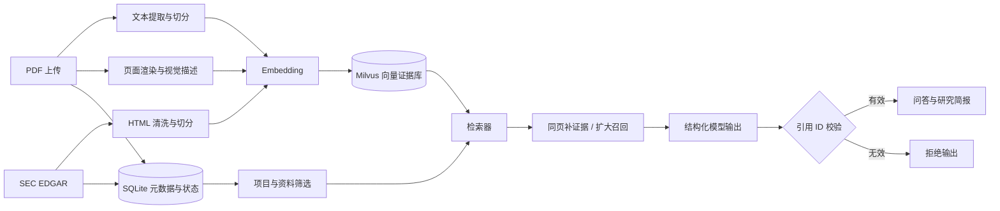

# ResearchKB

[](https://github.com/tykhed666-lab/ResearchKB/actions/workflows/quality.yml)
[](https://www.python.org/)
[](LICENSE)

ResearchKB 是一个面向个人行业研究的多模态知识库。它把 PDF、图表和 SEC EDGAR 官方披露转换为可追踪的证据，在限定资料范围内完成检索问答、拒答判断和研究简报生成，并对模型返回的每个引用 ID 做程序级校验。

当前演示主题是美股 AI 基础设施产业链，但数据模型和处理流程不绑定行业。

## 为什么做这个项目

通用聊天模型可以总结文档，却很难同时解决以下工程问题：

- 大型 PDF 的文字、表格和图表如何进入同一个检索空间；
- 多份报告和 SEC 网页混合检索时，如何保留来源、报告期和页码；
- 模型证据不足时如何拒答，而不是用常识补齐；
- 上传、重新入库和删除后，SQLite、Milvus 与本地文件如何保持一致；
- 研究结论如何保存为可复查、不会覆盖旧版本的交付物。

ResearchKB 将这些问题实现为一条完整的数据与应用链路，而不是只演示一次模型调用。

## 核心能力

- **多模态 PDF 入库**：提取文本、切分证据，并为选定图表页生成视觉描述和图像证据。
- **可控范围检索**：支持按项目、行业、公司、日期和资料多选限制检索范围。
- **有依据的问答**：只允许引用本轮召回的真实证据 ID；证据不足时明确拒答。
- **自适应召回**：先执行 Top-K 检索，必要时补齐同页片段；仍不足时扩大一次召回范围。
- **SEC 官方资料接入**：根据美股 Ticker 查询 10-K/10-Q，下载并清洗官方 HTML 后入库。
- **研究简报生成**：平衡不同来源的证据，生成带结论、对比、催化因素、风险和信息缺口的 Markdown 简报。
- **文档生命周期管理**：支持哈希去重、项目归属、重新入库、备份删除和失败状态记录。
- **工程质量门禁**：Ruff、语法编译、Pytest、覆盖率阈值和 GitHub Actions 使用同一套检查入口。

## 系统架构



### 关键设计

1. **证据可追踪**：每条证据保存稳定 ID、来源、物理页码、片段序号和内容类型。
2. **两层去重**：文件 SHA-256 防止重复登记，稳定证据 ID 防止重复向量写入。
3. **引用白名单**：模型只能返回本轮上下文中的证据 ID；伪造引用会直接触发异常。
4. **安全拒答**：资料不足的回答不展示无关召回结果作为引用。
5. **跨来源平衡**：研究简报按来源分配召回配额，避免大型文档独占上下文。
6. **有限外部访问**：SEC 客户端包含身份声明、速率控制、超时、重试、响应大小和域名限制。
7. **可恢复删除**：文档删除前生成备份，再同步清理向量、登记、PDF 和页面图片。

## 技术栈

| 层级 | 技术 |
| --- | --- |
| Web 应用 | Streamlit |
| 模型接口 | OpenAI-compatible API、LangChain Core |
| 文本与视觉模型 | 默认配置为阿里云百炼兼容接口，可替换为其他兼容服务 |
| 向量数据库 | Milvus |
| 元数据存储 | SQLite |
| PDF 处理 | PyMuPDF、pypdf |
| 数据校验 | Pydantic |
| 工程工具 | uv、Ruff、Pytest、pytest-cov、GitHub Actions |

## 快速开始

### 1. 前置条件

- Python 3.11；
- [uv](https://docs.astral.sh/uv/)；
- 一个可访问的 Milvus 实例；
- 支持文本、视觉和 Embedding 的 OpenAI-compatible 模型服务；
- 如需使用 SEC 功能，准备一个包含联系邮箱的 User-Agent。

### 2. 安装项目

```powershell
git clone https://github.com/tykhed666-lab/ResearchKB.git
cd ResearchKB
uv sync --locked --all-groups
Copy-Item .env.example .env
```

编辑 `.env`：

```dotenv
MILVUS_URI=http://your-milvus-host:19530
MILVUS_COLLECTION=research_knowledge

OPENAI_API_KEY=your-api-key
OPENAI_BASE_URL=https://your-provider.example.com/v1
TEXT_MODEL=your-text-model
VISION_MODEL=your-vision-model
EMBEDDING_MODEL=your-embedding-model

SEC_USER_AGENT=ResearchKB your-email@example.com
```

真实密钥只应保存在本机 `.env`，不要提交到 Git。

### 3. 初始化并启动

```powershell
uv run python scripts/setup_milvus.py
uv run streamlit run app.py
```

浏览器访问 `http://localhost:8501`。在 PyCharm 中也可以直接运行 `scripts/run_streamlit.py`；不要把 `app.py` 当普通 Python 脚本启动。

首次使用时，在页面中创建研究项目并上传 PDF。原始 PDF、向量数据、SQLite、SEC 原文、页面图片和生成简报均属于本地运行数据，不包含在仓库中。

## 页面工作流

1. **研究范围**：创建项目，按行业、公司和日期筛选资料。
2. **上传 PDF**：填写文档元数据，完成文本证据入库并查看处理状态。
3. **图表增强**：选择关键图表页，生成可检索的视觉描述。
4. **SEC 披露**：输入 Ticker，查询、保存并索引官方 10-K/10-Q。
5. **检索问答**：在所选资料范围内提问，检查回答、拒答状态和原始证据。
6. **研究简报**：生成带完整引用清单的 Markdown 文件并下载。

## 质量与验收

本地和 CI 使用同一个质量门禁：

```powershell
uv run python scripts/check_quality.py
```

该命令依次执行格式检查、静态检查、Python 语法编译和完整自动化测试；核心包行覆盖率低于 70% 时失败。

2026-10-01 在真实本地数据与服务上的收工验收结果：

| 验收项 | 结果 |
| --- | --- |
| 自动化测试 | 38 项通过，覆盖率 72%+ |
| Python / PDF / Milvus 环境 | 6 份 PDF、571 页、目标 Collection 可用 |
| 文本、视觉、Embedding 模型 | 全部调用成功，Embedding 维度 1024 |
| 普通检索 | 5/5 来源命中，单文档过滤通过 |
| 多模态检索 | 3/3 图像证据命中 |
| 多模态问答 | 3/3 正确引用预期图像证据 |
| 综合问答 | 库内问题 5/5，库外拒答 3/3 |
| 重复上传 | 新增文档 0、新增向量 0，前后数量一致 |
| SEC 实时查询 | 成功返回 NVIDIA 最近 3 份 10-K/10-Q |
| 研究简报 | 生成成功，8 条召回证据对应 8 条有效引用 |
| Streamlit | 服务启动成功，首页 HTTP 200 |

涉及真实模型、Milvus 或 SEC 网络的验收脚本不会放入 CI，以避免消耗密钥和依赖私有运行数据，可按需执行：

```powershell
uv run python scripts/check_day1.py
uv run python scripts/check_cloud_models.py
uv run python scripts/check_retrieval.py
uv run python scripts/check_multimodal_retrieval.py
uv run python scripts/check_multimodal_qa.py
uv run python scripts/evaluate_qa.py
uv run python scripts/check_upload.py
```

## 项目结构

```text
ResearchKB/
├─ app.py                         # Streamlit 页面与交互入口
├─ src/research_kb/
│  ├─ settings.py                # 路径、环境变量和业务默认值
│  ├─ upload_service.py          # PDF 上传、去重和入库编排
│  ├─ retrieval.py               # Milvus 检索与同页证据扩展
│  ├─ qa.py                      # 结构化问答、拒答和引用校验
│  ├─ visual_ingestion.py        # 图表页视觉证据流水线
│  ├─ sec_edgar.py               # SEC 官方接口客户端
│  ├─ external_ingestion.py      # SEC HTML 清洗与入库
│  └─ research_report.py         # 多来源研究简报生成
├─ tests/                         # 离线自动化测试
├─ scripts/                       # 初始化、启动与真实链路验收脚本
└─ .github/workflows/quality.yml  # GitHub Actions 质量门禁
```

## 当前边界

- Milvus 需要单独部署，仓库暂未提供一键容器编排。
- 图表页由用户选择后处理，尚未自动识别整份 PDF 中的高价值图表。
- 综合评测是固定的小规模验收集，不代表通用行业问答准确率。
- 项目是个人研究辅助工具，生成内容仍需结合原始证据人工复核，不构成投资建议。

## 安全与数据

以下内容已被 `.gitignore` 排除：`.env`、原始 PDF、SQLite 数据库、SEC 下载原文、页面图片、评测记录、备份和生成简报。若发现凭证曾进入 Git 历史，应立即吊销并更换，而不只是删除本地文件。

## License

本项目采用 [MIT License](LICENSE)。
