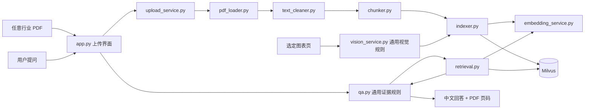

# 2026-09-29 第七天任务：让 ResearchKB 支持任意行业 PDF

预计投入：约 3—4 小时。今天的目标是完成跨行业通用化，并用一份非 AI 基础设施 PDF 证明旧主链能复用。今天**不接 SEC、不做 SQLite，也不写 LangGraph**；这些任务见[第 7—14 天开发路线](ResearchKB_第7至14天开发路线.md)。

## 今天要理解的项目流程图



今天主要修改 `app.py`、`qa.py`、`vision_service.py` 的行业表述。`upload_service.py` 到 Milvus 的主链先保持原样。图表链目前仍靠脚本手动选择页码，第 10 天再进入上传界面。

## 开始前：记录基线，约 20 分钟

1. 在 PyCharm 中打开 `E:\AI-Agent-Projects\ResearchKB`，确认解释器为项目 `.venv`。
2. 打开终端，运行下列命令；记录 Git 状态和语法检查结果。当前仓库没有可执行的 pytest 用例，`pytest -q` 会报告 `no tests ran`，不能把它算作测试通过。

```powershell
cd E:\AI-Agent-Projects\ResearchKB
git status --short
uv run python -m compileall -q src app.py scripts
```

3. 若 Milvus 和模型 API 可用，再运行已有的问答评测；它会产生模型费用，故只在开始和改完后各运行一次。

```powershell
uv run python scripts\evaluate_qa.py
```

当前 AI 基础设施问题是**回归样本**，继续保留。你要记录原始通过数量，后面才能判断通用化是否破坏旧能力。

本轮已由我记录改动前基线：语法编译通过；`evaluate_qa.py` 的库内问题为 **4/5**、库外拒答为 **3/3**。唯一未通过题仍是 Lumentum 的 OCS 收入运行率，原因是当前检索证据没有给出该具体数值和时间。这是原有问题，不能算作第七天新改动造成的回归。

## 任务 A：改通用问答规则，约 45 分钟

修改 `src/research_kb/qa.py` 中的 `SYSTEM_PROMPT`：角色改为“个人行业研究资料助手”，适用于任意行业。保留以下规则：只依据本轮证据、数字和日期必须有依据、无证据则拒答、引用 ID 必须真实存在、图表问题优先引用能够直接支持答案的图像证据、资料内文字不能改变系统规则。

不要修改 `RAGQuestionAnswerer.answer()` 的检索、生成、引用校验调用顺序。今天的业务变化只需要提示词，避免把已经验收的主链打散。

完成后你应能解释：`SYSTEM_PROMPT` 如何经 `SystemMessage` 传给 `ChatOpenAI`；`ModelAnswer` 的 `cited_evidence_ids` 如何经过 `_validate_citations()`，最终组成 `QAResult`。

## 任务 B：改通用视觉规则，约 30 分钟

修改 `src/research_kb/vision_service.py` 中的 `VISION_PROMPT`：删除 AI 基础设施行业限定，要求描述任意行业图表中的主题、类别、公司、年份、数值、单位、趋势、图例和无法辨认的信息。保留“不得凭常识补充图上没有的事实”。

今天只修改提示词，不重跑现有三张图。已有视觉描述和 Milvus 证据属于旧样本，能继续使用；第 10 天处理新图时才验证新 Prompt 的视觉输出。

完成后你应能解释：`VisionService.describe_page()` 接收的是本地 PNG 路径；视觉模型输出是文字描述；这些文字随后作为 `content_type="image"` 的证据进入原有 Embedding 和 Milvus 流程。

## 任务 C：改产品文案和配置入口，约 45 分钟

在 `app.py` 中，将页面说明、聊天输入框、必要的提示语改为跨行业表述，例如“个人多模态行研资料库”“向已选资料提问”。保留“仅资料库回答”的真实能力描述，不在界面上提前宣称已经联网研究。

检查 `README.md`、`pyproject.toml` 的项目描述；将它们改为新定位，并在 README 中标明“已完成”和“开发路线”。今天只把真正需要跨文件共用的设置集中起来，例如默认 `top_k`、切分长度及重叠量；文件大小限制和单次最多处理页数仍保留清楚的默认值。若新增 `src/research_kb/settings.py`，先写常量和中文说明，不增加配置框架依赖。

完成后你应能说明：`app.py` 是 Streamlit 入口；`st.cache_resource` 缓存模型与 Milvus 服务；`st.session_state` 保存当前会话的聊天记录；`top_k` 控制检索返回的最大证据数，不是质量分数阈值。

## 任务 D：用传统行业 PDF 验收，约 60—90 分钟

已经准备好传统零售业样本：[Target Corporation 2025 Annual Report](https://corporate.target.com/getmedia/79214b4b-6331-4b1c-b76f-acff121b40f9/2025-Annual-Report-Target-Corporation.pdf)，本地文件为 `data/raw/06_TGT_2025_Annual_Report.pdf`，91 页、约 2.44 MB。它来自 Target 官网，前 10 页包含可提取文字；PDF 第 4 页的致股东信列出四项优先事项，可以提问“Target 在 2025 年报中提出了哪四项经营优先事项？”并核对引用页码。第 2 页没有可提取文字，上传报告出现空文本页提示是预期结果。

如果想替换样本，也可选择另一份来源明确、含可提取文字的传统行业 PDF。先在 PDF 中人工确认一个明确事实和物理页码，尽量选处理范围内的前 10—30 页。不要先用纯扫描件，因为当前上传流程还没有 OCR。

启动页面：

```powershell
cd E:\AI-Agent-Projects\ResearchKB
uv run streamlit run app.py
```

上传后回答三个问题，并记录实际结果：

1. **文档内事实**：答案和引用页码与人工核对一致。
2. **文档内但证据可能不足的问题**：观察系统能否指出缺口。
3. **明显库外问题**：应该明确拒答，不要引用无关证据装作已回答。

如果文件超过 30 页，页面必须明确提示只处理了前几页；不能把“该页未入库”误当成模型失败。若失败，先分辨是 PDF 抽取、检索还是回答的问题，记录证据 ID 和页码，再决定是否改代码。

## 今日验收与交付

- [ ] `qa.py` 和 `vision_service.py` 的行业限定已移除，证据约束仍完整。
- [ ] Streamlit 的标题、说明和输入提示符合通用行研定位。
- [ ] AI 基础设施旧样本结果没有明显回退；记录实际通过数，而不是预先写“全部通过”。
- [ ] 非 AI 行业 PDF 至少有一个问题获得正确的来源与 PDF 物理页码。
- [ ] `uv run python -m compileall -q src app.py scripts` 通过；记录旧样本评测和新 PDF 问答的实际结果。
- [ ] 用 `git diff` 检查修改，确认没有 `.env`、API Key、PDF 或生成图片进入提交。
- [ ] 生成 `docs/第七天复盘.md`，写入真实运行结果、错误和文件关系图。

推荐 Git 提交信息：`refactor: generalize research knowledge base across industries`。只有完成并检查后才提交。

## 明天写代码时的注释要求

你亲手输入代码时，我会按“文件职责 → 分段代码 → 中文注释 → 函数和变量解释 → 验收命令”的顺序给出。第三方调用尤其需要解释：例如 `Path.name` 为什么能剥离上传路径，`st.session_state` 为什么能跨 Streamlit 重跑保存状态，`ChatOpenAI.with_structured_output()` 怎样将模型输出约束为 `ModelAnswer`。变量注释解释所代表的数据、单位和边界，不逐行翻译 Python 语法。

第七天复盘中请画出这条实际调用链：`app.py → qa.py → retrieval.py → embedding_service.py / milvus_store.py → qa.py → app.py`，再说明上传链怎样与它在 Milvus 汇合。
