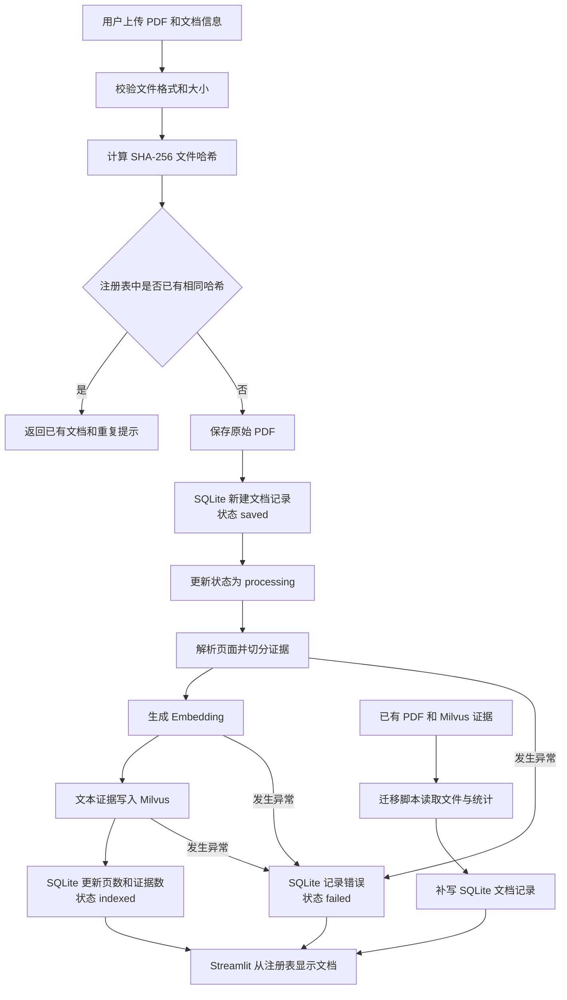
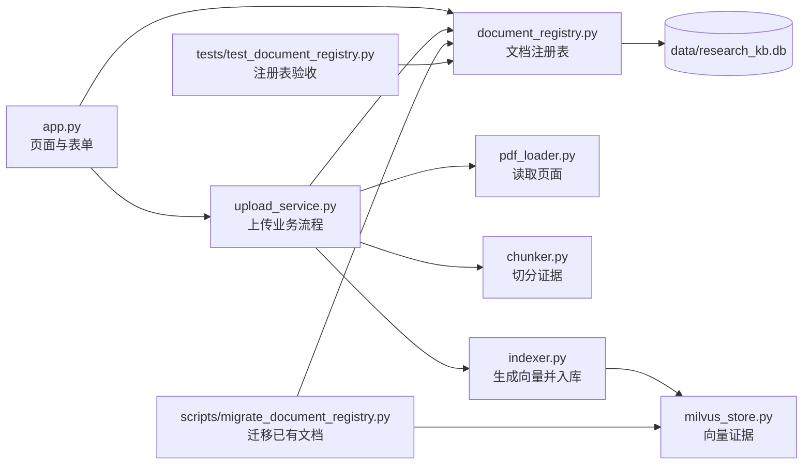

# ResearchKB 第八天任务：建立文档注册表

## 1. 今天要解决的问题

当前项目已经能把 PDF 解析成证据并写入 Milvus，但系统仍然通过扫描 Milvus 中的 `source` 字段来推断有哪些文档。这会带来几个问题：

- 文档标题、公司、行业、报告日期等业务信息没有统一保存位置；
- 同名文件、相同内容和不同版本之间不容易区分；
- PDF 解析或向量入库失败后，页面看不到失败记录和原因；
- 页面为了列出文档，需要扫描大量向量记录；
- 后续很难按行业、公司、文档类型和日期筛选资料。

第八天将增加一个轻量的 SQLite 文档注册表。Milvus继续保存可检索的文本和图像向量，SQLite负责保存文档级信息和处理状态。两者分工明确：

| 存储 | 保存内容 | 主要用途 |
| --- | --- | --- |
| SQLite | 一份 PDF 对应的一条文档记录 | 文档管理、状态、筛选、去重 |
| Milvus | 一份 PDF 拆出的多条文本或图像证据 | 语义检索、RAG 问答 |
| 本地磁盘 | 原始 PDF 与渲染图片 | 文件保留和证据回看 |

SQLite 是 Python 自带的本地关系型数据库，不需要额外安装服务，适合当前单人使用的项目规模。将来如果项目需要多人协作，可以在保留业务接口的前提下迁移到 PostgreSQL。

## 2. 第八天结束时应达到的结果

- 新建 `documents` 表，一份 PDF 对应一条记录；
- 保存文件哈希、原文件名、实际文件名和研究元数据；
- 保存总页数、处理页数、文本证据数和图像证据数；
- 保存 `saved`、`processing`、`indexed`、`failed` 四种处理状态；
- 同一内容重复上传时不新增文档记录；
- 同名但内容不同的 PDF 可以分别保存；
- 解析或入库失败时保留失败原因；
- Streamlit 文档列表改为读取注册表；
- 把当前已有的 6 份 PDF 迁移到注册表，不重新生成向量；
- 完成自动化验收和第八天复盘。

## 3. 今天的整体流程图

## 4. 数据模型

`documents` 表计划保存以下字段：

| 字段 | 含义 |
| --- | --- |
| `document_id` | 文档业务 ID，由文件哈希生成 |
| `document_hash` | PDF 内容的完整 SHA-256 哈希，用于内容去重 |
| `original_name` | 用户上传时的文件名 |
| `saved_name` | 最终保存在 `data/raw` 中的文件名 |
| `title` | 文档标题 |
| `company` | 公司或机构名称，可为空 |
| `ticker` | 股票代码，可为空 |
| `industry` | 行业，可为空 |
| `document_type` | 年报、路演材料、行业报告等类型 |
| `report_date` | 报告日期，可为空，采用 `YYYY-MM-DD` |
| `uploaded_at` | 入库时间，采用 UTC ISO 时间 |
| `total_pages` | PDF 总页数 |
| `processed_pages` | 实际处理页数 |
| `text_chunk_count` | Milvus 中的文本证据数 |
| `image_chunk_count` | Milvus 中的图像证据数 |
| `status` | `saved`、`processing`、`indexed` 或 `failed` |
| `error_message` | 失败原因，成功时为空 |

## 5. 代码关系图

## 6. 今日任务安排

### 阶段一：创建 SQLite 表和 Python 数据模型

预计用时：45 分钟。

- 新建 `src/research_kb/document_registry.py`；
- 学习 `sqlite3.connect`、`sqlite3.Row` 和 SQL `CREATE TABLE`；
- 定义 `DocumentMetadata` 和 `DocumentRecord`；
- 自动创建数据库目录和 `documents` 表；
- 把本地数据库加入 `.gitignore`。

验收：首次运行会生成数据库，再次运行不会重复建表或报错。

### 阶段二：实现注册、查询和状态更新

预计用时：60 分钟。

- 按文件哈希查询文档；
- 按实际文件名查询文档；
- 注册一份新文档；
- 列出全部文档；
- 更新为 `processing`、`indexed` 或 `failed`；
- 对空字符串、日期和股票代码进行统一清理。

验收：同一哈希注册两次只保留一条记录，状态和统计字段可以正确更新。

### 阶段三：增加有意义的自动化测试

预计用时：30 分钟。

- 使用 pytest 的 `tmp_path` 创建临时数据库；
- 验证相同内容不会生成重复记录；
- 验证成功状态可以保存页数和证据数；
- 验证失败状态可以保存错误原因。

验收：测试不依赖正式数据库，也不会修改真实文档。

### 阶段四：接入 PDF 上传流程

预计用时：75 分钟。

- `PdfUploadService` 接收 `DocumentRegistry`；
- 上传前根据文件内容哈希判断是否已存在；
- 保存 PDF 后创建 `saved` 记录；
- 解析和入库期间更新为 `processing`；
- 成功后更新页数、证据数和 `indexed` 状态；
- 异常时写入 `failed` 和错误信息，再把异常交给页面显示。

验收：重复上传相同内容不重复写入 SQLite 或 Milvus。

### 阶段五：改造 Streamlit 文档管理区

预计用时：60 分钟。

- 上传时填写标题、公司、股票代码、行业、文档类型和报告日期；
- 文档列表从 SQLite 获取，不再扫描 Milvus 推断；
- 显示状态、页数、证据数和失败原因；
- 保留现有问答、来源筛选和 PDF 上传能力。

验收：页面刷新后文档信息仍然存在，失败文档也可以被看见。

### 阶段六：迁移已有文档

预计用时：45 分钟。

- 新建 `scripts/migrate_document_registry.py`；
- 扫描 `data/raw` 中已有 PDF；
- 从 PDF 和 Milvus 读取页数、哈希与证据数量；
- 为当前 6 份 PDF 补写注册表记录；
- 脚本重复运行时跳过已有哈希。

验收：迁移后 SQLite 中有 6 条文档记录，Milvus 实体总数保持不变。

### 阶段七：综合验收、Git 和复盘

预计用时：30 分钟。

- 运行注册表测试；
- 运行 Python 编译检查；
- 启动 Streamlit 做页面验收；
- 检查相同内容重复上传和同名不同内容逻辑；
- 生成 `docs/第八天复盘.md`；
- 提交并推送到 GitHub。

## 7. 今天重点掌握的面试知识

1. 向量数据库适合相似度检索，但不适合承担全部业务数据管理职责。
2. SQLite 与 Milvus 组成了“元数据存储 + 向量存储”的双存储结构。
3. 文件名不能可靠标识内容，SHA-256 哈希可以用于内容去重。
4. 上传入库不是一个瞬间动作，需要保存处理中、成功和失败状态。
5. 数据库事务保证一次状态更新要么完整成功，要么保持原状。
6. 迁移脚本让新功能能够接管旧数据，而不必重新生成昂贵的向量。

## 8. 第八天完成标准

- [x] 数据库和 `documents` 表可重复初始化；
- [x] 文档增查改方法完成；
- [x] 注册表自动化测试通过；
- [x] 上传流程接入文档状态；
- [x] Streamlit 可以录入并展示文档元数据；
- [x] 6 份历史 PDF 完成迁移；
- [x] 重复迁移不会生成重复记录；
- [x] Milvus 原有 311 条证据不丢失；
- [x] 页面问答功能正常；
- [x] 第八天复盘文档完成；
- [x] 代码提交并推送到 GitHub。
