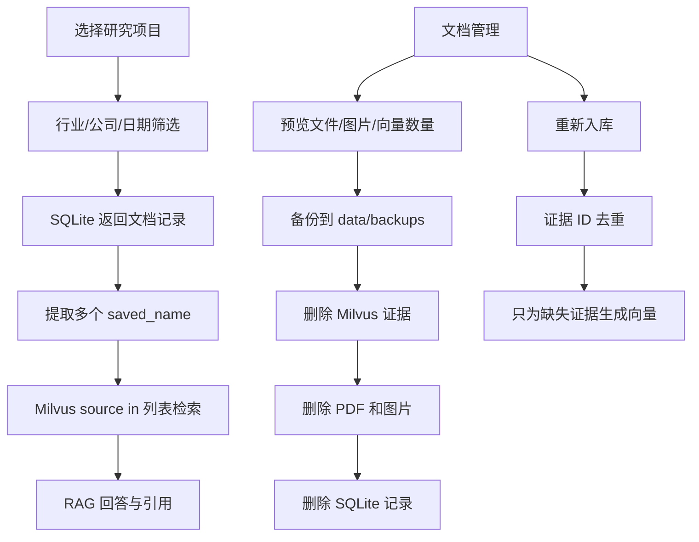
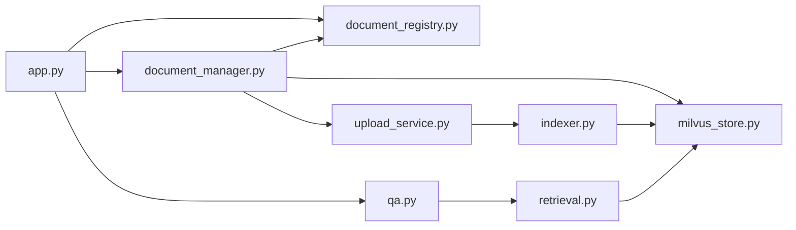

# 第九天任务与完整代码：研究项目、筛选和文档管理

> 前置条件：先完成《第八天剩余任务与完整代码》。第九天代码是在第八天版本上继续修改。

## 1. 今日目标

- 创建研究项目，例如“AI 基础设施”和“消费零售”；
- 将文档分配给一个研究项目；
- 按项目、行业、公司和报告日期筛选文档；
- 将筛选结果转换成多个 Milvus `source` 条件，防止项目间串资料；
- 删除前预览 PDF、图片和向量数量；
- 删除前自动备份原文件与图片，再同步删除三处数据；
- 支持重新入库，稳定证据 ID 已存在时不重复调用 Embedding。

## 2. 总流程图



## 3. 扩展 `document_registry.py`

### 3.1 增加导入和数据类

在导入区加入：

```python
from uuid import uuid4
```

在 `DocumentRecord` 最后加入字段：

```python
    project_id: str | None
```

在 `DocumentRecord` 后加入：

```python
@dataclass(frozen=True, slots=True)
class ProjectRecord:
    """一个轻量研究项目。"""

    project_id: str
    name: str
    description: str | None
    created_at: str
```

### 3.2 增加项目表 SQL

```python
CREATE_PROJECTS_SQL: Final = """
CREATE TABLE IF NOT EXISTS projects (
    project_id TEXT PRIMARY KEY,
    name TEXT NOT NULL UNIQUE COLLATE NOCASE,
    description TEXT,
    created_at TEXT NOT NULL
);
"""
```

### 3.3 替换 `_initialize_database`

```python
    def _initialize_database(self) -> None:
        """创建项目表，并为旧 documents 表执行一次轻量迁移。"""
        with self._connect() as connection:
            connection.executescript(CREATE_DOCUMENTS_SQL)
            connection.executescript(CREATE_PROJECTS_SQL)

            # PRAGMA table_info 用于读取现有列名。
            # 只有旧数据库缺少 project_id 时才 ALTER，保证重复启动安全。
            columns = {
                row["name"]
                for row in connection.execute(
                    "PRAGMA table_info(documents)"
                ).fetchall()
            }
            if "project_id" not in columns:
                connection.execute(
                    """
                    ALTER TABLE documents
                    ADD COLUMN project_id TEXT REFERENCES projects(project_id)
                    """
                )
            connection.execute(
                """
                CREATE INDEX IF NOT EXISTS idx_documents_project_id
                ON documents(project_id)
                """
            )
```

### 3.4 用下面版本替换 `list_documents`

```python
    def list_documents(
        self,
        status: str | None = None,
        project_id: str | None = None,
        industry: str | None = None,
        company: str | None = None,
        report_date_from: str | None = None,
        report_date_to: str | None = None,
    ) -> list[DocumentRecord]:
        """组合多个可选条件筛选文档。"""
        conditions: list[str] = []
        parameters: list[str] = []

        if status is not None:
            if status not in VALID_DOCUMENT_STATUSES:
                raise ValueError(f"不支持的文档状态：{status}")
            conditions.append("status = ?")
            parameters.append(status)
        if project_id is not None:
            conditions.append("project_id = ?")
            parameters.append(project_id)
        if industry is not None:
            conditions.append("industry = ?")
            parameters.append(industry)
        if company is not None:
            conditions.append("company = ?")
            parameters.append(company)
        if report_date_from is not None:
            date.fromisoformat(report_date_from)
            conditions.append("report_date >= ?")
            parameters.append(report_date_from)
        if report_date_to is not None:
            date.fromisoformat(report_date_to)
            conditions.append("report_date <= ?")
            parameters.append(report_date_to)

        sql = "SELECT * FROM documents"
        if conditions:
            sql += " WHERE " + " AND ".join(conditions)
        sql += " ORDER BY uploaded_at DESC, saved_name ASC"

        with self._connect() as connection:
            rows = connection.execute(sql, parameters).fetchall()
        return [DocumentRecord(**dict(row)) for row in rows]
```

### 3.5 在类末尾加入项目和删除方法

```python
    def create_project(self, name: str, description: str | None = None) -> ProjectRecord:
        """创建研究项目，项目名不区分大小写且不能重复。"""
        cleaned_name = name.strip()
        if not cleaned_name:
            raise ValueError("项目名称不能为空")
        project_id = f"project_{uuid4().hex[:16]}"
        created_at = datetime.now(timezone.utc).isoformat(timespec="seconds")
        with self._connect() as connection:
            try:
                connection.execute(
                    "INSERT INTO projects VALUES (?, ?, ?, ?)",
                    (
                        project_id,
                        cleaned_name,
                        self._optional_text(description),
                        created_at,
                    ),
                )
            except sqlite3.IntegrityError as error:
                raise ValueError(f"项目名称已经存在：{cleaned_name}") from error
        return ProjectRecord(
            project_id, cleaned_name,
            self._optional_text(description), created_at,
        )

    def list_projects(self) -> list[ProjectRecord]:
        """按创建时间列出项目。"""
        with self._connect() as connection:
            rows = connection.execute(
                "SELECT * FROM projects ORDER BY created_at, name"
            ).fetchall()
        return [ProjectRecord(**dict(row)) for row in rows]

    def assign_document(self, document_id: str, project_id: str | None) -> None:
        """将文档分配给项目；传入 None 表示移出项目。"""
        with self._connect() as connection:
            if project_id is not None:
                project = connection.execute(
                    "SELECT 1 FROM projects WHERE project_id = ?",
                    (project_id,),
                ).fetchone()
                if project is None:
                    raise KeyError(f"找不到项目：{project_id}")
            cursor = connection.execute(
                "UPDATE documents SET project_id = ? WHERE document_id = ?",
                (project_id, document_id),
            )
            if cursor.rowcount != 1:
                raise KeyError(f"找不到文档：{document_id}")

    def delete_document(self, document_id: str) -> None:
        """删除文档登记；文件和向量应由管理服务先处理。"""
        with self._connect() as connection:
            cursor = connection.execute(
                "DELETE FROM documents WHERE document_id = ?",
                (document_id,),
            )
            if cursor.rowcount != 1:
                raise KeyError(f"找不到文档：{document_id}")
```

### 3.6 修改 `register_document`

由于第九天数据库多了 `project_id`，`INSERT` 不需要修改；未指定列会自动保存为 `NULL`。但是所有旧数据库启动后都必须先构造一次 `DocumentRegistry()`，让迁移自动执行。

## 4. 支持一个项目内的多文档检索

文件：`src/research_kb/retrieval.py`

导入区加入：

```python
from collections.abc import Sequence
```

把 `search` 的 `source` 类型改成：

```python
        source: str | Sequence[str] | None = None,
```

用以下代码替换原来的 `if source is not None` 整段：

```python
        if source is not None:
            source_names = [source] if isinstance(source, str) else list(source)
            source_names = list(
                dict.fromkeys(name.strip() for name in source_names if name.strip())
            )

            # 空列表代表用户当前没有选择任何文档，必须返回空结果，
            # 不能把它解释成“搜索全部资料”。
            if not source_names:
                return []

            escaped_sources = [
                name.replace("\\", "\\\\").replace('"', '\\"')
                for name in source_names
            ]
            if len(escaped_sources) == 1:
                filter_expression = f'source == "{escaped_sources[0]}"'
            else:
                quoted = ", ".join(f'"{name}"' for name in escaped_sources)
                filter_expression = f"source in [{quoted}]"
```

文件：`src/research_kb/qa.py`

导入：

```python
from collections.abc import Sequence
```

将 `answer` 的参数类型改为：

```python
        source: str | Sequence[str] | None = None,
```

其余调用不变。这样旧脚本传字符串仍然兼容，页面可以传入多个文件名。

## 5. 给 Milvus 增加删除能力

文件：`src/research_kb/milvus_store.py`

加入：

```python
    def delete_by_source(self, source: str) -> int:
        """删除一份 PDF 的全部文本和图像证据，返回删除前数量。"""
        statistics = self.get_source_statistics(source)
        if statistics["total"] == 0:
            return 0
        safe_source = self._escape_filter_text(source)
        self.client.delete(
            collection_name=self.collection_name,
            filter=f'source == "{safe_source}"',
        )
        self.flush()
        return statistics["total"]
```

## 6. 新建文档管理服务

文件：`src/research_kb/document_manager.py`

```python
"""协调文档预览、备份、删除和重新入库。"""

import shutil
from dataclasses import dataclass
from datetime import datetime, timezone
from pathlib import Path

from research_kb.document_registry import DocumentMetadata, DocumentRegistry
from research_kb.milvus_store import MilvusStore
from research_kb.upload_service import PdfUploadService, UploadReport


PROJECT_ROOT = Path(__file__).resolve().parents[2]
RAW_DATA_DIR = PROJECT_ROOT / "data" / "raw"
IMAGE_ROOT = PROJECT_ROOT / "data" / "images"
BACKUP_ROOT = PROJECT_ROOT / "data" / "backups" / "deletions"


@dataclass(frozen=True, slots=True)
class DeletionPreview:
    """删除确认区需要展示的影响范围。"""

    document_id: str
    saved_name: str
    pdf_exists: bool
    image_count: int
    vector_count: int


class DocumentManager:
    """让 SQLite、Milvus 和本地文件保持同步。"""

    def __init__(
        self,
        registry: DocumentRegistry,
        store: MilvusStore,
        upload_service: PdfUploadService,
    ) -> None:
        self.registry = registry
        self.store = store
        self.upload_service = upload_service

    def preview_delete(self, document_id: str) -> DeletionPreview:
        """只读取即将删除的数据，不执行修改。"""
        record = self.registry.get_by_id(document_id)
        if record is None:
            raise KeyError(f"找不到文档：{document_id}")
        pdf_path = RAW_DATA_DIR / record.saved_name
        image_dir = IMAGE_ROOT / Path(record.saved_name).stem
        image_count = len(list(image_dir.glob("*.png"))) if image_dir.is_dir() else 0
        statistics = self.store.get_source_statistics(record.saved_name)
        return DeletionPreview(
            document_id, record.saved_name, pdf_path.is_file(),
            image_count, statistics["total"],
        )

    def delete_document(self, document_id: str) -> DeletionPreview:
        """先备份文件，再同步删除向量、文件和登记。"""
        preview = self.preview_delete(document_id)
        record = self.registry.get_by_id(document_id)
        if record is None:
            raise KeyError(f"找不到文档：{document_id}")

        timestamp = datetime.now(timezone.utc).strftime("%Y%m%dT%H%M%SZ")
        backup_dir = BACKUP_ROOT / f"{timestamp}_{document_id}"
        backup_dir.mkdir(parents=True, exist_ok=False)
        pdf_path = RAW_DATA_DIR / record.saved_name
        image_dir = IMAGE_ROOT / Path(record.saved_name).stem

        # 备份成功后才开始删除，误操作时仍有原始材料可恢复。
        if pdf_path.is_file():
            shutil.copy2(pdf_path, backup_dir / pdf_path.name)
        if image_dir.is_dir():
            shutil.copytree(image_dir, backup_dir / "images")

        self.store.delete_by_source(record.saved_name)
        if pdf_path.is_file():
            pdf_path.unlink()
        if image_dir.is_dir():
            shutil.rmtree(image_dir)
        self.registry.delete_document(document_id)
        return preview

    def reindex_document(self, document_id: str, max_pages: int) -> UploadReport:
        """重新解析 PDF；已有稳定证据 ID 会被 indexer 跳过。"""
        record = self.registry.get_by_id(document_id)
        if record is None:
            raise KeyError(f"找不到文档：{document_id}")
        pdf_path = RAW_DATA_DIR / record.saved_name
        if not pdf_path.is_file():
            raise FileNotFoundError(f"找不到原始 PDF：{pdf_path}")
        metadata = DocumentMetadata(
            title=record.title,
            document_type=record.document_type,
            company=record.company,
            ticker=record.ticker,
            industry=record.industry,
            report_date=record.report_date,
        )
        return self.upload_service.ingest_pdf(
            file_name=record.saved_name,
            file_bytes=pdf_path.read_bytes(),
            metadata=metadata,
            max_pages=max_pages,
            force_reindex=True,
        )
```

在 `.gitignore` 加入：

```text
data/backups/
```

## 7. Streamlit 页面改造

### 7.1 服务创建

导入：

```python
from research_kb.document_manager import DocumentManager
```

`create_services` 返回值增加 `DocumentManager`：

```python
manager = DocumentManager(registry, store, upload_service)
return store, answerer, upload_service, registry, manager
```

### 7.2 创建项目

在侧边栏“知识库状态”后加入：

```python
st.subheader("研究项目")
with st.expander("新建项目"):
    with st.form("create_project_form", clear_on_submit=True):
        new_project_name = st.text_input("项目名称")
        new_project_description = st.text_area("项目说明")
        create_project_clicked = st.form_submit_button("创建")
        if create_project_clicked:
            try:
                registry.create_project(new_project_name, new_project_description)
                st.success("项目已创建")
                st.rerun()
            except ValueError as error:
                st.error(str(error))
```

### 7.3 项目和元数据筛选

```python
projects = registry.list_projects()
project_by_id = {project.project_id: project for project in projects}
project_options = [None, *project_by_id]
selected_project_id = st.selectbox(
    "当前研究项目",
    project_options,
    format_func=lambda value: (
        "全部项目" if value is None else project_by_id[value].name
    ),
)

all_documents = registry.list_documents()
industries = sorted({d.industry for d in all_documents if d.industry})
companies = sorted({d.company for d in all_documents if d.company})
selected_industry = st.selectbox("行业筛选", [None, *industries],
                                 format_func=lambda value: value or "全部行业")
selected_company = st.selectbox("公司筛选", [None, *companies],
                                format_func=lambda value: value or "全部公司")

documents = registry.list_documents(
    status=STATUS_INDEXED,
    project_id=selected_project_id,
    industry=selected_industry,
    company=selected_company,
)
available_sources = [document.saved_name for document in documents]
selected_sources = st.multiselect(
    "参与问答的资料",
    available_sources,
    default=available_sources,
)
```

聊天提交前把原来的 `source_filter` 替换为：

```python
source_filter = selected_sources
```

`knowledge_base_ready` 增加：

```python
and bool(selected_sources)
```

历史用户消息显示范围时，可改为：

```python
if message.get("source"):
    source_text = message["source"]
    if isinstance(source_text, list):
        source_text = "、".join(source_text)
    st.caption(f"限定资料：{source_text}")
```

### 7.4 把文档分配给项目

```python
with st.expander("分配文档到项目"):
    document_by_id = {d.document_id: d for d in all_documents}
    assign_document_id = st.selectbox(
        "选择文档",
        list(document_by_id),
        format_func=lambda value: document_by_id[value].title,
    )
    assign_project_id = st.selectbox(
        "目标项目",
        project_options,
        format_func=lambda value: (
            "不属于任何项目" if value is None else project_by_id[value].name
        ),
    )
    if st.button("保存文档归属"):
        registry.assign_document(assign_document_id, assign_project_id)
        st.success("文档归属已更新")
        st.rerun()
```

### 7.5 删除预览和重新入库

不要使用最初五份样本测试删除。先上传一份小型演示 PDF。

```python
with st.expander("文档维护"):
    maintenance_id = st.selectbox(
        "维护文档",
        list(document_by_id),
        format_func=lambda value: document_by_id[value].title,
    )
    preview = manager.preview_delete(maintenance_id)
    st.caption(
        f"PDF存在：{preview.pdf_exists} · 图片：{preview.image_count} · "
        f"Milvus向量：{preview.vector_count}"
    )
    reindex_pages = st.number_input("重新入库页数", 1, 30, 10)
    if st.button("重新入库"):
        report = manager.reindex_document(maintenance_id, int(reindex_pages))
        st.success(
            f"完成：新增 {report.inserted_chunks}，跳过 {report.skipped_chunks}"
        )
        st.rerun()

    confirm_delete = st.checkbox("我已确认删除上方这份演示文档")
    if st.button("备份并删除", disabled=not confirm_delete, type="primary"):
        deleted = manager.delete_document(maintenance_id)
        st.success(f"已删除 {deleted.saved_name}，删除前已自动备份")
        st.rerun()
```

## 8. 第九天测试

追加到 `tests/test_document_registry.py`：

```python
def test_project_assignment_and_filters(tmp_path) -> None:
    registry = DocumentRegistry(tmp_path / "project.db")
    ai_project = registry.create_project("AI 基础设施")
    retail_project = registry.create_project("消费零售")

    first, _ = registry.register_document(
        "1" * 64, "nvda.pdf", "nvda.pdf",
        DocumentMetadata("NVIDIA 年报", "年报", "NVIDIA", "NVDA", "半导体", "2025-12-31"),
        100,
    )
    second, _ = registry.register_document(
        "2" * 64, "target.pdf", "target.pdf",
        DocumentMetadata("Target 年报", "年报", "Target", "TGT", "零售", "2025-12-31"),
        100,
    )
    registry.assign_document(first.document_id, ai_project.project_id)
    registry.assign_document(second.document_id, retail_project.project_id)

    ai_documents = registry.list_documents(project_id=ai_project.project_id)
    retail_documents = registry.list_documents(project_id=retail_project.project_id)
    assert [document.saved_name for document in ai_documents] == ["nvda.pdf"]
    assert [document.saved_name for document in retail_documents] == ["target.pdf"]
    assert registry.list_documents(industry="零售")[0].ticker == "TGT"
```

## 9. 验收顺序

```powershell
uv run python -m compileall -q src scripts app.py
uv run pytest -q
uv run streamlit run app.py
```

页面验收：

1. 建立“AI 基础设施”和“消费零售”两个项目；
2. 将 NVIDIA、AMD、Lumentum、Micron、Seagate 分入第一个项目；
3. 将 Target 分入第二个项目；
4. 在消费零售项目问 NVIDIA 问题，应当检索不到 NVIDIA 证据；
5. 在 AI 基础设施项目问 NVIDIA 五层架构，应命中原有证据；
6. 对一份新上传的小 PDF 执行重新入库，新增应为 0、跳过应大于 0；
7. 对同一演示 PDF 预览删除数量，再执行删除；
8. 页面列表、SQLite、Milvus 和本地文件中均不再出现该演示 PDF；
9. `data/backups/deletions` 中存在删除前备份；
10. 初始六份研究资料不得用于删除验收。

## 10. 文件关系图



## 11. Git 提交

```powershell
git diff
git status --short
git add .gitignore app.py src tests docs
git commit -m "feat: add research workspaces and document management"
git push origin main
```

## 12. 面试表达

可以这样解释：

> 我把 SQLite 作为文档与研究项目的业务数据库，把 Milvus 作为证据向量库。用户先在 SQLite 中按项目和元数据选出文档，再把这些文档的实际文件名转换成 Milvus 的 `source in [...]` 过滤条件。因此两个研究项目不会串资料。删除时系统先展示影响范围并备份原文件，再同步删除向量、图片、PDF 和登记记录。重新入库继续使用稳定 evidence ID，已存在的证据会跳过 Embedding，从而控制重复费用。

