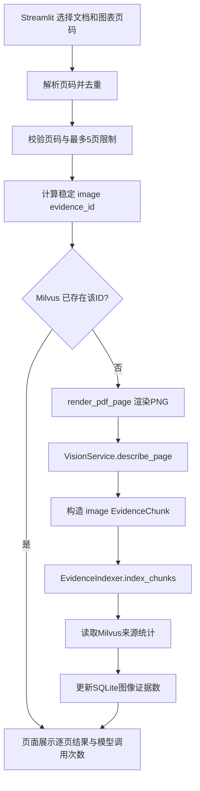
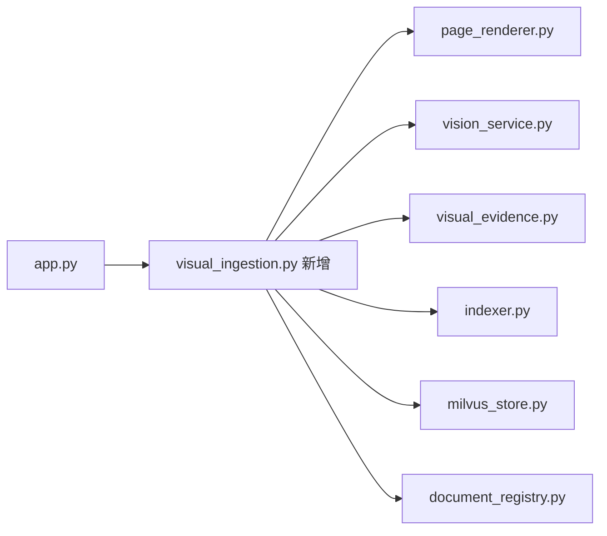

# 第十天任务：上传后选择图表页并生成多模态证据

日期：2026-10-02

## 1. 今日目标

第六天的图表处理依赖三个固定脚本，并在代码中写死 PDF 和页码。第十天将这些能力接入网页，让用户从已经上传的 PDF 中选择少量图表页，完成页面渲染、视觉描述、图像证据入库和统计更新。

今天不做自动识别所有图表页，因为这会增加实现复杂度和视觉模型费用。演示版本由用户输入明确页码，一次最多处理 5 页。

## 2. 完整流程图

## 3. 今日文件关系

## 4. 分段任务

### 任务一：提取单条图像证据构造函数

在 `visual_evidence.py` 中新增 `build_visual_evidence_chunk()`，让脚本导入和网页处理共用来源、页码、文本长度及稳定 ID 校验。

### 任务二：更新 SQLite 图像统计

在 `DocumentRegistry` 中增加只更新 `image_chunk_count` 的方法。视觉页失败时不能把已经成功的文本状态改为 `failed`。

### 任务三：新增视觉入库服务

创建 `visual_ingestion.py`：解析页码、限制调用数量、处理每一页、记录逐页成功或失败，并在处理结束后同步真实 Milvus 图像数量。

### 任务四：接入 Streamlit

在文档维护区域增加页码输入、费用提示、处理按钮和逐页结果。视觉处理失败只影响对应页，不删除文本证据。

### 任务五：测试与验收

使用临时 PDF、Fake VisionService 和 Fake Indexer 测试页码解析、越界拒绝、重复跳过和部分失败。最后在正式页面选择一份 PDF 的一张已存在图表页，验证重复处理不会调用视觉模型，也不会增加 Milvus 实体。

## 5. 验收标准

- 页码支持 `3, 7, 9` 和 `3, 7-9` 两种输入；
- 一次最多处理 5 个不重复页面；
- 页码越界时在调用视觉模型前拒绝；
- 已存在的图像证据不再次调用视觉模型；
- 单页失败不删除文本证据，也不影响其他页面；
- 页面展示视觉模型调用次数、新增数、跳过数和失败页；
- SQLite `image_chunk_count` 与 Milvus 实际数量一致；
- 自动化测试全部通过；
- 完成第十天复盘并提交 GitHub。

