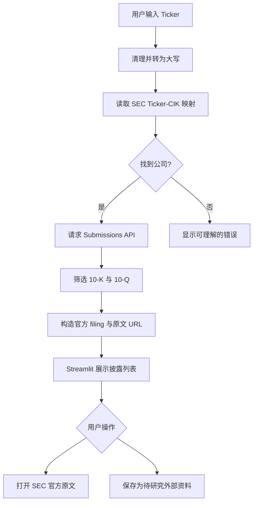
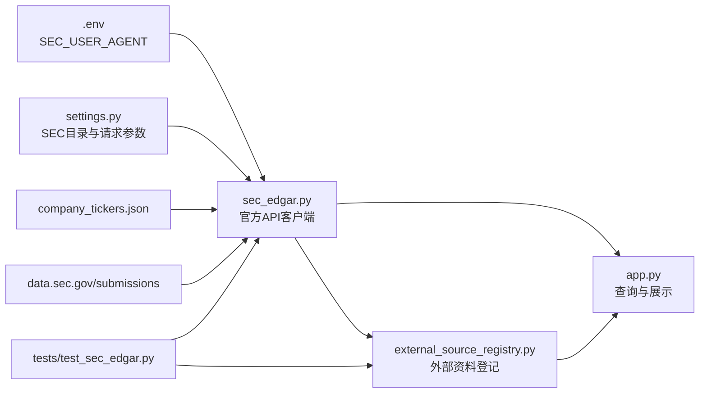

# 第十一天任务：接入 SEC EDGAR 官方披露

日期：2026-10-03

## 1. 今日目标

让 ResearchKB 可以根据美股 Ticker 查询 SEC EDGAR，列出公司最近的 10-K 与 10-Q，并提供可核验的官方原文链接。今天先把“发现官方资料”和“保存待研究资料”做稳；SEC 披露通常是 HTML，不伪装成 PDF，也不虚构 PDF 页码。外部 HTML 证据与本地 PDF 证据的统一引用将在第十二天完成。

今天完成后，项目的数据入口会从单一的“用户上传 PDF”扩展为两种：

1. 用户上传的本地 PDF；
2. SEC EDGAR 官方披露目录与原文。

## 2. 为什么选择 SEC EDGAR

- SEC 的 `data.sec.gov` 提供无需 API Key 的 JSON 接口；
- Submissions API 可以按公司的 10 位 CIK 获取近期申报记录；
- SEC 提供 Ticker、CIK、公司名称之间的官方映射文件；
- 10-K 与 10-Q 适用于半导体、零售、制造、能源等多个美股行业；
- 官方原文 URL 便于面试时解释来源可靠性和可追溯性。

官方资料：

- [EDGAR Application Programming Interfaces](https://www.sec.gov/search-filings/edgar-application-programming-interfaces)
- [Accessing EDGAR Data](https://www.sec.gov/search-filings/edgar-search-assistance/accessing-edgar-data)
- [Ticker、CIK 与交易所映射说明](https://www.sec.gov/search-filings/edgar-search-assistance/accessing-edgar-data#cik)

## 3. 今日主流程图

## 4. 代码文件关系图

## 5. 分段任务

### 任务一：创建 SEC 数据模型与纯函数

创建 `src/research_kb/sec_edgar.py`，先实现：

- `SecCompany`：Ticker、CIK、公司名称；
- `SecFiling`：表单类型、报告期、提交日期、accession number、主文档名和 URL；
- Ticker 清理；
- CIK 补足为 10 位；
- SEC 原文 URL 构造。

这一步不请求网络，先保证输入输出规则清楚。

### 任务二：实现官方 API 客户端

继续在 `sec_edgar.py` 中实现：

- 使用 `SEC_USER_AGENT` 声明客户端身份；
- 请求 Ticker-CIK 映射；
- 请求公司 Submissions JSON；
- 只保留最近的 10-K / 10-Q；
- 设置超时、有限重试和低于官方上限的请求间隔；
- 将网络错误、限流和无结果转换为可理解的业务错误。

SEC 当前要求声明 User-Agent，并将自动请求限制在每秒 10 次以内。本项目是单用户工具，主动控制为最多每秒 5 次。

### 任务三：登记外部资料

创建轻量的 SQLite 外部资料表，记录：

- 唯一来源 ID；
- CIK、Ticker、公司名称；
- 10-K / 10-Q；
- 报告期、提交日期；
- accession number；
- SEC 官方原文 URL；
- 首次采集时间；
- 当前状态。

外部资料与 PDF 文档分表保存，避免现在就把 HTML 强行套进 `documents.total_pages` 等 PDF 字段。

### 任务四：接入 Streamlit

在左侧栏增加“SEC 官方披露”区域：

1. 输入 Ticker；
2. 点击查询；
3. 显示公司名称、CIK 和最近披露；
4. 可打开 SEC 原文；
5. 可保存为待研究资料；
6. 页面明确标注“官方目录数据”和采集时间。

查询结果保存在 `st.session_state`，页面重新运行时不会无故重复请求 SEC。

### 任务五：自动化测试

测试不直接依赖 SEC 在线状态，使用固定 JSON 测试：

- Ticker 大小写与空格清理；
- CIK 10 位补零；
- 10-K / 10-Q 筛选；
- URL 构造；
- 不同长度的并列数组处理；
- 未知 Ticker；
- 网络超时与 429 错误；
- 重复保存不产生重复记录。

### 任务六：真实验收、复盘与 Git

使用一个科技公司和一个传统行业公司完成查询，例如 NVDA 与 TGT：

- 两家公司都能解析为正确 CIK；
- 能列出近期 10-K / 10-Q；
- 官方原文链接可打开；
- 重复保存同一披露不会生成重复记录；
- 断网或错误 Ticker有清楚提示；
- 完成第十一天复盘并提交 GitHub。

## 6. 今天明确不做的内容

- 不将 SEC HTML 假装成 PDF；
- 不为 HTML 引用虚构页码；
- 不一次接入新闻、财报电话会、搜索引擎等多个来源；
- 不把 SEC 返回内容当成模型已经核验过的财务结论；
- 不引入 LangGraph。

这些边界让第十一天解决一个完整问题：可靠地找到、展示并登记官方披露。第十二天再让外部 HTML 内容进入统一检索与引用结构。

## 7. 验收标准

- `SEC_USER_AGENT` 未配置时提示明确，且不会发送匿名自动请求；
- Ticker 可映射到公司名称和 10 位 CIK；
- 只展示 10-K 与 10-Q，并保留报告期和提交日期；
- SEC URL 按 CIK、去除连字符的 accession number 和主文档名生成；
- 请求频率不超过项目设置的每秒 5 次；
- 至少 NVDA 和 TGT 两家公司真实查询成功；
- 同一披露重复保存时被识别为已有记录；
- 测试通过，页面正常，Git 不包含 `.env` 和下载的私有资料。

## 8. 面试时可以怎样说明

“早期版本只能回答用户上传的 PDF，资料发现仍靠人工。第十一天我接入 SEC 官方披露 API，用 Ticker 映射 CIK，再读取公司的 Submissions 数据，筛选 10-K 和 10-Q，并保留官方 URL、报告期、提交日期和采集时间。为了避免把不同媒介混在一起，我没有给 SEC HTML 虚构 PDF 页码，而是先独立登记，在下一阶段统一外部网页与本地 PDF 的引用模型。”
