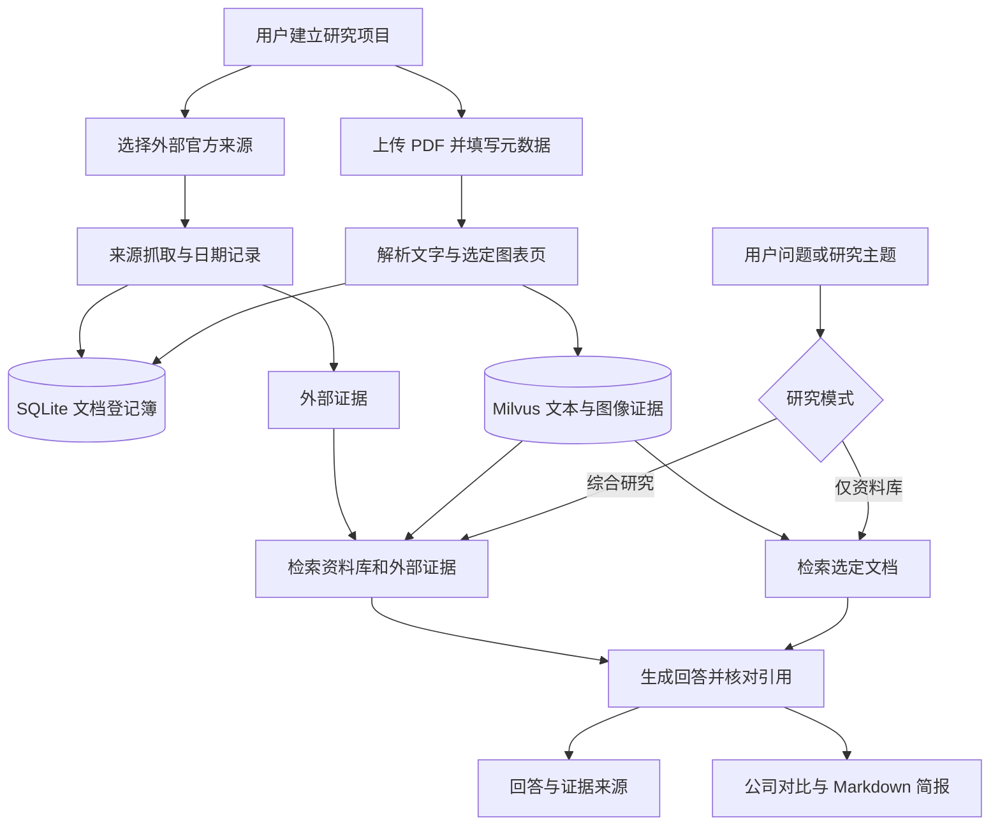
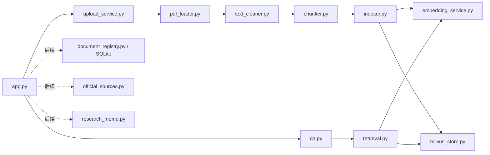

# ResearchKB 新版项目总览：个人多源行研工作台

更新日期：2026-09-28。本文是第六天之后的**新路线**；此前每日复盘记录的是当时的学习过程，不代表后续仍要实现 LangGraph。

## 1. 一句话定位

把个人 PDF、公司官方披露和结构化经营数据整理成可追溯的证据，支持跨行业问答、公司对比与研究简报。美股是第一批外部数据场景；行业不限定为 AI 基础设施。

**当前已完成**：PDF 文本处理、Milvus 向量检索、带页码引用的问答、Streamlit 上传、三个手工指定图表页的视觉描述和检索。现有样本为 5 份 PDF、276 条文本证据、3 条图像证据。

**计划实现**：研究项目与文档元数据、文档管理、从上传流程选择图表页、官方披露来源、综合研究和简报导出。计划中的能力不能当成现有能力向面试官介绍。

## 2. 业务流程图

资料库模式只依据用户选择的文档。综合研究模式需要用户显式开启；回答中的本地页码、外部 URL、发布日期和抓取时间分别展示。来源冲突时标明差异和时间，不让模型擅自把旧数字说成最新数字。

## 3. 当前代码链与未来扩展点

`src/research_kb` 放可复用业务逻辑；`app.py` 负责界面和调用；`scripts` 放一次性操作和验收入口；`tests` 放稳定的回归检查。虚线文件尚未创建，其名称只是建议，写代码时可按实际职责调整。

## 4. 数据边界和技术取舍

| 组件 | 职责 | 当前 / 计划 |
|---|---|---|
| 本地 `data/raw` | 保存原始 PDF | 当前已有 |
| Milvus | 保存 1024 维向量、片段正文、来源、页码和证据 ID | 当前已有 |
| SQLite | 保存研究项目、文档元数据、入库状态和外部来源记录 | 计划新增 |
| 视觉模型 | 将用户选中的 PDF 图表页描述成可检索文字 | 原链路已有，上传集成待做 |
| 文本模型 | 基于检索证据回答和写简报 | 问答已有，简报待做 |
| 官方数据接口 | 获取最新披露或结构化指标，并保留 URL 与时间 | 计划新增 |

Milvus 中已有 279 条证据，不为增加元数据立刻重建 Collection。首版由 SQLite 将唯一保存文件名映射到行业、公司、研究项目；检索仍按 `source` 过滤。若后续发现这个映射已无法可靠支持多项目共享，再设计 `document_id` 和新 Collection 的迁移。

文档哈希负责识别同一份文件，文件名负责当前 Milvus `source` 过滤，两者不能混为一谈。入库状态要区分“文件已保存”“解析完成”“向量写入完成”，避免失败后显示为成功。超过当前处理页数上限的 PDF 要明确显示只处理了前几页。

## 5. 这轮重构解决的具体问题

1. **跨行业**：把 AI 基础设施文案和 Prompt 改成通用行研语义，增加行业、公司、代码、文档类型和日期字段。现有测试样本继续保留。
2. **资料范围**：保留可信的资料库问答，同时增加显式开启的官方来源研究模式。外部信息先从美股公司披露开始，再扩展一般网页和行情。
3. **固定操作**：把手工指定图表页移到上传界面；参数集中管理，但保留合理默认值。测试脚本中的固定问题仍应固定，便于回归。
4. **研究产出**：增加公司或行业对比、带来源的 Markdown 简报。财务数值由来源或代码提供，模型只负责归纳与解释。
5. **质量**：保留拒答和引用校验，扩充跨行业、不同年份和来源冲突的评测集。只有评测表明需要时才加入混合检索或重排。

## 6. 暂不引入的复杂度

当前确定性问答流程不需要 LangGraph。将来出现“自主判断下一步搜哪个来源、补足证据缺口、循环到满足终止条件”的真实需求，再引入状态图。MCP 也等到需要向其他客户端提供统一工具接口时再做。当前依赖列表中已安装这些包，并不等于项目必须使用它们。

研究简报不是自动投资建议。界面需要把原始事实、模型推断和信息缺口分开显示，便于用户核对。

## 7. 开发和学习约定

继续执行 [学习协作约定](学习协作约定.md)：除非你明确要求我直接修改代码，我会先解释文件职责、调用关系，再给你适合亲手输入的分段代码；你运行后贴结果，我检查再进入下一段。

后续给出的 Python 代码统一使用清晰英文命名和**中文注释 / docstring**。特别说明第三方包函数的作用、关键参数及返回值，例如 `Path.name`、`hashlib.sha256`、`sqlite3.connect`、`MilvusClient.search`、`st.session_state`；解释关键变量代表的数据和单位；对页码、日期、文件哈希、异常及幂等边界写“为什么”。不逐行翻译简单 Python 语法。

每日完成后生成新的复盘 Markdown，包含当天的流程图、文件之间的 `import` / 调用 / 数据流、实际命令与结果、遇到的问题和可供面试复述的取舍。
