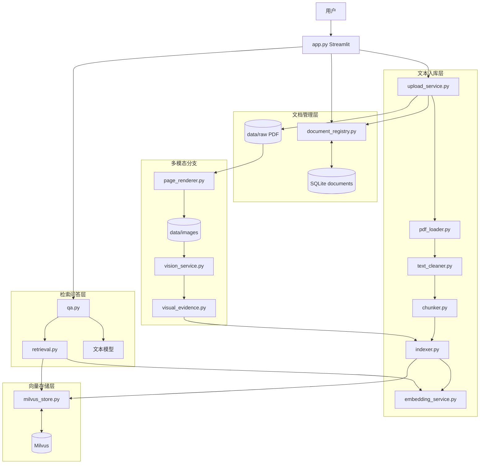
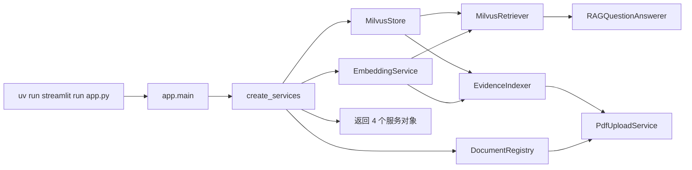
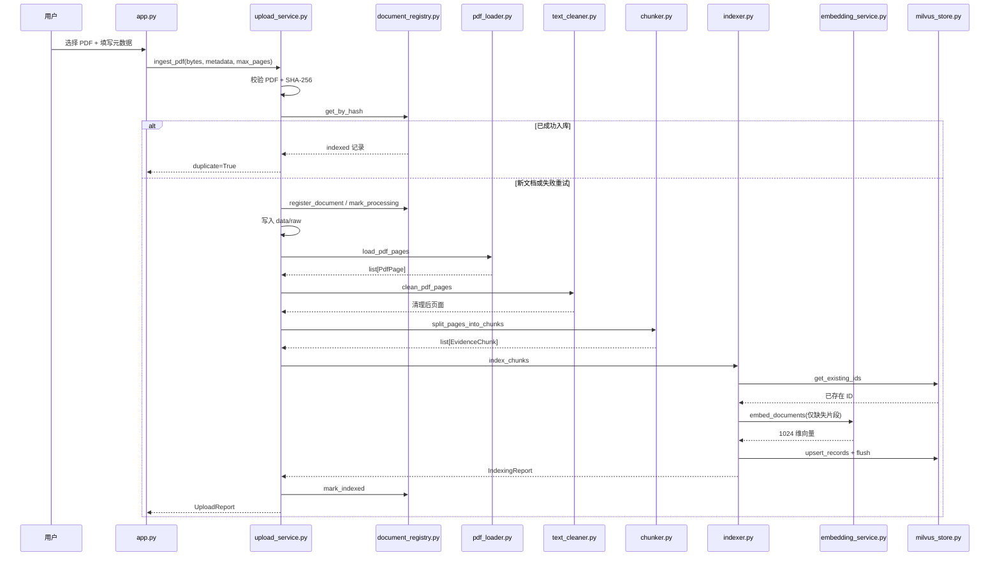
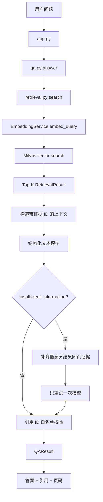
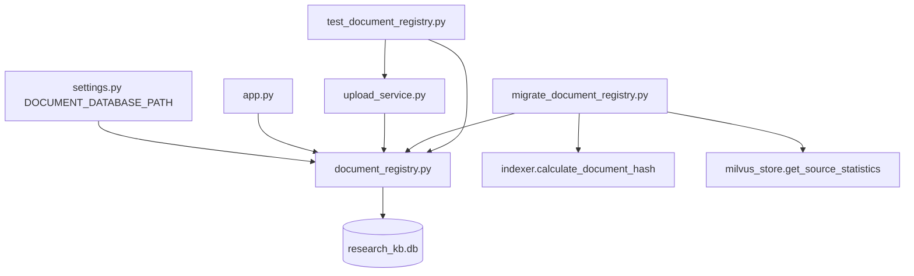
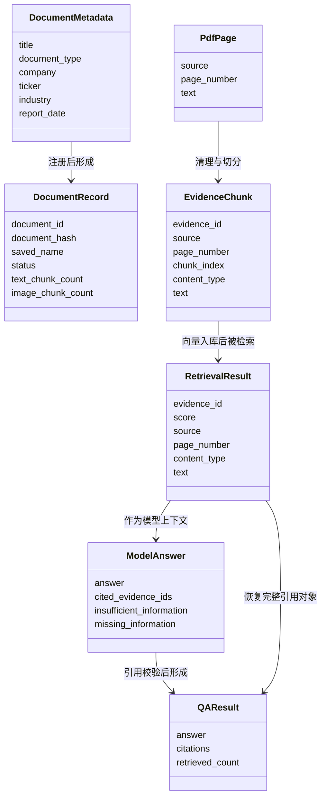
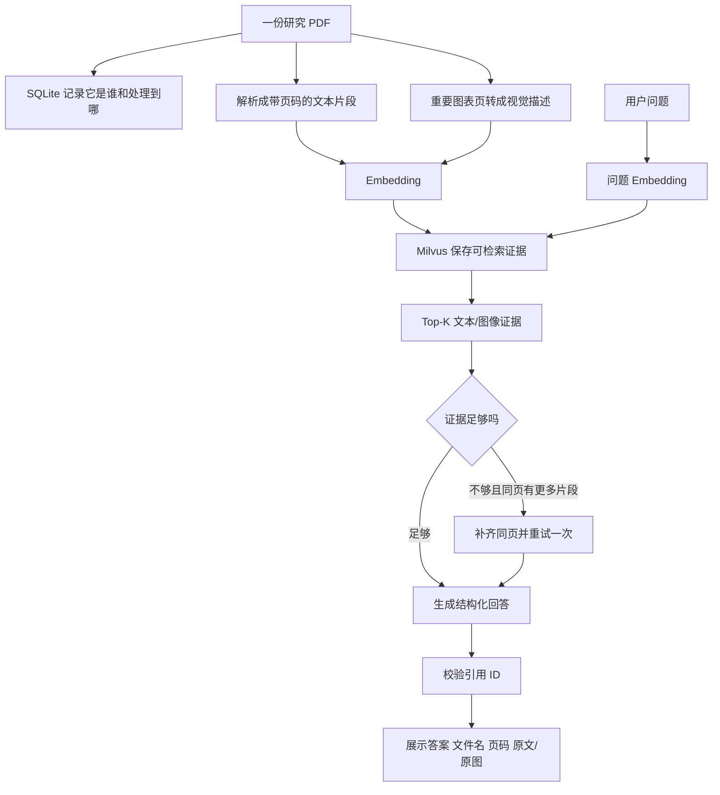

# ResearchKB 前八天完整复盘与代码导读

本文对应第八天结束后的真实代码。目标是帮助你从“会运行项目”进阶到“能沿着调用关系解释项目”。阅读时先看总架构，再按上传、文本 RAG、多模态、文档登记四条分支顺代码。

## 一、项目现在是什么

ResearchKB 是一个面向个人的跨行业多模态研究资料库。用户上传 PDF，系统提取文字、切分证据、生成向量并写入 Milvus；图表页可以由视觉模型转成文字描述后进入同一检索空间；用户提问时，系统只依据检索证据回答，并返回文件名、PDF 物理页码和证据 ID。

第八天结束后，项目使用三种存储：

| 存储 | 保存什么 | 为什么适合 |
|---|---|---|
| `data/raw` 本地文件 | 原始 PDF | 保留原文，支持重新解析和原页查看 |
| SQLite | 一份 PDF 一条文档记录 | 适合元数据、状态、唯一约束和筛选 |
| Milvus | 一份 PDF 拆出的多条文本/图像证据及向量 | 适合语义相似度检索 |

项目当前没有使用 LangGraph。问答流程只有一个边界明确的回退：首轮证据不足时补齐最高分结果所在页，再回答一次。普通 Python 控制流更符合当前复杂度。项目依赖中预留了 MCP 和 LangGraph，但业务代码尚未使用；后续接入官方披露来源时再评估 MCP，只有出现真正需要状态编排的多步骤 Agent 时再使用 LangGraph。

## 二、前八天完成情况

| 天数 | 核心成果 | 形成的能力 |
|---|---|---|
| 第一天 | 环境、目录、PDF 样本和项目骨架 | 项目能稳定运行，资料范围清楚 |
| 第二天 | PDF 加载、文本清理、切分和证据 ID | PDF 变成带来源页码的文本证据 |
| 第三天 | Embedding、Milvus Schema、幂等入库与检索 | 证据可向量化、存储和 Top-K 召回 |
| 第四天 | 结构化问答、引用校验、拒答与评测 | 回答只能引用本轮真实证据 |
| 第五天 | Streamlit 问答、上传和会话展示 | 用户可通过网页上传和提问 |
| 第六天 | PDF 页面渲染、视觉描述、图像证据 | 图表信息可进入统一 RAG 流程 |
| 第七天 | 跨行业通用化、统一配置、同页补全 | 支持传统行业，修复双栏页面召回不全 |
| 第八天 | SQLite 文档登记、状态、迁移和文档级去重 | 文档管理与向量检索职责分离 |

## 三、当前项目目录

```text
ResearchKB/
├─ app.py                         # Streamlit 主页面和服务装配
├─ pyproject.toml                 # Python 版本、运行依赖和测试依赖
├─ .env                           # 本地模型与 Milvus 配置，不提交 Git
├─ .env.example                   # 环境变量示例
├─ data/
│  ├─ raw/                        # 原始 PDF，不提交 Git
│  ├─ images/                     # 渲染的图表页图片，不提交 Git
│  ├─ processed/                  # 中间 JSON 和验收记录，不提交 Git
│  ├─ qa/                         # 人工检查图片，不提交 Git
│  └─ research_kb.db              # SQLite 文档登记簿，不提交 Git
├─ src/research_kb/
│  ├─ settings.py                 # 跨模块默认值和路径
│  ├─ pdf_loader.py               # PDF → PdfPage
│  ├─ text_cleaner.py             # 清理页文本
│  ├─ chunker.py                  # 页面 → EvidenceChunk
│  ├─ embedding_service.py        # 文本 → 1024 维向量
│  ├─ milvus_store.py             # Collection、查询、写入和统计
│  ├─ indexer.py                  # 证据去重、Embedding、Milvus 入库
│  ├─ retrieval.py                # 问题向量检索与同页补全
│  ├─ qa.py                       # 结构化回答和引用校验
│  ├─ upload_service.py           # 上传业务编排
│  ├─ document_registry.py        # SQLite 文档登记簿
│  ├─ page_renderer.py            # PDF 指定页 → PNG
│  ├─ vision_service.py           # PNG → 视觉文字描述
│  └─ visual_evidence.py          # 视觉描述 → 图像证据对象
├─ scripts/
│  ├─ run_streamlit.py            # PyCharm 普通运行按钮入口
│  ├─ inspect_pdf.py              # 检查 PDF 提取结果
│  ├─ build_evidence.py           # 批量生成首轮文本证据
│  ├─ index_milvus.py             # 文本证据批量入库
│  ├─ check_retrieval.py          # 文本检索验收
│  ├─ ask_question.py             # 命令行问答
│  ├─ evaluate_qa.py              # 固定问题回归评测
│  ├─ render_chart_pages.py       # 渲染指定图表页
│  ├─ describe_chart_pages.py     # 生成视觉描述
│  ├─ index_visual_evidence.py    # 图像证据入库
│  ├─ check_multimodal_retrieval.py
│  ├─ check_multimodal_qa.py
│  ├─ migrate_document_registry.py # 历史文档迁移
│  └─ check_upload.py             # 真实重复上传验收
├─ tests/
│  └─ test_document_registry.py   # SQLite 与上传流程离线测试
└─ docs/                          # 每日任务、复盘和设计说明
```

## 四、最终总架构图



总图可拆成下面五条主线：服务启动、PDF 上传、文本问答、多模态图表、SQLite 登记与迁移。

---

## 五、分支一：应用启动与服务装配

### 5.1 流程图



### 5.2 文件联系

`app.py` 是组合根。它不负责解析算法或 SQL，而是创建对象并把依赖传进去：

- `MilvusStore` 负责数据库连接；
- `EmbeddingService` 负责向量模型；
- `MilvusRetriever` 同时需要 Store 和 Embedding；
- `RAGQuestionAnswerer` 依赖 Retriever；
- `EvidenceIndexer` 同时需要 Store 和 Embedding；
- `DocumentRegistry` 负责 SQLite；
- `PdfUploadService` 依赖 Indexer 和 Registry。

这种构造方式叫依赖注入。业务类不在内部偷偷创建所有依赖，因此测试可以把真实 Indexer 换成 `FakeIndexer`。

### 5.3 为什么使用 `st.cache_resource`

Streamlit 每次交互会从上到下重新执行脚本。模型客户端、Milvus 客户端和注册表服务没有必要每次创建，因此 `@st.cache_resource` 缓存这些长生命周期对象。页面数据如 `documents` 仍会在每次重跑时重新查询。

---

## 六、分支二：PDF 上传与文本证据入库

### 6.1 端到端时序图



### 6.2 `pdf_loader.py`

输入是 PDF 路径，输出是逐页对象。每页至少包含：

- 来源文件名；
- 用户看到的物理页码，从 1 开始；
- 提取出的原始文字。

页码必须在这里统一，因为 PyMuPDF 内部从 0 开始，而引用展示从 1 开始。

### 6.3 `text_cleaner.py`

负责把 PDF 提取结果变成适合切分的文本，例如统一空白、处理重复内容和标记空文本页。它不负责向量化，也不决定检索结果。

### 6.4 `chunker.py`

把每页文本切成多个 `EvidenceChunk`。核心字段：

| 字段 | 含义 |
|---|---|
| `evidence_id` | 基于内容与来源生成的稳定 ID |
| `source` | PDF 实际保存文件名 |
| `page_number` | PDF 物理页码 |
| `chunk_index` | 页内片段序号 |
| `content_type` | 文本证据为 `text` |
| `text` | 送入 Embedding 和模型的正文 |

切分默认参数来自 `settings.py`：片段最大 800 字符，相邻片段重叠 120 字符。重叠用于保留跨切分边界的语义。

### 6.5 `indexer.py`

`EvidenceIndexer.index_chunks()` 做四件事：

1. 批量查询哪些 `evidence_id` 已经存在；
2. 只保留缺失片段；
3. 只为缺失片段请求 Embedding；
4. 组装 Milvus 字段并 upsert。

文件哈希按来源只计算一次，随后写入每条证据的 `document_hash` 字段。

### 6.6 `upload_service.py`

它是上传用例的业务编排器，不实现底层 PDF 算法。它决定执行顺序、状态更新和异常处理：

```text
校验 → 哈希查重 → 登记 → processing → 写文件 → 解析 → 入库 → indexed
                                                      └异常→ failed
```

`UploadReport` 是给页面展示的结果，不是数据库实体。

---

## 七、分支三：文本 RAG 问答

### 7.1 主流程



### 7.2 `retrieval.py`

`MilvusRetriever.search()`：

1. 校验问题和 Top-K；
2. 把问题转成 1024 维向量；
3. 可选地添加 `source` 文件名过滤；
4. 执行 COSINE 检索；
5. 将 Milvus 返回值转换成 `RetrievalResult`。

`RetrievalResult` 是检索层统一的数据结构，保存 ID、分数、文件名、页码、片段序号、证据类型和正文。

### 7.3 为什么要同页补全

Target 年报第 4 页采用双栏排版。四个经营优先事项被拆到 7 个片段，Top-5 只召回其中一部分。模型正确地判断证据不足。

`expand_top_result_page()` 以最高分证据的 `source + page_number` 为锚点，从 Milvus 精确读取同一物理页的片段。因为标量 `query()` 不返回相似度，代码使用问题向量和已有文档向量重新计算余弦相似度。

### 7.4 `qa.py`

`ModelAnswer` 使用 Pydantic 约束模型返回：

- `answer`；
- `cited_evidence_ids`；
- `insufficient_information`；
- `missing_information`。

`_validate_citations()` 将模型返回的 ID 与本轮证据白名单比较。模型引用不存在的 ID 会抛出异常；模型声称信息充足但不提供引用，也会抛出异常。

模型最多调用两次：首轮一次；只有首轮明确证据不足且存在更多同页片段时，再调用一次。

---

## 八、分支四：多模态图表证据

### 8.1 流程图

```mermaid
flowchart LR
    PDF[原始 PDF] --> RP[render_chart_pages.py]
    RP --> PR[page_renderer.py]
    PR --> PNG[data/images/page_XXXX.png]
    PNG --> DP[describe_chart_pages.py]
    DP --> VS[vision_service.py]
    VS --> JSON[visual_descriptions.json]
    JSON --> IV[index_visual_evidence.py]
    IV --> VE[visual_evidence.py]
    VE --> IDX[indexer.py]
    IDX --> MV[(Milvus content_type=image)]
    MV --> RET[retrieval.py]
    RET --> QA[qa.py]
    QA --> APP[app.py 显示描述和原图]
```



### 8.2 为什么不是把图片向量直接存进去

当前 Embedding 模型是文本向量模型。视觉模型先读取图表，生成包含标题、数值、比例、趋势和单位的文字描述，再把描述当作 `image` 类型证据向量化。这样文本问题和图表描述可以进入同一个向量空间。

### 8.3 图像证据和文本证据如何统一

两类证据共享：

- `evidence_id`；
- `source`；
- `page_number`；
- `chunk_index`；
- `text`；
- `vector`。

区别只在 `content_type`。页面遇到 `image` 引用时，通过 `page_renderer.get_page_image_path()` 定位 PNG，同时显示视觉描述和原图。

### 8.4 当前三条图像证据

| 文件 | 页码 | 内容 |
|---|---:|---|
| NVIDIA 年报 | 3 | AI 五层架构 |
| Lumentum 投资者演示 | 30 | 光学 AI TAM 与带宽结构 |
| Seagate 行业报告 | 11 | 可持续存储前三大障碍 |

多模态检索和问答验收均为 3/3。

---

## 九、分支五：SQLite 文档登记与迁移

### 9.1 文件调用图



### 9.2 `DocumentMetadata` 与 `DocumentRecord`

`DocumentMetadata` 是写入输入，只包含用户需要填写的业务信息。`DocumentRecord` 是读取输出，包含数据库全部字段和处理统计。

分开定义的好处是：用户上传时不应该自己提供 `document_id`、哈希、上传时间和状态，这些字段必须由系统生成。

### 9.3 SQL 参数为什么使用 `?`

示例：

```python
connection.execute(
    "SELECT * FROM documents WHERE document_hash = ?",
    (document_hash,),
)
```

变量不直接拼进 SQL 字符串。参数化查询可以正确处理特殊字符，也避免 SQL 注入。

### 9.4 `register_document()` 返回两个值

返回 `(DocumentRecord, created)`：

- 新哈希：插入并返回 `created=True`；
- 已有哈希：返回旧记录和 `created=False`。

调用者因此不需要先查询再决定是否插入，同时能知道本次是否创建了记录。

### 9.5 迁移脚本

`scripts/migrate_document_registry.py` 读取：

- `data/raw`：发现 PDF、计算哈希和总页数；
- Milvus：读取文本数、图像数和最大证据页码；
- `KNOWN_METADATA`：为六份历史资料补充公司、Ticker 和行业。

脚本可以重复运行。第二次会按哈希跳过，不会重复登记或修改向量。

---

## 十、核心数据模型之间的关系



## 十一、当前真实数据状态

| 文档 | 文本 | 图像 | 已处理到页码 |
|---|---:|---:|---:|
| NVIDIA | 59 | 1 | 20 |
| AMD | 20 | 0 | 7 |
| Lumentum | 40 | 1 | 30 |
| Micron | 71 | 0 | 15 |
| Seagate | 86 | 1 | 28 |
| Target | 32 | 0 | 10 |
| 合计 | 308 | 3 | — |

SQLite 有 6 条 `indexed` 文档记录；Milvus 有 311 条有效证据。

## 十二、第三方包在项目中的作用

| 包 | 使用位置 | 作用 |
|---|---|---|
| PyMuPDF `pymupdf` | loader、renderer、upload、migration | 验证 PDF、提取文字、读取页数、渲染图片 |
| LangChain | embedding、qa | 统一模型接口、消息对象和结构化输出 |
| `langchain-openai` | embedding、qa、vision | 调用兼容 OpenAI 协议的云模型接口 |
| Pydantic | qa | 约束文本模型输出结构 |
| PyMilvus | milvus_store | Collection Schema、向量查询和标量查询 |
| Streamlit | app.py | 页面、会话状态、上传和聊天组件 |
| python-dotenv | 模型与 Milvus 服务 | 从 `.env` 读取配置 |
| pytest | tests | 临时目录、异常断言和 monkeypatch |
| sqlite3 | document_registry | Python 标准库本地关系数据库 |

## 十三、推荐的顺代码路线

不要一开始逐行看 `app.py`。推荐按数据变换顺序阅读：

### 第一遍：理解文本如何入库

```text
settings.py
→ pdf_loader.py
→ text_cleaner.py
→ chunker.py
→ embedding_service.py
→ milvus_store.py
→ indexer.py
```

你要能回答：一页 PDF 如何变成一条带向量和页码的 Milvus 记录？

### 第二遍：理解问题如何变成回答

```text
retrieval.py
→ qa.py
→ app.py 的 render_qa_result
```

你要能回答：模型拿到哪些证据，引用 ID 如何防止伪造，何时会重试？

### 第三遍：理解上传业务和状态

```text
document_registry.py
→ upload_service.py
→ app.py 的上传区域
→ migrate_document_registry.py
→ test_document_registry.py
```

你要能回答：相同文件为何不重复计费，失败后为何仍能在页面看到？

### 第四遍：理解多模态分支

```text
page_renderer.py
→ vision_service.py
→ visual_evidence.py
→ 三个视觉脚本
→ app.py 的图像引用展示
```

你要能回答：文本问题为什么能够召回图表，以及用户如何回看原图？

## 十四、常用运行与验收命令

```powershell
# 全项目语法检查
uv run python -m compileall -q src scripts app.py

# 自动化测试
uv run pytest -q

# 历史文档迁移；重复运行应全部跳过
uv run python scripts\migrate_document_registry.py

# 真实重复上传验收
uv run python scripts\check_upload.py

# 原有文本问答回归
uv run python scripts\evaluate_qa.py

# 多模态检索与回答回归
uv run python scripts\check_multimodal_retrieval.py
uv run python scripts\check_multimodal_qa.py

# 启动网页
uv run streamlit run app.py
```

停止 Streamlit：在运行服务的终端按 `Ctrl + C`。

## 十五、前八天遇到的代表性问题

### 15.1 `ModuleNotFoundError: research_kb`

原因是直接运行脚本时包路径没有按项目安装方式解析。使用 `uv run` 并在项目根目录运行，配合 `pyproject.toml` 的 `src` 包配置解决。

### 15.2 Streamlit 当普通 Python 文件运行

`app.py` 需要 Streamlit 的运行上下文。PyCharm 使用 `scripts/run_streamlit.py` 或模块 `streamlit` 参数 `run app.py`，不能直接执行 `python app.py`。

### 15.3 双栏 PDF 答案不完整

问题在召回上下文，而不是 Prompt。用“首轮不足 → 补最高分页内片段 → 只重试一次”修复。

### 15.4 Lumentum OCS 题失败

样本页没有所问的明确收入运行率证据。系统拒答是正确行为，不能为了通过评测让模型编造。

### 15.5 SQLite 临时文件无法删除

原因是 `sqlite3.Connection` 的 `with` 不自动关闭连接。使用 `@contextmanager` 在 `finally` 中显式 `close()`。

### 15.6 迁移脚本发现 0 个 PDF

脚本错误地放进了 `src/research_kb`，而 `parents[1]` 是按 `scripts` 目录层级编写的。把入口脚本移回 `scripts` 后路径恢复正确。

## 十六、面试时如何介绍项目

### 16.1 一分钟版本

> 我做了一个个人多模态行研资料库。PDF 上传后经过页级提取、清理和带重叠切分，使用文本 Embedding 写入 Milvus；图表页由视觉模型生成结构化描述后进入同一检索空间。问答只允许使用本轮召回证据，模型引用 ID 会经过白名单校验，证据不足时明确拒答。为了解决双栏页面片段分散的问题，我增加了有边界的同页补全重试。文档级元数据和处理状态保存在 SQLite，向量证据保存在 Milvus，并使用文件哈希与稳定证据 ID 两层去重控制重复费用。

### 16.2 技术取舍

- SQLite 管业务实体，Milvus 管语义证据；
- 文档级 SHA-256 去重，片段级 evidence ID 去重；
- 图表转文字描述复用文本向量空间；
- 证据不足只执行一次同页补全，不引入不必要的 LangGraph；
- 失败保留状态和错误，支持幂等重试；
- 当前单用户本地使用，因此不引入账号、权限和分布式任务队列。

### 16.3 可以主动说明的限制

- 只处理可提取文本的 PDF，纯扫描件尚未加入 OCR；
- 图表页目前仍由脚本指定，第十天才进入上传页面；
- 资料只来自用户上传，第十一天计划接入 SEC 官方披露；
- 向量检索目前没有 BM25 和重排，是否增加要通过评测决定；
- SQLite 适合当前单用户规模，多用户版本需要 PostgreSQL 和后台任务系统。

## 十七、当前端到端心智模型



记住五个核心对象即可串起项目：

```text
DocumentRecord → PdfPage → EvidenceChunk → RetrievalResult → QAResult
```

它们分别对应：一份文档、一页原文、一条可入库证据、一条检索结果、一次最终回答。

