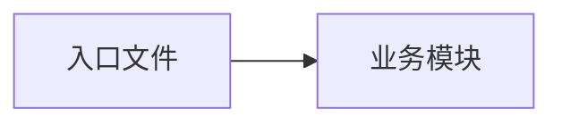

# 第 N 天复盘

## 1. 今日目标与完成情况

## 2. 新建或修改的文件

| 文件 | 职责 | 被谁引用 | 引用了谁 |
|---|---|---|---|

## 3. 文件关系图

## 4. 调用顺序和数据流

## 5. 核心代码解释

## 6. 运行命令与实际结果

## 7. 错误与解决过程

## 8. 今天掌握的知识点

## 9. 面试可能追问

## 10. 明天开始前的准备
