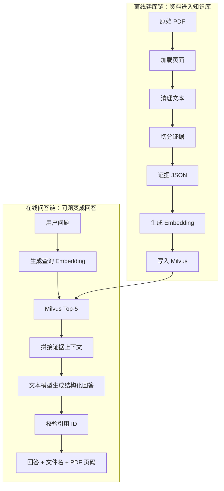
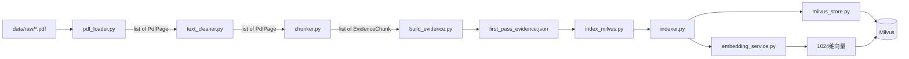
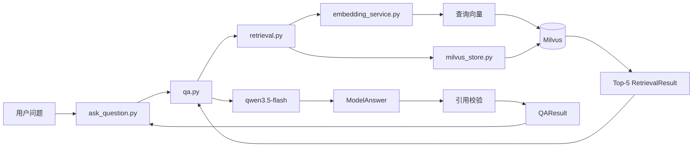

# ResearchKB 第1至4天总体框架与二次学习路线

日期：2026-09-26

## 1. 先用一句话理解项目

ResearchKB 是一个面向 AI 基础设施行业研究的个人 RAG 知识库：系统先把 NVIDIA、AMD、Lumentum、Micron 和 Seagate 的 PDF 处理成可检索证据，再根据用户问题从 Milvus 找到相关片段，让大模型只依据这些片段回答，并显示原始文件和 PDF 物理页码。

当前完成的是文本 RAG 主链。Streamlit、多模态图表、LangGraph 和 MCP 尚未进入主链。

## 2. 不要把项目理解成很多零散文件

当前项目只有两条真正重要的主链：

1. **离线建库链**：PDF 进入知识库。
2. **在线问答链**：用户问题变成带引用的回答。

环境检查、初始化和评测脚本都围绕这两条主链服务。



只要先把这两条链连起来，所有文件就有位置了。

## 3. 项目的三层结构

### 3.1 核心业务层：`src/research_kb`

这里存放可以被其他代码重复调用的业务模块。

```text
src/research_kb/
├── pdf_loader.py          PDF → 页面
├── text_cleaner.py        原始页面 → 清理页面
├── chunker.py             页面 → 证据片段
├── embedding_service.py   文本 → 1024维向量
├── milvus_store.py        Milvus连接、Schema和读写
├── indexer.py             证据 → 向量 → Milvus实体
├── retrieval.py           问题 → Top-K证据
├── qa.py                  Top-K证据 → 有引用回答
└── __init__.py            声明Python包
```

### 3.2 运行入口层：`scripts`

这里的文件负责“启动一个流程”，不保存主要业务逻辑。

```text
scripts/
├── build_evidence.py      启动离线解析和切分
├── index_milvus.py        启动向量入库
├── ask_question.py        启动一次完整问答
├── setup_milvus.py        初始化Collection
├── inspect_pdf.py         检查PDF解析
├── check_embeddings.py    检查Embedding
├── check_retrieval.py     检查Top-5
├── evaluate_qa.py         检查问答和拒答
├── check_day1.py          检查本地环境
└── check_cloud_models.py  检查云端模型
```

可以把 `scripts` 理解成各种“启动按钮”，把 `src/research_kb` 理解成按钮背后的机器。

### 3.3 数据、配置和文档层

```text
data/raw/          原始PDF，只保存在本机
data/processed/    可重新生成的JSON，不提交Git
docs/              每日复盘和资料清单
.env               密钥和本机地址，不提交Git
.env.example       配置字段示例
pyproject.toml     Python版本和项目依赖
uv.lock            实际安装版本锁定
```

## 4. 四天是怎样逐步搭出主链的

### 第1天：只确认基础设施能用

第1天没有正式RAG业务，主要回答这些问题：

- Python环境是否正确？
- 所需依赖能否导入？
- PDF能否读取？
- 文本、视觉和Embedding接口能否调用？
- Windows能否连接虚拟机Milvus？
- Ollama和Attu是否可用？

对应文件：

```text
scripts/check_day1.py
scripts/check_cloud_models.py
.env.example
pyproject.toml
```

第1天相当于检查材料和工具，尚未开始生产。

### 第2天：把PDF变成证据

第2天建立离线链的前半段：

```text
PDF
  → PdfPage
  → 清理后的PdfPage
  → EvidenceChunk
  → first_pass_evidence.json
```

实际处理了100个物理页，生成276条证据。

### 第3天：把证据写入向量数据库并能检索

第3天建立离线链后半段和在线链前半段：

```text
EvidenceChunk
  → 1024维Embedding
  → Milvus实体

用户问题
  → 查询Embedding
  → COSINE Top-5
  → RetrievalResult
```

最终276条证据进入Milvus，5个问题都在Top-5命中正确报告。

### 第4天：让模型依据证据回答

第4天完成在线链后半段：

```text
RetrievalResult
  → 带ID的上下文
  → ModelAnswer
  → 引用校验
  → QAResult
```

最终库内问题通过4/5，库外问题拒答3/3。

## 5. 离线建库链：每个文件怎样连接

这是二次学习时应该先掌握的链。



### 5.1 `pdf_loader.py`：只负责读取

核心对象：

```text
PdfPage
├── source
├── page_number
└── text
```

核心函数：

```text
load_pdf_pages(pdf_path) -> list[PdfPage]
```

它不清理文本、不切片、不调用模型。它只保证每一页都有文件名、从1开始的物理页码和正文。

### 5.2 `text_cleaner.py`：只负责清理

导入关系：

```python
from research_kb.pdf_loader import PdfPage
```

输入和输出都是 `PdfPage`。变化的只有 `text`，文件名和页码继续保留。

```text
原始PdfPage
  ↓ clean_page_text()
删除多余空白、独立页码、换行断词
  ↓ clean_pdf_pages()
新的PdfPage
```

### 5.3 `chunker.py`：把页面变成检索单位

导入 `PdfPage`，输出 `EvidenceChunk`。

```text
EvidenceChunk
├── evidence_id
├── source
├── page_number
├── chunk_index
├── content_type
└── text
```

这里发生了非常重要的对象转换：从“页面”变成“证据”。

`RecursiveCharacterTextSplitter`控制片段最大800字符、重叠120字符。切分按页进行，因此一条证据不会跨PDF物理页。

`build_evidence_id()`使用文件名、页码、页内序号和正文生成稳定SHA-256 ID。这个ID以后同时用于Milvus主键和回答引用。

### 5.4 `build_evidence.py`：离线解析总调度

它本身不是底层算法，而是按顺序调用：

```python
load_pdf_pages()
clean_pdf_pages()
split_pages_into_chunks()
```

然后把 `EvidenceChunk` 转成字典并写入JSON。

`DocumentPlan`定义每份PDF首轮处理多少页。它让5份PDF共用一套流程。

### 5.5 `embedding_service.py`：统一管理向量模型

它提供两个入口：

```text
embed_documents(texts)  文档文本 → 文档向量
embed_query(query)      用户问题 → 查询向量
```

文档和问题必须使用同一个Embedding模型，才能在同一个向量空间比较。

当前模型返回1024维向量，代码会检查维度，防止Milvus Schema与模型不一致。

### 5.6 `milvus_store.py`：数据库适配层

这个文件把PyMilvus的操作集中起来：

- 连接Milvus。
- 创建八字段Schema。
- 创建COSINE向量索引。
- 查询已有ID。
- 批量upsert。
- 查询实体数量。
- flush持久化。

其他模块不需要重复处理URI、Collection名称和Schema。

### 5.7 `indexer.py`：把证据真正写入Milvus

它同时依赖三个模块：

```text
EvidenceChunk
EmbeddingService
MilvusStore
```

入库流程：

```text
一批EvidenceChunk
  ↓ 查询已有evidence_id
  ├── 已存在：跳过
  └── 不存在：生成Embedding
                  ↓
              组装Milvus实体
                  ↓
                upsert
```

它还计算PDF文件哈希。`evidence_id`标识片段，`document_hash`标识PDF文件版本。

### 5.8 `index_milvus.py`：启动入库

它完成对象装配：

```python
store = MilvusStore()
embedding_service = EmbeddingService()
indexer = EvidenceIndexer(store, embedding_service)
indexer.index_chunks(chunks)
```

这类代码称为组合根或应用入口：它负责创建对象，并把对象连接起来。

## 6. 在线问答链：每个文件怎样连接

掌握离线链后，再学习在线链。



### 6.1 `retrieval.py`：只负责找证据

它依赖：

```python
EmbeddingService
MilvusStore
```

流程：

```text
问题字符串
  ↓ embed_query()
1024维向量
  ↓ Milvus COSINE search
Top-K命中
  ↓
list[RetrievalResult]
```

`RetrievalResult`统一保存分数、文件名、页码、正文和证据ID。

可选 `source` 参数会生成Milvus过滤表达式，只检索指定PDF。

### 6.2 `qa.py`：只负责依据证据回答

它不直接操作Milvus，而是调用 `MilvusRetriever.search()`。

主要步骤：

```text
answer(question)
  ↓ retriever.search()
Top-5证据
  ↓ _build_context()
带证据ID的Prompt
  ↓ ChatOpenAI.with_structured_output()
ModelAnswer
  ↓ _validate_citations()
QAResult
```

### 6.3 为什么有 `ModelAnswer` 和 `QAResult` 两个对象

`ModelAnswer`是大模型返回的内容。即使它符合Pydantic格式，也仍然可能引用一个不存在的ID。

`QAResult`是Python校验后的结果。它的引用已经从真实 `RetrievalResult` 中重新映射，可以安全展示文件名和页码。

```text
模型输出 ≠ 最终可信输出

模型输出
  ↓ 代码校验
最终可信输出
```

### 6.4 `ask_question.py`：启动一次问答

它负责组装完整对象：

```python
retriever = MilvusRetriever(
    store=MilvusStore(),
    embedding_service=EmbeddingService(),
)

answerer = RAGQuestionAnswerer(
    retriever=retriever,
    top_k=5,
)
```

随后调用：

```python
result = answerer.answer(question)
```

### 6.5 `evaluate_qa.py`：批量验收业务效果

它重复调用 `answer()`，但不实现新的RAG逻辑。

验收规则：

- 库内问题：模型认为信息充足，并引用预期PDF。
- 库外问题：模型明确标记信息不足。

最终结果是4/5和3/3。

## 7. 六种核心数据对象如何演化

这是连接全部代码最重要的一张表。

| 阶段 | 对象 | 由谁产生 | 交给谁 |
|---|---|---|---|
| PDF读取 | `PdfPage` | `pdf_loader.py` | `text_cleaner.py` |
| 文本切分 | `EvidenceChunk` | `chunker.py` | JSON、`indexer.py` |
| 数据库存储 | Milvus实体字典 | `indexer.py` | `MilvusStore` |
| 向量检索 | `RetrievalResult` | `retrieval.py` | `qa.py` |
| 模型生成 | `ModelAnswer` | ChatOpenAI | `qa.py`引用校验 |
| 最终输出 | `QAResult` | `qa.py` | CLI或未来Streamlit |

对象变化可以记成：

```text
PdfPage
  → EvidenceChunk
  → Milvus实体
  → RetrievalResult
  → ModelAnswer
  → QAResult
```

## 8. 二次学习的推荐阅读顺序

不要先读所有检查脚本，也不要从最长的 `qa.py` 开始。按下面顺序学习。

### 第0步：先看项目边界

1. `README.md`
2. `.env.example`
3. `pyproject.toml`

回答三个问题：项目解决什么问题、依赖哪些外部服务、入口在哪里。

### 第1组：PDF如何变成证据

1. `pdf_loader.py`
2. `text_cleaner.py`
3. `chunker.py`
4. `build_evidence.py`

每读一个文件，都写下：输入类型、输出类型、它调用谁、谁调用它。

学习完成标志：能够不看代码画出：

```text
PDF → PdfPage → EvidenceChunk → JSON
```

### 第2组：证据如何进入Milvus

5. `embedding_service.py`
6. `milvus_store.py`
7. `indexer.py`
8. `index_milvus.py`

学习完成标志：能够解释为什么重复入库时新增0、跳过276。

### 第3组：问题如何找到证据

9. `retrieval.py`
10. `check_retrieval.py`

学习完成标志：能够解释问题文本怎样变成Top-5，以及COSINE分数代表什么。

### 第4组：证据如何变成可靠回答

11. `qa.py`
12. `ask_question.py`
13. `evaluate_qa.py`

学习完成标志：能够解释模型为什么不能直接决定最终引用。

### 第5组：最后再看辅助脚本

14. `inspect_pdf.py`
15. `check_embeddings.py`
16. `setup_milvus.py`
17. `check_day1.py`
18. `check_cloud_models.py`

这些文件用于检查某一层，不是主业务链。最后阅读更容易理解它们在检查什么。

## 9. 阅读一个文件时固定问六个问题

二次学习不要只逐行看语法。对每个文件回答：

1. 这个文件的业务职责是什么？
2. 它接收什么输入？
3. 它返回什么输出？
4. 它导入了哪些项目模块？
5. 哪个脚本会调用它？
6. 如果它出错，最终现象是什么？

例如 `retrieval.py`：

```text
职责：查找证据
输入：用户问题、top_k、可选source
输出：list[RetrievalResult]
依赖：EmbeddingService、MilvusStore
调用者：qa.py、check_retrieval.py
错误现象：回答缺少关键证据，或引用错误报告
```

## 10. 最有效的二次学习方法：跟踪一条数据

### 练习A：跟踪一条PDF证据

选择NVIDIA第3页，依次查看：

1. `load_pdf_pages()`产生的 `PdfPage`。
2. `clean_pdf_pages()`清理前后的字符数。
3. `split_pages_into_chunks()`产生的 `EvidenceChunk`。
4. JSON中的 `text_341da3ba34a2c7fc`。
5. Attu中相同 `evidence_id` 的Milvus实体。
6. NVIDIA问答结果中的相同引用ID。

这会把第2、3、4天全部连成一条线。

### 练习B：跟踪一个用户问题

使用：

```text
NVIDIA如何描述AI基础设施的主要层级？
```

依次观察：

1. `EmbeddingService.embed_query()`返回1024维向量。
2. `MilvusRetriever.search()`返回Top-5。
3. `_build_context()`怎样加入ID、文件名和页码。
4. `ModelAnswer`返回哪些引用ID。
5. `_validate_citations()`怎样映射真实对象。
6. `ask_question.py`怎样显示最终答案。

## 11. 建议在PyCharm设置的断点

按执行顺序设置断点：

```text
scripts/ask_question.py
└── result = answerer.answer(...)

src/research_kb/qa.py
├── retrieved_results = self.retriever.search(...)
├── context = self._build_context(...)
├── model_answer = self._structured_model.invoke(...)
└── citations = self._validate_citations(...)

src/research_kb/retrieval.py
├── query_vector = self.embedding_service.embed_query(...)
└── search_response = self.store.client.search(...)
```

每次只观察变量的“类型、长度、前一项”，不要一次展开1024维向量。

## 12. 业务视角下的完整流程

### 知识库管理员流程

```text
准备官方行业PDF
  ↓
运行build_evidence.py
  ↓
人工检查证据JSON
  ↓
运行setup_milvus.py
  ↓
运行index_milvus.py
  ↓
在Attu检查Schema和实体
  ↓
运行check_retrieval.py和evaluate_qa.py
```

### 最终用户流程

```text
输入行业问题
  ↓
系统从知识库找5条证据
  ↓
模型只根据证据生成中文回答
  ↓
系统校验模型引用
  ↓
用户看到结论、文件名和PDF页码
  ↓
用户可以回到原始报告核对
```

这个项目的业务价值不是“让模型什么都知道”，而是让个人研究者能够在一组可信行业资料中快速定位依据，并知道系统何时没有足够证据。

## 13. 各技术栈在项目中的真实位置

| 技术 | 当前作用 |
|---|---|
| Python | 数据结构、流程控制、文件处理和模块组织。 |
| PyMuPDF | 按页提取PDF文本。 |
| LangChain Text Splitters | 将页面递归切成证据片段。 |
| LangChain OpenAIEmbeddings | 调用兼容接口生成文档和查询向量。 |
| LangChain ChatOpenAI | 调用文本模型并生成Pydantic结构化结果。 |
| Milvus | 保存向量、正文和来源元数据，执行COSINE检索。 |
| Attu | 可视化检查Milvus Schema、索引和实体。 |
| RAG | 把检索证据交给模型，限制回答依据。 |
| Git/GitHub | 保存每天稳定节点，避免代码丢失。 |
| Streamlit | 尚未接入，第5天负责演示页面。 |
| LangGraph | 尚未接入，后续负责有限状态工作流。 |
| MCP | 尚未接入，后续把检索能力暴露为标准工具。 |

不要在面试中说当前已经使用LangGraph或MCP完成主流程。现阶段真正运行的是LangChain、Milvus和普通Python编排。

## 14. 项目必须始终成立的约束

这些约束一旦被破坏，RAG结果就不可信：

1. `page_number`必须是用户看到的、从1开始的物理页码。
2. 一条 `EvidenceChunk`不能跨物理页。
3. 文档向量和查询向量必须使用同一个模型。
4. Milvus向量维度必须等于模型实际维度1024。
5. `evidence_id`必须稳定，重复运行不能随机变化。
6. 模型引用的ID必须属于本次检索结果。
7. 没有证据时必须说明不足，不能补数字。
8. `.env`和原始PDF不能提交到GitHub。

## 15. Lumentum案例怎样贯穿整个框架

问题：

```text
Lumentum预计OCS业务何时达到怎样的收入运行率？
```

事实：正确证据在PDF第10页，并已解析、切分和入库：

```text
OCS Ramping to >$1B 2027 Run Rate
```

但它在向量检索中排第6，Top-5上下文没有它。模型因此拒答。

这个案例说明：

```text
PDF解析正确
证据切分正确
Milvus入库正确
文档来源召回正确
精确片段召回失败
模型拒答正确
```

RAG不是一个“对或错”的黑盒。可以沿数据链定位错误属于解析、切分、入库、检索还是生成。

## 16. 建议的四轮二次学习安排

### 第一轮：只画图，不背代码

- 画出离线链和在线链。
- 写出六个数据对象。
- 给每个文件写一句职责。

### 第二轮：跟踪一条证据

- 从NVIDIA第3页开始。
- 追踪到JSON、Milvus、检索结果和最终引用。
- 在PyCharm中观察对象字段。

### 第三轮：跟踪一个问题

- 从 `ask_question.py` 的 `main()` 开始单步调试。
- 进入 `qa.py`、`retrieval.py`、Embedding和Milvus。
- 观察每一步输入输出，不研究第三方库内部源码。

### 第四轮：脱离代码复述

尝试在三分钟内回答：

1. PDF怎样进入Milvus？
2. 用户问题怎样得到答案？
3. 如何防止重复入库？
4. 如何防止虚假引用？
5. Lumentum问题为什么失败？

无法清楚复述的部分，再回到对应模块学习。

## 17. 面试中的一分钟介绍

> 我做了一个面向美股AI基础设施研究的个人RAG知识库。离线部分使用PyMuPDF按物理页解析公司年报，通过LangChain递归切分生成稳定证据ID，再调用Embedding接口生成1024维向量，连同文件名、页码和正文写入Milvus。在线部分把中文问题向量化后执行COSINE Top-5检索，将证据和ID交给文本模型生成结构化回答，并在Python中校验引用ID确实来自本次检索结果。当前首轮处理5份报告的100页、276条证据，检索来源测试5/5，问答测试4/5，3个库外问题全部拒答。Attu用于检查Schema、索引和实体，GitHub保存每天的稳定版本。

## 18. 判断自己是否真正连起来了

如果你能够不看代码完成下面三件事，说明框架已经建立：

1. 从 `ask_question.py` 开始，说出最终会调用哪些核心类。
2. 从一个 `evidence_id` 开始，反向找到PDF文件和物理页码。
3. 面对错误回答时，说明应该检查解析、切分、检索还是生成。

现阶段最优先掌握的是两条主链和六个数据对象。具体正则、PyMilvus参数和Prompt措辞可以在需要时查代码，不需要全部背诵。
