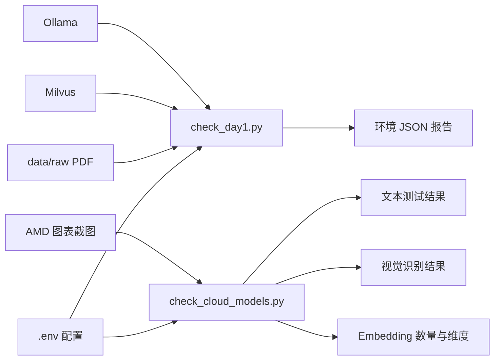

# 第一天记录

## 已完成

- 创建 `E:\AI-Agent-Projects\ResearchKB` 项目目录。
- 建立独立 Python 3.11 虚拟环境并用 `uv.lock` 锁定依赖。
- 下载 5 份 AI 基础设施官方 PDF，覆盖算力芯片、光通信、内存和数据存储。
- 校验 PDF 文件头、页数、文字提取和代表页面渲染。
- 验证 Windows 到虚拟机 Milvus 的连接。
- 使用本地 Ollama `qwen3:1.7b` 进行文本模型冒烟测试。

## 尚需用户完成

- 在已经准备好的 `.env` 中填入一个支持文本、视觉和 Embedding 的 OpenAI 兼容 API Key。
- 在 PyCharm 中将项目解释器设为 `.venv\Scripts\python.exe`。
- 自己运行一次环境检查脚本并阅读输出。

## 已验证版本

- Python 3.11.9
- LangChain 1.4.2
- LangGraph 1.2.12
- langchain-milvus 0.4.0
- PyMilvus 3.0.2
- Streamlit 1.64.0
- MCP 1.30.0

## 第一阶段范围

首轮入库只处理样本清单中的 100 页。MongoDB 暂不使用；Milvus 保存证据和向量，Attu 用于检查数据。

## 今天的代码如何关联

今天一共建立了三个 Python 文件：

```text
scripts/check_day1.py
    ├── 读取 data/raw 下的 PDF
    ├── 连接虚拟机 Milvus
    ├── 调用本地 Ollama
    └── 检查项目依赖和云端配置是否齐全

scripts/check_cloud_models.py
    ├── 读取同一个 .env
    ├── 读取 data/qa/amd_p3.png
    └── 分别调用文本、视觉和 Embedding 接口

src/research_kb/__init__.py
    └── 声明项目包和版本，目前没有被两个检查脚本引用
```

两个检查脚本之间没有互相 `import`。它们共享 `.env` 和项目数据目录：`check_day1.py` 负责本地环境总检查，`check_cloud_models.py` 专门验证需要 API Key 的三类云端能力。拆开的原因是即使没有云端 Key，也能先验证 PDF、Milvus 和 Ollama。

## 从输入到输出的数据流



## 实际验收结果

- 文本模型：`CLOUD_TEXT_OK`
- 视觉模型：正确识别 `FY2023`、`FY2024`、`FY2025`
- Embedding：返回 2 条向量，每条 1024 维
- Milvus：连接成功，当前 Collection 为空
- 本地模型：`qwen3:1.7b` 返回 `DAY1_OK`
- PDF：5 份，共 480 页

结论：第一天任务通过，可以进入第二天。
