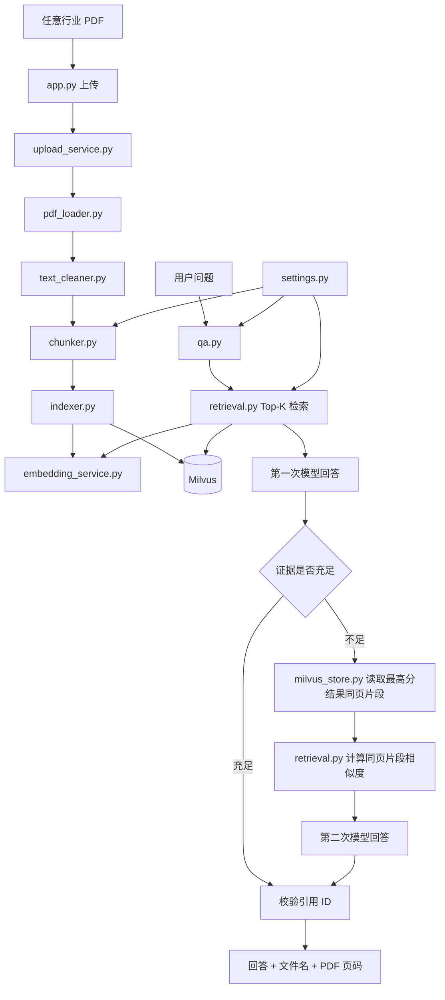
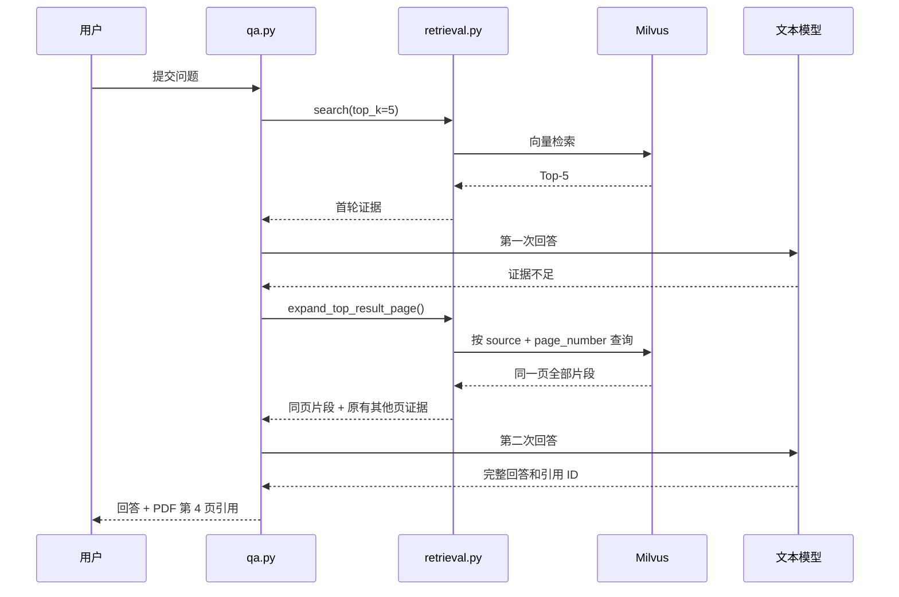

# 第七天复盘：跨行业资料与同页证据补全

日期：2026-09-29

## 1. 今日目标与完成情况

第七天把 ResearchKB 从 AI 基础设施演示项目改成可处理任意行业 PDF 的个人行研资料库，并使用传统零售行业的 Target 年报完成验收。

- [x] 问答 Prompt 不再限定 AI 基础设施行业。
- [x] 视觉 Prompt 支持任意行业的图表、表格和示意图。
- [x] Streamlit 页面改为跨行业行研资料库文案。
- [x] README 和 Python 项目描述更新为新版定位。
- [x] 新增统一默认配置，集中管理 Top-K 和文本切分参数。
- [x] Target 2025 年报前 10 页成功入库。
- [x] 定位并解决双栏 PDF 导致相关片段未进入 Top-5 的问题。
- [x] Target 四项经营优先事项能够完整回答并引用 PDF 第 4 页。
- [x] Streamlit 页面刷新后能够显示完整回答和正确页码。
- [x] 旧问题回归保持库内 4/5、库外拒答 3/3。
- [x] Target 资料范围内的库外问题继续正确拒答。

Milvus 实体数从 279 增加到 311，共新增 32 条 Target 文本证据。

## 2. 项目流程图



## 3. 新建和修改的文件

| 文件 | 职责 | 主要调用关系 |
|---|---|---|
| `src/research_kb/settings.py` | 保存 Top-K、切分长度和重叠长度的统一默认值 | 被 `app.py`、`qa.py`、`retrieval.py`、`chunker.py` 引用 |
| `src/research_kb/qa.py` | 通用行业问答；证据不足时控制一次同页补全重试 | 调用 `retrieval.py`，校验 `RetrievalResult` 引用 |
| `src/research_kb/vision_service.py` | 为任意行业页面生成可检索的视觉描述 | 由视觉处理脚本调用 |
| `src/research_kb/retrieval.py` | Top-K 检索、补齐最高分证据所在页、计算余弦相似度 | 调用 `embedding_service.py` 和 `milvus_store.py` |
| `src/research_kb/milvus_store.py` | 根据来源文件和物理页码精确查询同页记录 | 被 `retrieval.py` 调用 |
| `src/research_kb/chunker.py` | 使用统一默认值切分页面 | 引用 `settings.py` |
| `src/research_kb/upload_service.py` | 上传 PDF 时复用切分模块默认值 | 调用 `chunker.py` 和 `indexer.py` |
| `app.py` | 显示通用行研文案，使用统一 Top-K | 调用上传和问答服务 |
| `README.md`、`pyproject.toml` | 说明新的跨行业项目定位 | 项目文档与包元数据 |

## 4. 为什么第一次 Target 问答失败

问题是：

```text
Target 在 2025 年报致股东信中提出了哪四项经营优先事项？
```

四项内容都在 PDF 第 4 页，但该页采用双栏排版。PyMuPDF 虽然使用 `sort=True` 尝试恢复阅读顺序，提取结果仍会把左右两栏部分文字交错。清理后的第 4 页被切成 7 条证据，四个标题分散在不同片段中。

第一次 Top-5 检索只返回了部分片段。模型看到的证据不能证明完整的四项内容，因此返回 `insufficient_information=True`。这次拒答符合证据约束，错误发生在召回范围，不是生成模型没有识别答案。

## 5. 同页证据补全流程



重试只会发生一次。若第二次仍然缺少信息，系统继续返回证据不足，不会循环调用模型。

## 6. 核心代码关系

### `MilvusStore.get_page_records()`

使用 Milvus 的标量过滤表达式，根据 `source` 和 `page_number` 精确读取同页证据。`query()` 与向量 `search()` 不同：它负责按字段取记录，不负责语义相似度排序。

输出中包含已保存的 `vector`，让检索层无需重新向量化文档片段。

### `MilvusRetriever.expand_top_result_page()`

取首次检索排名第一的结果作为页面锚点，获取该物理页的其他片段。问题会再次生成查询向量，并与同页现有向量计算余弦相似度。补充结果按页内 `chunk_index` 排列，使模型更容易恢复阅读顺序。

### `RAGQuestionAnswerer._generate_model_answer()`

封装一次“构造证据上下文并调用结构化模型”的过程。`answer()` 可以复用它执行首轮回答和一次重试，不需要复制 Prompt 构造代码。这是普通 Python 方法拆分，不是 LangGraph 工作流。

## 7. 关键变量和第三方函数

- `DEFAULT_TOP_K`：一次向量检索最多返回的证据数，不是相似度阈值。
- `DEFAULT_CHUNK_SIZE`：单个文本片段的最大字符数，目前为 800。
- `DEFAULT_CHUNK_OVERLAP`：相邻片段重复的字符数，目前为 120。
- `MilvusClient.search()`：按照查询向量执行余弦相似度检索。
- `MilvusClient.query()`：按照文件名、页码等标量字段精确读取记录。
- `zip(..., strict=True)`：同时遍历两个向量；长度不同会立即报错，避免静默计算错误结果。
- `sqrt()`：计算余弦相似度所需的向量长度。
- `insufficient_information`：模型判断当前证据能否支持答案的结构化布尔字段。

## 8. 实际验收结果

### Target 上传

```text
文件：06_TGT_2025_Annual_Report.pdf
总页数：91
处理页数：10
空文本页：1
新增文本证据：32
Milvus 实体数：279 → 311
```

### Target 四项经营优先事项

同页补全前后：

```text
首次证据数：5
扩展后证据数：10
第 4 页片段：1、2、3、4、5、6、7
```

最终结果：

```text
insufficient_information=False
retrieved_count=10
引用均来自 PDF 第 4 页
Streamlit 页面显示：正常
```

回答包含四项：

1. Lead with merchandising authority。
2. Elevate the guest experience。
3. Accelerate technology。
4. Strengthen our team and communities。

### 原有回归问题

```text
库内问题：4/5
库外拒答：3/3
```

与第七天改动前基线一致。Lumentum OCS 收入运行率问题仍因样本证据缺失未通过，属于已知问题。

### Target 库外拒答

问题：`Target 2030 年的电动汽车交付目标是多少？`

```text
insufficient_information=True
引用数量：0
缺失信息：缺少 Target 2030 年电动汽车交付目标的数据或声明
```

## 9. 今天掌握的知识点

- 通用 RAG 的行业范围主要由文档、Prompt 和元数据决定，底层向量流程不应绑定某个行业。
- 集中默认配置可以避免上传、检索和问答模块各自写一份常量。
- PDF 有文字不等于阅读顺序一定正确，双栏版式会影响切分和向量召回。
- 模型拒答可能说明召回证据不完整，应先检查检索片段，再调整 Prompt。
- Top-K 全局调大可能增加噪声；按最高分结果补充同页证据更有明确边界。
- 回退流程必须设置终止条件，本项目最多补页并重试一次。
- 引用 ID 仍经过白名单校验，补充证据不会绕过原有可信引用机制。

## 10. 面试可能追问

### 为什么不直接把 Top-K 从 5 改成 20？

全局扩大 Top-K 会让所有问题携带更多无关片段，增加模型输入和费用。同页补全只在模型判断证据不足时触发，并围绕最高分证据所在页面补充上下文，范围更明确。

### 为什么模型第一次拒答反而说明系统设计有效？

首次证据中没有完整列出四项内容。模型没有凭常识补齐，而是明确报告证据不足，说明证据约束正常工作。修复重点应放在检索上下文完整性。

### 为什么需要重新计算同页片段的相似度？

Milvus `query()` 是字段过滤，不会返回向量检索分数。页面展示和模型上下文仍需要一个一致的相关度值，因此用已有文档向量和查询向量计算余弦相似度。

### 这是不是 LangGraph？

不是。它是一个固定的单次回退：首次回答不足时补页并再调用一次模型。没有动态节点编排、循环状态或工具自主选择，普通 Python 控制流更容易理解和测试。

## 11. 当前限制与下一步

- 双栏文本仍可能存在交错，同页补全提高了上下文完整性，但没有真正完成版面结构恢复。
- 证据不足且同页存在额外片段时，会多产生一次 Embedding 和一次文本模型调用。
- 当前文档列表仍由 Milvus 证据反推，尚未保存行业、公司、Ticker、文档类型和处理状态。
- 图表页仍需要脚本手工指定。

第八天将增加 SQLite 文档登记簿，为文档元数据、处理状态、重复上传和后续研究项目管理提供稳定的数据来源。
