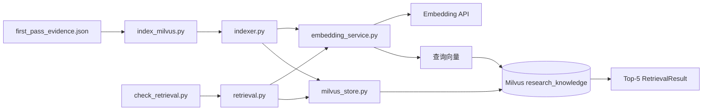

# 第三天复盘：向量入库与 Milvus 检索

日期：2026-09-26

## 1. 今日目标与完成情况

第三天目标是先确认检索能够找到正确资料，再进入大模型问答。

- [x] 验证 Embedding 模型名称和向量维度。
- [x] 创建 `research_knowledge` Collection。
- [x] 建立 1024 维 COSINE 向量索引。
- [x] 保存正文、文件名、物理页码、证据 ID 和文件哈希。
- [x] 将 276 条证据写入 Milvus。
- [x] 重复运行时跳过已有 ID，不重复调用 Embedding。
- [x] 实现 COSINE Top-5 检索。
- [x] 实现单份 PDF 的过滤检索。
- [x] 使用 5 个已知来源问题完成检索验收。
- [x] 在 Attu 中检查 Collection、Schema、索引、实体和过滤查询。

## 2. 新建文件

| 文件 | 负责内容 |
|---|---|
| `src/research_kb/embedding_service.py` | 调用 LangChain Embedding 接口并检查 1024 维结果。 |
| `src/research_kb/milvus_store.py` | 管理 Milvus 连接、Schema、索引、查询和写入。 |
| `src/research_kb/indexer.py` | 计算文件哈希、跳过已有 ID、生成向量并批量入库。 |
| `src/research_kb/retrieval.py` | 把问题转成向量，执行 COSINE Top-5 和文件过滤。 |
| `scripts/check_embeddings.py` | 验证文档向量与查询向量。 |
| `scripts/setup_milvus.py` | 幂等创建并检查 Collection。 |
| `scripts/index_milvus.py` | 从证据 JSON 读取 276 条记录并执行入库。 |
| `scripts/check_retrieval.py` | 使用 5 个问题验收检索和文件过滤。 |

## 3. 文件调用关系



具体的 `import` 关系：

```text
indexer.py
├── chunker.EvidenceChunk
├── embedding_service.EmbeddingService
└── milvus_store.MilvusStore

index_milvus.py
├── chunker.EvidenceChunk
├── embedding_service.EmbeddingService
├── indexer.EvidenceIndexer
└── milvus_store.MilvusStore

retrieval.py
├── embedding_service.EmbeddingService
└── milvus_store.MilvusStore

check_retrieval.py
├── embedding_service.EmbeddingService
├── milvus_store.MilvusStore
└── retrieval.MilvusRetriever
```

## 4. 入库数据流

```text
first_pass_evidence.json
  ↓ 还原为 EvidenceChunk
检查 evidence_id 是否已存在
  ├── 已存在 → 跳过，不调用 Embedding
  └── 不存在 → 文本生成 1024 维向量
                    ↓
                组装 Milvus 实体
                    ↓
                  upsert
                    ↓
         research_knowledge Collection
```

每份 PDF 还会计算一次 SHA-256，保存到 `document_hash`。代码使用分块读取，避免把整个 PDF 一次性读入内存。

## 5. 检索数据流

```text
中文问题
  ↓ EmbeddingService.embed_query()
1024 维查询向量
  ↓ Milvus COSINE search
Top-5 命中
  ↓ 转换
RetrievalResult
  ├── evidence_id
  ├── score
  ├── source
  ├── page_number
  ├── chunk_index
  ├── content_type
  └── text
```

如果传入 `source`，检索同时使用表达式：

```text
source == "指定的 PDF 文件名"
```

## 6. Milvus Schema

| 字段 | 类型 | 作用 |
|---|---|---|
| `evidence_id` | VARCHAR，主键 | 稳定 ID，用于去重和引用。 |
| `vector` | FLOAT_VECTOR(1024) | 文本语义向量。 |
| `source` | VARCHAR | 原始 PDF 文件名。 |
| `page_number` | INT64 | PDF 物理页码。 |
| `chunk_index` | INT64 | 页内证据序号。 |
| `content_type` | VARCHAR | 当前为 `text`，以后可扩展。 |
| `document_hash` | VARCHAR | 原始 PDF 的 SHA-256。 |
| `text` | VARCHAR | 检索后展示或交给大模型的正文。 |

Collection 关闭了动态字段。字段名拼错时写入会失败，避免错误数据悄悄进入数据库。

## 7. 实际验收结果

### Embedding

- 模型：`qwen3.7-text-embedding-flash`
- 文档向量数量：2
- 文档向量维度：1024
- 查询向量维度：1024
- 维度检查：通过

### Milvus

- Milvus：2.5.5
- Collection：`research_knowledge`
- 实体数量：276
- 向量索引：`AUTOINDEX`
- 相似度：`COSINE`
- 本地 JSON 与远程 ID：完全一致
- 元数据差异：0
- 每份 PDF 的文件哈希数量：1

重复运行入库结果：

```text
JSON证据数：276
本次新增：0
本次跳过：276
入库前实体数：276
入库后实体数：276
```

这证明重复运行不会增加实体，也不会为已有证据重新请求 Embedding。

### Top-5 检索

| 问题方向 | 预期资料 | Top-5 命中 |
|---|---|---|
| AMD 数据中心收入 | AMD 年报 | 是 |
| NVIDIA AI 基础设施层级 | NVIDIA 年报 | 是 |
| Lumentum OCS | Lumentum 简报 | 是 |
| Micron HBM、DRAM、NAND | Micron 年报 | 是 |
| Seagate 数据中心扩容 | Seagate 报告 | 是 |

结果：`5/5`。单文件过滤测试：`True`。

### Attu

已在 Attu 中人工确认：

- `default` 数据库中存在 `research_knowledge`。
- 实体数量为 276。
- 八个 Schema 字段正确。
- `vector` 维度和 COSINE 索引正确。
- 可以按 `source` 和 `page_number` 查看证据。

## 8. 当前效果与限制

- 当前验收标准是“正确来源是否出现在 Top-5”，还没有评价答案是否完整。
- NVIDIA、AMD、Micron 和 Seagate 的高排名结果与问题内容较匹配。
- Lumentum 的 Top-5 包含正确资料，但封面、免责声明和版权页脚排名偏高，说明版面噪声仍会影响排序。
- 语料是英文、问题是中文，本次 5/5 表明当前 Embedding 模型具备可用的跨语言检索能力。
- 当前只有向量检索，没有关键词检索、重排器或查询改写；首版暂不增加这些复杂度。

## 9. 面试可能追问

### 为什么使用 COSINE？

Embedding 主要表达向量方向上的语义关系。COSINE 比较方向相似度，适合文本语义检索，也不直接受向量长度影响。

### 为什么主键不用自动生成？

项目已经有稳定的 `evidence_id`。关闭 `auto_id` 后，可以用同一个证据 ID 判断重复数据并建立可追溯引用。

### `insert` 与 `upsert` 有什么区别？

`insert` 只新增数据，主键重复可能报错；`upsert` 在主键存在时更新，不存在时新增。本项目还会先查询已有 ID，减少不必要的 Embedding 费用。

### 为什么同时保存 `evidence_id` 和 `document_hash`？

`evidence_id` 标识一个证据片段，`document_hash` 标识原始 PDF 文件版本。二者粒度不同。

### 为什么文档和问题使用同一个 Embedding 模型？

它们必须位于同一个向量空间，相似度才有意义。若分别使用不同模型，向量通常不能直接比较。

### 为什么Milvus里还要保存正文？

检索命中后可以直接取得正文、文件名和页码，无需再到其他存储中查询；当前只有 276 条，适合这种简单设计。

### Attu是什么？

Attu是Milvus的可视化管理工具，不负责存储向量。它用于查看Schema、索引、实体和执行过滤查询。

## 10. 第四天开始前

第四天目标是在命令行完成有引用的文本 RAG 闭环：

1. 把 Top-5 证据拼成上下文。
2. 要求模型只依据证据回答。
3. 输出结论、引用 ID、文件名和页码。
4. 校验模型返回的引用 ID 确实来自本次检索结果。
5. 测试 5 个可回答问题和 3 个知识库外问题。
6. 知识库没有依据时明确说明信息不足，不能编造数字。

第三天验收通过，可以进入第四天。
