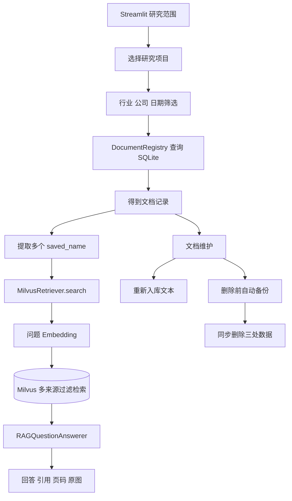
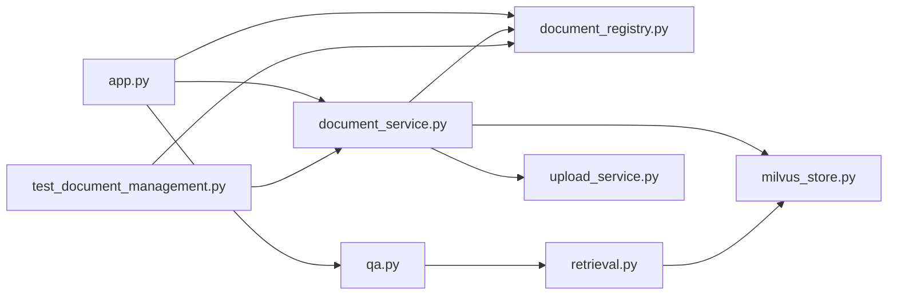
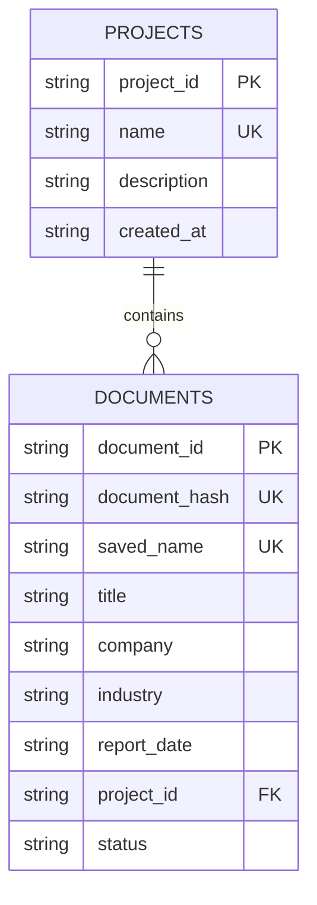
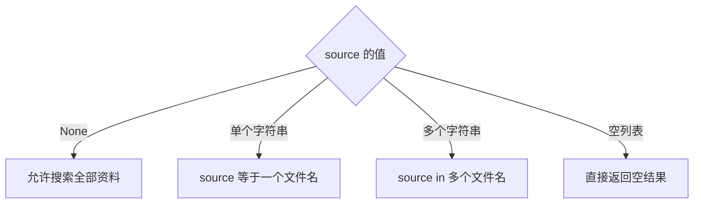
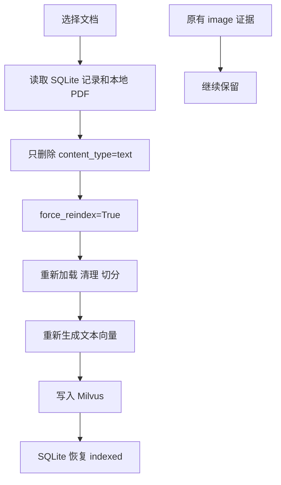
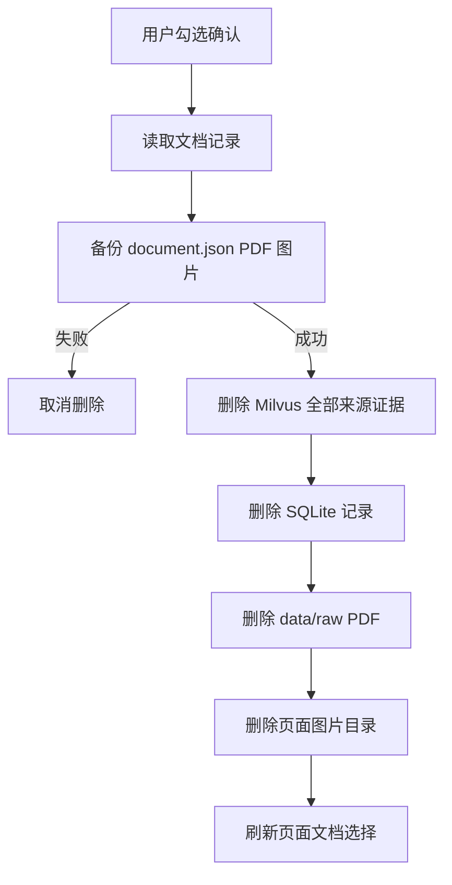

# 第九天复盘：研究项目、组合筛选与文档维护

日期：2026-10-01

## 1. 今日完成情况

- [x] SQLite 增加 `projects` 表和 `documents.project_id`。
- [x] 旧数据库启动时自动补充 `project_id`，重复启动不会重复迁移。
- [x] 创建“AI 基础设施”和“消费零售”两个研究项目。
- [x] 将 6 份已有资料分别归入对应项目。
- [x] 支持项目、行业、公司和报告日期组合筛选。
- [x] 支持在筛选结果中继续选择多份 PDF 参与问答。
- [x] Milvus 检索支持单来源、多来源和空来源列表。
- [x] 空来源列表直接返回，不调用 Embedding，也不会错误搜索全部资料。
- [x] 页面支持新建项目、调整文档归属和上传时指定项目。
- [x] 支持重新生成一份文档的文本证据，同时保留图像证据。
- [x] 支持确认后删除 Milvus、SQLite、本地 PDF 和页面图片。
- [x] 删除前自动备份文档元数据、PDF 和图片；备份失败会取消删除。
- [x] 自动化测试由 3 项增加到 6 项。

## 2. 第九天完成后的完整流程



## 3. 代码文件之间的关系



| 文件 | 第九天职责 | 主要调用关系 |
|---|---|---|
| `app.py` | 项目筛选、多文档选择、项目管理、删除与重新入库界面 | 调用 Registry、QA 和 DocumentManagementService |
| `document_registry.py` | 项目表、文档归属、组合筛选、删除登记 | 被页面、上传服务和文档管理服务调用 |
| `retrieval.py` | 将一份或多份文件名转换成 Milvus 过滤表达式 | 被 QA 调用 |
| `qa.py` | 将单来源或多来源范围传给检索器 | 被 Streamlit 和命令行入口调用 |
| `milvus_store.py` | 删除一份 PDF 的全部或指定类型证据 | 被 DocumentManagementService 调用 |
| `document_service.py` | 协调 Milvus、SQLite、PDF、图片和备份目录 | 被 Streamlit 文档维护面板调用 |
| `test_document_management.py` | 验证项目隔离、组合筛选、备份删除和文本重建 | 使用临时目录和假外部服务 |

## 4. 项目与文档的数据模型



当前是一份文档最多属于一个项目。这符合个人研究工具的使用方式，也让页面筛选和 SQL 查询保持简单。若未来需要同一份资料加入多个专题，可以增加中间表 `project_documents`，现阶段不需要提前引入多对多关系。

## 5. 组合筛选如何工作

`DocumentRegistry.list_documents()` 接受可选参数：

```text
status + project_id + industry + company + report_date_from + report_date_to
```

只有用户实际选择的条件才进入 SQL 的 `WHERE`。参数值通过 SQLite 占位符 `?` 传入，没有直接拼接用户输入。ISO 日期使用 `YYYY-MM-DD` 时，字符串排序与日期先后顺序一致。

页面的处理顺序是：

```text
项目/行业/公司/日期
→ SQLite 得到文档
→ 只保留 indexed 文档
→ 用户勾选参与问答的资料
→ saved_name 列表传给 RAG
```

## 6. 多来源检索为何不能把空列表当成全部资料

`source=None` 表示调用者没有限定资料，可以检索整个库；`source=[]` 表示用户在页面中没有选择任何资料，必须返回空结果。

如果混淆这两个值，用户清空选择后反而会搜索全部项目，造成跨行业串资料。当前检索器在生成问题向量之前检查空列表，因此既不会串库，也不会产生无意义的 Embedding 调用。



## 7. 文档重新入库流程



重新入库不删除 `image` 证据，因为视觉描述需要单独调用视觉模型。如果把全部来源证据删除，页面虽然仍显示图像数量，但 Milvus 中的图像证据已经消失，会造成统计与实际不一致。

## 8. 安全删除流程



备份目录为 `data/backups/deleted_documents/<UTC时间>_<document_id>`，其中：

- `document.json` 保存 SQLite 删除前的完整元数据；
- PDF 使用原保存文件名；
- `images` 保存已有页面图片；
- `data/backups` 已被 Git 忽略，不会把私有资料推到 GitHub。

Milvus、SQLite 和文件系统不支持一个共同事务，因此服务层明确规定执行顺序。备份先于任何删除；Milvus 删除后若 SQLite 操作失败，原始 PDF 与备份仍在，可以重新入库恢复。

## 9. Streamlit 状态为何要显式重置

Streamlit 每次交互会从上到下重新执行 `app.py`，但带 `key` 的控件值保存在 `st.session_state`。删除文档后，如果仍保存已经不存在的文件名或文档 ID，下一次渲染会出现失效选项。

删除成功后先设置 `reset_document_widgets=True`。下一次重新执行、控件创建之前，统一清理：

```text
selected_document_sources
document_scope_signature
managed_document_id
target_project_id
managed_document_assignment_signature
```

这样不会在控件创建之后修改它的状态，也不会保留已经删除的文档。

## 10. 自动化测试覆盖

原有 3 项测试继续验证文档哈希去重、上传去重和失败状态。第九天新增：

1. `test_project_assignment_and_combined_filters`：验证项目分配、多条件组合筛选及项目名称不区分大小写去重。
2. `test_delete_document_cleans_all_storage`：验证备份、Milvus 删除请求、SQLite 删除、PDF 与图片清理。
3. `test_reindex_replaces_only_text_evidence`：验证只删除文本证据，并以 `force_reindex=True` 重新执行上传流程。

所有测试使用 `tmp_path`、Fake Milvus 和 Fake UploadService，不连接正式向量库，不调用模型，也不修改正式 PDF。

## 11. 最终验收结果

```text
自动化测试：6 passed
正式 SQLite 文档：6
正式 Milvus 实体：311
AI 基础设施项目：5 份文档
消费零售项目：1 份文档
消费零售筛选：只显示 Target
AI 基础设施筛选：只显示 NVIDIA、AMD、Lumentum、Micron、Seagate
删除按钮：未确认时禁用
正式文档删除或重新入库：未触发
```

## 12. 面试复习问题

### 为什么 SQLite 和 Milvus 都需要？

SQLite 管理文档、项目、状态和组合筛选；Milvus 管理证据片段及向量相似度搜索。一个项目筛选先由 SQLite 决定文档范围，再用文件名限制 Milvus 检索。

### 为什么需要 DocumentManagementService？

删除和重新入库涉及多个存储。若页面分别操作 SQLite、Milvus 和文件，很容易漏掉一步。服务层把执行顺序、备份和异常处理集中在一个位置，页面只表达用户操作。

### 删除为何不做成一个数据库事务？

SQLite 事务无法控制远程 Milvus 和 Windows 文件系统。这里使用补偿思路：先建立可恢复备份，再依次删除；失败后保留足够信息用于重新入库。

### 为什么重新入库会产生 Embedding 调用？

重新入库用于重新切分或扩大处理页数，旧文本向量必须被替换。普通重复上传仍通过 SHA-256 提前返回，不重新计费；只有用户明确点击重新生成时才重新调用。

## 13. 推荐复习顺序

```text
document_registry.py
→ retrieval.py
→ qa.py
→ document_service.py
→ app.py
→ test_document_management.py
```

先理解 SQLite 如何选出文档，再看文件名如何进入 Milvus 过滤条件，最后看页面如何调用服务层完成维护操作。

## 14. 第十天衔接

第十天将把图表页处理接入上传页面。用户上传 PDF 后可以填写少量图表页码，由系统调用页面渲染、视觉描述和图像证据入库流程，不再修改脚本中的固定 `CHART_PAGES`。

