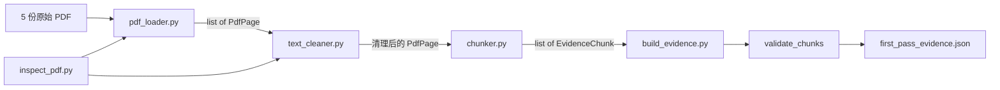

# 第二天复盘：PDF 文本解析与证据结构

日期：2026-09-25

## 1. 今日目标与完成情况

第二天目标是让每条文本证据都能追溯到原始 PDF 页。

- [x] 使用 PyMuPDF 按物理页读取 PDF。
- [x] 保留文件名、页码和正文。
- [x] 识别没有可提取文字的页面。
- [x] 清理多余空格、换行、独立页码和换行断词。
- [x] 使用 LangChain `RecursiveCharacterTextSplitter` 切分正文。
- [x] 生成稳定且唯一的 `evidence_id`。
- [x] 处理首轮 5 份资料的 100 个物理页。
- [x] 保存可阅读的证据 JSON。
- [x] 抽查来自 5 份资料的 10 条证据。

## 2. 新建或修改的文件

| 文件 | 作用 |
|---|---|
| `src/research_kb/pdf_loader.py` | 按页读取 PDF，返回 `PdfPage` 列表。 |
| `src/research_kb/text_cleaner.py` | 清理页面文本，同时保留来源和页码。 |
| `src/research_kb/chunker.py` | 将页面切成 `EvidenceChunk`，生成证据 ID。 |
| `scripts/inspect_pdf.py` | 检查单份 PDF 的加载和清理结果。 |
| `scripts/build_evidence.py` | 调度 5 份 PDF，验证并输出首轮证据 JSON。 |
| `pyproject.toml` | 增加项目构建声明和 `langchain-text-splitters` 依赖。 |
| `uv.lock` | 锁定新增依赖的实际版本。 |
| `data/processed/first_pass_evidence.json` | 276 条本地中间证据；可重新生成，不上传 Git。 |

## 3. 文件之间的关系



具体的 `import` 关系：

```text
text_cleaner.py
└── from research_kb.pdf_loader import PdfPage

chunker.py
└── from research_kb.pdf_loader import PdfPage

inspect_pdf.py
├── from research_kb.pdf_loader import load_pdf_pages
└── from research_kb.text_cleaner import clean_pdf_pages

build_evidence.py
├── from research_kb.pdf_loader import load_pdf_pages
├── from research_kb.text_cleaner import clean_pdf_pages
└── from research_kb.chunker import EvidenceChunk, split_pages_into_chunks
```

`build_evidence.py` 是流程入口，其余三个 `src` 文件是可以被其他入口重复调用的业务模块。

## 4. 数据如何一步步变化

```text
PDF 文件
  ↓ load_pdf_pages()
PdfPage(source, page_number, text)
  ↓ clean_pdf_pages()
清理后的 PdfPage
  ↓ split_pages_into_chunks()
EvidenceChunk(
    evidence_id,
    source,
    page_number,
    chunk_index,
    content_type,
    text,
)
  ↓ to_dict() + json.dumps()
first_pass_evidence.json
```

`PdfPage` 与 `EvidenceChunk` 使用不可变 dataclass，减少处理中意外修改来源信息的风险。清理模块只替换 `text`，文件名和页码继续向后传递。

## 5. 核心代码知识点

### 5.1 为什么页码使用 `page_index + 1`

PyMuPDF 和 Python 从 0 开始计数，但用户看到的 PDF 物理页从 1 开始。保存面向用户的页码可以直接回到 PDF 核对证据。

### 5.2 为什么使用递归字符切分

`RecursiveCharacterTextSplitter` 会优先尝试在段落、句号和空格处切分，只有找不到合适边界时才按字符切分。当前设置：

- `chunk_size=800`：片段最大 800 字符。
- `chunk_overlap=120`：相邻片段保留部分上下文。

Overlap 是目标上限，实际重叠会受到句子和单词边界影响，不保证每段恰好重复 120 字符。

### 5.3 为什么不用 Python 内置 `hash()`

Python 内置 `hash()` 在不同进程中可能变化。项目使用 SHA-256，并取前 16 位生成稳定 ID：

```text
文件名 + 页码 + 页内序号 + 正文 → SHA-256 → evidence_id
```

相同输入会得到相同 ID，重复导入时可以用它去重；正文变化后 ID 也会变化。

### 5.4 为什么先保存 JSON

JSON 把“PDF 解析问题”和“Milvus 入库问题”分开。第三天如果检索错误，可以先检查 JSON：

- JSON 已错误：回到加载、清理或切分模块。
- JSON 正确但检索错误：检查 Embedding、Milvus Schema 或检索参数。

## 6. 实际运行结果

| 文件 | 计划物理页 | 产生证据的页 | 证据数 |
|---|---:|---:|---:|
| NVIDIA | 20 | 20 | 59 |
| AMD | 7 | 7 | 20 |
| Lumentum | 30 | 30 | 40 |
| Micron | 15 | 12 | 71 |
| Seagate | 28 | 28 | 86 |
| 合计 | 100 | 97 | 276 |

Micron 第 1、3、4 物理页没有提取出文字，`chunker.py` 按设计跳过空文本页。

自动验收结果：

- 证据总数：276。
- 唯一 ID 数：276。
- 最长片段：800 字符。
- 空证据：0。
- 内容类型：只有 `text`。
- 使用同一输入重复生成后，JSON SHA-256 完全相同。

## 7. 人工抽查发现

- NVIDIA、AMD、Micron 的文件名、物理页码和文本能够对应原 PDF。
- Lumentum 页面中的版权信息和页码与正文在同一行，基础规则没有删除它。
- Seagate 目录页保留了较长的点线，这属于版面噪声。
- AMD 文本包含 `fi` 等 PDF 字体连字字符。
- NVIDIA 个别位置出现 `internet.AI`，说明 PDF 原始文本块之间缺少空格。
- Micron 的部分封面或图形页没有文本层，首版不执行 OCR。

这些问题已经记录，但暂不加入复杂版面分析。后续若它们实际影响检索，再用失败案例驱动改进。

## 8. 今天遇到的问题及解决方法

### `ModuleNotFoundError: No module named 'research_kb'`

原因：项目使用 `src` 目录结构，但 `pyproject.toml` 没有声明构建后端，普通 PowerShell 不会自动把 `src` 加入导入路径。

解决：增加 Hatchling 构建配置并运行 `uv sync`，将当前项目安装到 `.venv`。

### 电脑死机导致代码未保存

检查发现 `chunker.py` 变成 0 字节，`build_evidence.py` 尚未创建。根据已确认的代码恢复后，重新执行完整流程，并提前建立 Git 检查点。

### 清理后字符数明显减少

第 3 页从 1401 字符变为 573 字符。进一步比较发现非空白字符均为 484，说明删除的是 PDF 排版空格，没有删除正文。

## 9. 面试可能追问

### 为什么按页切分后再分块？

为了保证每条证据只对应一个明确物理页。若先把多页文本拼接，片段可能跨页，引用页码会变得不准确。

### 为什么需要 chunk overlap？

重要语义可能位于切分边界。适量重叠可以让相邻片段都保留上下文，降低检索到半句话的概率。

### 如何保证重复导入不会产生重复数据？

使用稳定的 `evidence_id` 作为后续 Milvus 主键或去重依据。相同来源和正文会生成相同 ID。

### 为什么暂时不做 OCR？

当前目标是快速完成可演示的文本 RAG。首轮 100 页已有 97 页带文本层，足以验证链路；OCR 会增加依赖、耗时和版面识别复杂度。

### 为什么模块要拆开？

加载、清理、切分和流程调度的错误来源不同。拆分后每层都可以单独检查，也能在以后替换某一实现而不重写整个流程。

## 10. 第三天开始前需要掌握

第三天目标是“先检索正确，再让模型回答”：

1. 读取 `first_pass_evidence.json`。
2. 调用 Embedding API，把每条文本变成 1024 维向量。
3. 根据实际维度创建 Milvus Collection。
4. 保存证据 ID、向量、文件名、页码、类型和正文。
5. 实现 COSINE Top-5 检索和单文件过滤。
6. 用 Attu 检查 Schema、实体数量和字段内容。

第二天验收通过，可以进入第三天。
