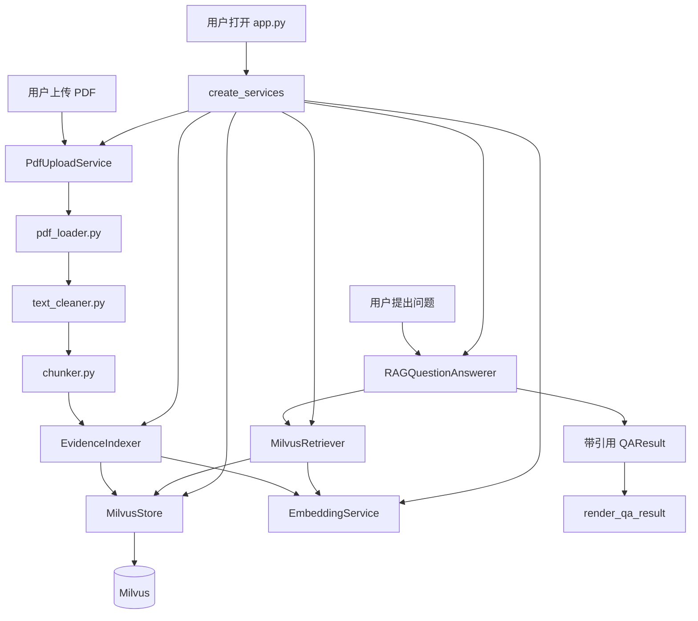

# 第五天复盘：Streamlit 演示与 PDF 上传入库

日期：2026-09-27

## 1. 今日目标与完成情况

第五天目标是把第四天的命令行 RAG 问答包装成可演示的网页，并允许用户上传 PDF 扩充知识库。

- [x] 建立 Streamlit 聊天页面。
- [x] 显示 Milvus 有效实体数和已入库文档数。
- [x] 支持全部资料检索和单份 PDF 过滤。
- [x] 展示答案、信息不足状态、引用页码、相似度和证据原文。
- [x] 使用 `st.session_state` 保存当前网页会话的聊天记录。
- [x] 缓存 Milvus、Embedding、检索和问答服务。
- [x] 支持 PDF 上传、校验、保存、解析、清洗、切分和入库。
- [x] 限制上传文件为 20 MB、单次最多处理 30 页。
- [x] 对重复证据执行幂等跳过，避免重复 Embedding 请求。
- [x] 增加 PyCharm 专用 Streamlit 启动入口。
- [x] 完成检索、上传去重和页面验收。

最终状态：5 份 AI 基础设施 PDF、276 条有效证据，页面和上传链路均可正常演示。

## 2. 新建和修改的文件

| 文件 | 作用 |
|---|---|
| `app.py` | Streamlit 页面入口，组合知识库状态、资料过滤、聊天问答、引用展示和 PDF 上传。 |
| `src/research_kb/upload_service.py` | 验证并保存上传文件，调用已有 PDF 处理与入库链路。 |
| `src/research_kb/milvus_store.py` | 新增资料来源列表，并使用 `count(*)` 统计当前有效实体。 |
| `scripts/check_upload.py` | 使用现有 NVIDIA PDF 验证重复上传和幂等入库。 |
| `scripts/run_streamlit.py` | 让 PyCharm 的普通 Python 运行按钮以 Streamlit CLI 启动页面。 |
| `.run/ResearchKB_Streamlit.run.xml` | 本机 PyCharm 运行配置；包含本机绝对路径，因此由 Git 忽略。 |
| `.gitignore` | 忽略本机 `.run` 配置。 |
| `README.md` | 更新当前状态、页面能力和启动方法。 |

## 3. 文件之间如何关联



具体 `import` 和调用关系：

```text
app.py
├── MilvusStore
├── EmbeddingService
├── MilvusRetriever
├── RAGQuestionAnswerer
├── EvidenceIndexer
└── PdfUploadService

upload_service.py
├── pdf_loader.py
├── text_cleaner.py
├── chunker.py
└── indexer.py
    ├── embedding_service.py
    └── milvus_store.py

scripts/check_upload.py
├── PdfUploadService
├── EvidenceIndexer
├── EmbeddingService
└── MilvusStore

scripts/run_streamlit.py
└── Streamlit CLI → app.py
```

## 4. 页面启动与服务创建

`app.py` 使用 `@st.cache_resource` 创建并缓存这些长生命周期对象：

```text
MilvusStore
  ↓
EmbeddingService
  ↓
MilvusRetriever + RAGQuestionAnswerer
  ↓
EvidenceIndexer + PdfUploadService
```

Streamlit 每次交互都会重新执行页面脚本。如果不缓存这些服务，每次点击都会重新连接 Milvus、重新创建模型客户端。缓存可以减少重复初始化，同时让页面代码仍保持简单。

## 5. 网页问答数据流

```text
用户选择资料范围并输入问题
  ↓
st.chat_input
  ↓
写入 st.session_state.messages
  ↓
RAGQuestionAnswerer.answer(question, source)
  ↓
Embedding 查询向量
  ↓
Milvus Top-5，可选 source 过滤
  ↓
文本模型结构化回答
  ↓
引用 ID 校验
  ↓
render_qa_result
  ├── 回答正文
  ├── 信息是否不足
  └── 文件名、页码、相似度和证据原文
```

历史消息保存的是用户问题和 `QAResult`。页面重新运行后，`render_message` 会按原顺序重新展示这些内容。

## 6. PDF 上传数据流

```text
st.file_uploader
  ↓
文件名、扩展名、大小、密码和页数校验
  ↓
保存到 data/raw
  ↓
load_pdf_pages
  ↓
clean_pdf_pages
  ↓
split_pages_into_chunks
  ↓
EvidenceIndexer.index_chunks
  ├── 已存在 evidence_id → 跳过
  └── 新 evidence_id → Embedding → Milvus
  ↓
UploadReport
  ↓
页面展示新增、跳过、空页和截断信息
```

`PdfUploadService` 没有重新实现第二天和第三天的逻辑，而是把已有的加载、清洗、切分和入库模块串起来。这使网页层只负责交互，业务规则仍集中在 `src/research_kb` 中。

## 7. 上传时的边界处理

### 文件安全

- 使用 `Path(file_name).name` 去除上传文件名中的目录部分。
- 只接受 `.pdf` 扩展名。
- 单文件最大 20 MB。
- 使用 PyMuPDF 验证内容确实是可读取 PDF。
- 拒绝空文件、零页 PDF 和带密码 PDF。

### 成本控制

- 页面最多允许一次处理 30 页。
- 默认只处理前 10 页。
- 相同证据 ID 在请求 Embedding 之前就会被跳过。

### 同名文件

- 同名且内容相同：复用已有文件，并通过证据 ID 全部跳过。
- 同名但内容不同：在文件名后增加前 8 位 SHA-256，避免覆盖旧文件。

## 8. 为什么实体数改用 `count(*)`

Milvus 的 `get_collection_stats()` 返回的 `row_count` 可能暂时包含已经删除、等待压缩的 tombstone 数据。第五天测试时删除了 10 条无关上传证据：实际查询已经只有 276 条，但统计接口仍短暂显示 286。

现在 `get_entity_count()` 使用：

```text
query(output_fields=["count(*)"])
```

它统计当前仍可查询的实体，因此页面显示与实际检索数据一致。

## 9. 最终验收结果

### Python 与 Git 检查

```text
compileall：通过
git diff --check：通过
```

### Milvus 检索

```text
5 个已知来源问题：5/5
单文件 source 过滤：True
有效资料数量：5
有效实体数量：276
```

### 重复上传

使用 NVIDIA 报告前 20 页再次入库：

```text
证据数量：59
本次新增：0
本次跳过：59
入库前实体：276
入库后实体：276
```

这说明文件可以重复上传，但不会重复调用 Embedding 或增加 Milvus 实体。

### Streamlit 页面

使用 Streamlit `AppTest` 运行页面：

```text
页面标题：📚 ResearchKB
Milvus实体数：276
已入库文档：5
检索范围选项：6（全部资料 + 5 份 PDF）
AppTest：通过
```

## 10. 今天遇到的问题与解决方法

### `missing ScriptRunContext`

原因：PyCharm 使用 `python app.py` 直接运行了页面。Streamlit 页面必须由 Streamlit CLI 创建运行上下文。

解决：运行 `uv run streamlit run app.py`，或在 PyCharm 中运行 `scripts/run_streamlit.py`。

### PyCharm 找不到解释器或启动脚本

原因：PyCharm 把上一级 `E:\AI-Agent-Projects` 当作项目根目录，导致 `$PROJECT_DIR$` 展开到了错误位置。

解决：本机运行配置使用完整路径，并建议直接把 `E:\AI-Agent-Projects\ResearchKB` 作为 PyCharm 项目打开。

### Windows 终端无法打印 PDF 连字

原因：部分 PDF 文本包含 `fl` 等 Unicode 连字，而当前终端采用 GBK 编码。

解决：检查脚本使用 UTF-8 模式运行：

```powershell
uv run python -X utf8 scripts\check_retrieval.py
```

### 删除测试资料后页面计数仍偏大

原因：Milvus 统计接口可能包含等待压缩的已删除实体。

解决：改用 `count(*)` 查询有效实体数量。

## 11. 面试可能追问

### 为什么 `app.py` 不直接实现 PDF 解析和入库？

页面层只负责接收输入和展示结果。解析、清洗、切分、Embedding 和 Milvus 入库已经分别封装，上传服务负责组合它们。这样命令行、网页和未来 API 都能复用同一套业务逻辑。

### 为什么使用 `st.cache_resource`？

Streamlit 交互时会重新运行页面脚本。Milvus、Embedding 和模型客户端适合跨页面重跑复用，缓存可以减少连接和初始化开销。

### 如何避免用户重复上传导致重复费用？

切片生成稳定的 `evidence_id`。入库前批量查询已有 ID，只对新片段调用 Embedding，并只写入新记录。

### 为什么仍然需要保存原始 PDF？

文件哈希、重新解析、页码核对和后续图表识别都需要原始文件。Milvus 保存的是检索证据，并不能替代原始资料。

### 页面如何限定只查询一份报告？

页面把选中的文件名传给 `answer(question, source)`，检索器再构造 Milvus 标量过滤表达式 `source == "文件名"`，向量搜索只在该文件的证据中执行。

### 当前上传为什么还不是完整多模态？

第五天上传链路只处理 PDF 文本层。扫描页和图表图片需要 OCR、页面渲染、视觉模型描述以及文本与图像证据统一建模，这属于下一阶段。

## 12. 第六天开始前

第六天进入最小多模态闭环，保持实习面试项目的合理复杂度：

1. 从样本 PDF 中选择少量包含图表的页面。
2. 将指定页面渲染为图片。
3. 使用视觉模型生成可检索的图表描述。
4. 为图表证据保留来源文件、物理页码和图片路径。
5. 将文本证据和图表证据统一写入 Milvus。
6. 在页面引用区域展示证据类型，并在需要时显示原图。

开始前需要掌握：文本 PDF 与扫描 PDF 的区别、为什么视觉描述可以参与向量检索、图表结论为什么仍必须保留页码和原图作为可核验证据。
