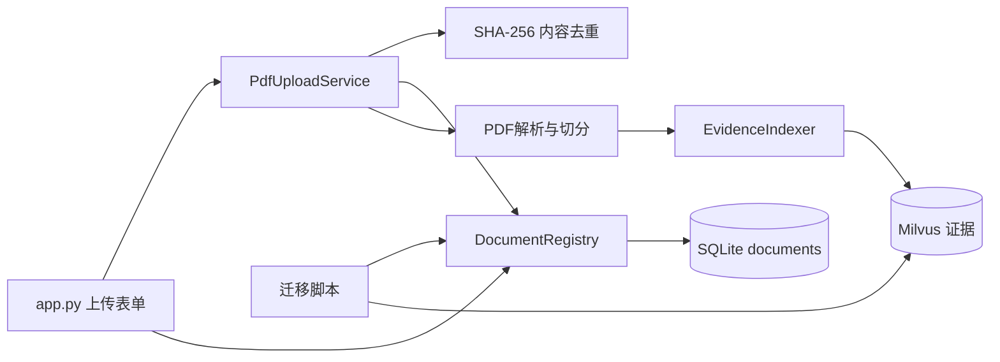

# 第八天剩余任务与完整代码

> 使用方式：按章节顺序手写。每完成一个文件先运行该节的编译命令。本文中的代码以第七天提交 `27a33f4` 为基础。

## 一、完成后的数据流



## 二、`settings.py` 增加数据库路径

文件：`src/research_kb/settings.py`

在文件开头加入：

```python
from pathlib import Path


PROJECT_ROOT = Path(__file__).resolve().parents[2]
DATA_DIR = PROJECT_ROOT / "data"
DOCUMENT_DATABASE_PATH = DATA_DIR / "research_kb.db"
```

原有 `DEFAULT_TOP_K`、`DEFAULT_CHUNK_SIZE` 和 `DEFAULT_CHUNK_OVERLAP` 保留。

## 三、完整创建 `document_registry.py`

文件：`src/research_kb/document_registry.py`

```python
"""使用 SQLite 管理文档元数据和处理状态。"""

import sqlite3
from collections.abc import Iterator
from contextlib import contextmanager
from dataclasses import dataclass
from datetime import date, datetime, timezone
from pathlib import Path
from typing import Final

from research_kb.settings import DOCUMENT_DATABASE_PATH


STATUS_SAVED: Final = "saved"
STATUS_PROCESSING: Final = "processing"
STATUS_INDEXED: Final = "indexed"
STATUS_FAILED: Final = "failed"
VALID_DOCUMENT_STATUSES: Final = frozenset(
    {
        STATUS_SAVED,
        STATUS_PROCESSING,
        STATUS_INDEXED,
        STATUS_FAILED,
    }
)


@dataclass(frozen=True, slots=True)
class DocumentMetadata:
    """用户为研究资料填写的业务信息。"""

    title: str
    document_type: str
    company: str | None = None
    ticker: str | None = None
    industry: str | None = None
    report_date: str | None = None


@dataclass(frozen=True, slots=True)
class DocumentRecord:
    """SQLite 中一条完整的文档记录。"""

    document_id: str
    document_hash: str
    original_name: str
    saved_name: str
    title: str
    company: str | None
    ticker: str | None
    industry: str | None
    document_type: str
    report_date: str | None
    uploaded_at: str
    total_pages: int
    processed_pages: int
    text_chunk_count: int
    image_chunk_count: int
    status: str
    error_message: str | None


CREATE_DOCUMENTS_SQL: Final = """
CREATE TABLE IF NOT EXISTS documents (
    document_id TEXT PRIMARY KEY,
    document_hash TEXT NOT NULL UNIQUE,
    original_name TEXT NOT NULL,
    saved_name TEXT NOT NULL UNIQUE,
    title TEXT NOT NULL,
    company TEXT,
    ticker TEXT,
    industry TEXT,
    document_type TEXT NOT NULL,
    report_date TEXT,
    uploaded_at TEXT NOT NULL,
    total_pages INTEGER NOT NULL DEFAULT 0 CHECK(total_pages >= 0),
    processed_pages INTEGER NOT NULL DEFAULT 0 CHECK(processed_pages >= 0),
    text_chunk_count INTEGER NOT NULL DEFAULT 0 CHECK(text_chunk_count >= 0),
    image_chunk_count INTEGER NOT NULL DEFAULT 0 CHECK(image_chunk_count >= 0),
    status TEXT NOT NULL CHECK(
        status IN ('saved', 'processing', 'indexed', 'failed')
    ),
    error_message TEXT
);

CREATE INDEX IF NOT EXISTS idx_documents_company ON documents(company);
CREATE INDEX IF NOT EXISTS idx_documents_ticker ON documents(ticker);
CREATE INDEX IF NOT EXISTS idx_documents_industry ON documents(industry);
CREATE INDEX IF NOT EXISTS idx_documents_status ON documents(status);
"""


class DocumentRegistry:
    """负责 SQLite 文档记录的初始化、查询和状态更新。"""

    def __init__(
        self,
        database_path: str | Path = DOCUMENT_DATABASE_PATH,
    ) -> None:
        self.database_path = Path(database_path)
        self.database_path.parent.mkdir(parents=True, exist_ok=True)
        self._initialize_database()

    @contextmanager
    def _connect(self) -> Iterator[sqlite3.Connection]:
        """创建连接，并在事务结束后保证关闭数据库文件。"""
        connection = sqlite3.connect(self.database_path, timeout=10)
        connection.row_factory = sqlite3.Row
        connection.execute("PRAGMA foreign_keys = ON")
        try:
            yield connection
            connection.commit()
        except Exception:
            connection.rollback()
            raise
        finally:
            # sqlite3.Connection 自带的 with 不负责 close，
            # Windows 下不关闭会导致数据库文件一直被占用。
            connection.close()

    def _initialize_database(self) -> None:
        """重复执行也安全地创建表与索引。"""
        with self._connect() as connection:
            connection.executescript(CREATE_DOCUMENTS_SQL)

    @staticmethod
    def _row_to_record(row: sqlite3.Row | None) -> DocumentRecord | None:
        """将 SQLite Row 转为有类型提示的业务对象。"""
        if row is None:
            return None
        return DocumentRecord(**dict(row))

    @staticmethod
    def _optional_text(value: str | None) -> str | None:
        """把空字符串统一转换为数据库中的 NULL。"""
        if value is None:
            return None
        cleaned = value.strip()
        return cleaned or None

    @classmethod
    def _normalize_metadata(cls, metadata: DocumentMetadata) -> DocumentMetadata:
        """清理并校验用户填写的文档信息。"""
        title = metadata.title.strip()
        document_type = metadata.document_type.strip()
        if not title:
            raise ValueError("文档标题不能为空")
        if not document_type:
            raise ValueError("文档类型不能为空")

        report_date = cls._optional_text(metadata.report_date)
        if report_date is not None:
            try:
                date.fromisoformat(report_date)
            except ValueError as error:
                raise ValueError("报告日期必须使用 YYYY-MM-DD") from error

        ticker = cls._optional_text(metadata.ticker)
        return DocumentMetadata(
            title=title,
            document_type=document_type,
            company=cls._optional_text(metadata.company),
            ticker=ticker.upper() if ticker else None,
            industry=cls._optional_text(metadata.industry),
            report_date=report_date,
        )

    def get_by_id(self, document_id: str) -> DocumentRecord | None:
        """按业务 ID 查询文档。"""
        with self._connect() as connection:
            row = connection.execute(
                "SELECT * FROM documents WHERE document_id = ?",
                (document_id,),
            ).fetchone()
        return self._row_to_record(row)

    def get_by_hash(self, document_hash: str) -> DocumentRecord | None:
        """按文件内容哈希查询，用于重复上传判断。"""
        with self._connect() as connection:
            row = connection.execute(
                "SELECT * FROM documents WHERE document_hash = ?",
                (document_hash,),
            ).fetchone()
        return self._row_to_record(row)

    def get_by_saved_name(self, saved_name: str) -> DocumentRecord | None:
        """按磁盘和 Milvus 共用的文件名查询。"""
        with self._connect() as connection:
            row = connection.execute(
                "SELECT * FROM documents WHERE saved_name = ?",
                (saved_name,),
            ).fetchone()
        return self._row_to_record(row)

    def list_documents(self, status: str | None = None) -> list[DocumentRecord]:
        """按上传时间倒序列出文档，可限定处理状态。"""
        parameters: tuple[str, ...] = ()
        sql = "SELECT * FROM documents"
        if status is not None:
            if status not in VALID_DOCUMENT_STATUSES:
                raise ValueError(f"不支持的文档状态：{status}")
            sql += " WHERE status = ?"
            parameters = (status,)
        sql += " ORDER BY uploaded_at DESC, saved_name ASC"

        with self._connect() as connection:
            rows = connection.execute(sql, parameters).fetchall()
        return [DocumentRecord(**dict(row)) for row in rows]

    def register_document(
        self,
        document_hash: str,
        original_name: str,
        saved_name: str,
        metadata: DocumentMetadata,
        total_pages: int = 0,
    ) -> tuple[DocumentRecord, bool]:
        """登记新文档；相同哈希已存在时直接返回旧记录。"""
        existing = self.get_by_hash(document_hash)
        if existing is not None:
            return existing, False
        if len(document_hash) != 64:
            raise ValueError("document_hash 必须是完整 SHA-256")
        if total_pages < 0:
            raise ValueError("total_pages 不能小于 0")

        normalized = self._normalize_metadata(metadata)
        document_id = f"doc_{document_hash[:20]}"
        uploaded_at = datetime.now(timezone.utc).isoformat(timespec="seconds")

        with self._connect() as connection:
            connection.execute(
                """
                INSERT INTO documents (
                    document_id, document_hash, original_name, saved_name,
                    title, company, ticker, industry, document_type,
                    report_date, uploaded_at, total_pages, status
                ) VALUES (?, ?, ?, ?, ?, ?, ?, ?, ?, ?, ?, ?, ?)
                """,
                (
                    document_id, document_hash, original_name, saved_name,
                    normalized.title, normalized.company, normalized.ticker,
                    normalized.industry, normalized.document_type,
                    normalized.report_date, uploaded_at, total_pages,
                    STATUS_SAVED,
                ),
            )

        record = self.get_by_id(document_id)
        if record is None:
            raise RuntimeError("文档登记完成后无法读取记录")
        return record, True

    def mark_processing(self, document_id: str) -> None:
        """将文档标记为处理中，并清除旧错误。"""
        self._update_status(document_id, STATUS_PROCESSING, None)

    def mark_failed(self, document_id: str, error_message: str) -> None:
        """保存失败状态和便于排查的错误摘要。"""
        cleaned_error = error_message.strip()[:1000] or "未知错误"
        self._update_status(document_id, STATUS_FAILED, cleaned_error)

    def mark_indexed(
        self,
        document_id: str,
        total_pages: int,
        processed_pages: int,
        text_chunk_count: int,
        image_chunk_count: int = 0,
    ) -> None:
        """保存成功入库后的页数和证据统计。"""
        counts = (total_pages, processed_pages, text_chunk_count, image_chunk_count)
        if any(value < 0 for value in counts):
            raise ValueError("页数和证据数量不能小于 0")
        if processed_pages > total_pages:
            raise ValueError("处理页数不能超过 PDF 总页数")

        with self._connect() as connection:
            cursor = connection.execute(
                """
                UPDATE documents
                SET total_pages = ?, processed_pages = ?,
                    text_chunk_count = ?, image_chunk_count = ?,
                    status = ?, error_message = NULL
                WHERE document_id = ?
                """,
                (
                    total_pages, processed_pages, text_chunk_count,
                    image_chunk_count, STATUS_INDEXED, document_id,
                ),
            )
            if cursor.rowcount != 1:
                raise KeyError(f"找不到文档：{document_id}")

    def _update_status(
        self,
        document_id: str,
        status: str,
        error_message: str | None,
    ) -> None:
        """集中执行只修改状态的 SQL。"""
        if status not in VALID_DOCUMENT_STATUSES:
            raise ValueError(f"不支持的文档状态：{status}")
        with self._connect() as connection:
            cursor = connection.execute(
                "UPDATE documents SET status = ?, error_message = ? WHERE document_id = ?",
                (status, error_message, document_id),
            )
            if cursor.rowcount != 1:
                raise KeyError(f"找不到文档：{document_id}")
```

## 四、给 Milvus 增加按来源统计

文件：`src/research_kb/milvus_store.py`

在 `list_sources` 前加入：

```python
    @staticmethod
    def _escape_filter_text(value: str) -> str:
        """转义 Milvus 字符串过滤条件中的特殊字符。"""
        return value.replace("\\", "\\\\").replace('"', '\\"')

    def get_source_statistics(self, source: str) -> dict[str, int]:
        """统计一份 PDF 的文本、图像证据和最大已处理页码。"""
        if not source.strip():
            raise ValueError("source 不能为空")
        safe_source = self._escape_filter_text(source)
        records = self.client.query(
            collection_name=self.collection_name,
            filter=f'source == "{safe_source}"',
            output_fields=["content_type", "page_number"],
            limit=16384,
        )
        text_count = sum(record["content_type"] == "text" for record in records)
        image_count = sum(record["content_type"] == "image" for record in records)
        max_page = max((int(record["page_number"]) for record in records), default=0)
        return {
            "total": len(records),
            "text": text_count,
            "image": image_count,
            "max_page": max_page,
        }
```

## 五、完整替换 `upload_service.py`

文件：`src/research_kb/upload_service.py`

```python
"""验证、登记、保存并入库用户上传的 PDF。"""

from dataclasses import dataclass
from hashlib import sha256
from pathlib import Path

import pymupdf

from research_kb.chunker import split_pages_into_chunks
from research_kb.document_registry import (
    DocumentMetadata,
    DocumentRegistry,
    STATUS_INDEXED,
)
from research_kb.indexer import EvidenceIndexer, calculate_document_hash
from research_kb.pdf_loader import load_pdf_pages
from research_kb.text_cleaner import clean_pdf_pages


PROJECT_ROOT = Path(__file__).resolve().parents[2]
RAW_DATA_DIR = PROJECT_ROOT / "data" / "raw"
MAX_UPLOAD_BYTES = 20 * 1024 * 1024
DEFAULT_MAX_PAGES = 30


@dataclass(frozen=True, slots=True)
class UploadReport:
    """记录一次 PDF 上传和入库结果。"""

    document_id: str
    saved_name: str
    total_pages: int
    processed_pages: int
    empty_pages: int
    evidence_chunks: int
    inserted_chunks: int
    skipped_chunks: int
    truncated: bool
    renamed: bool
    duplicate: bool


class PdfUploadService:
    """协调文件系统、SQLite 和 Milvus 的 PDF 上传流程。"""

    def __init__(self, indexer: EvidenceIndexer, registry: DocumentRegistry) -> None:
        self.indexer = indexer
        self.registry = registry

    def ingest_pdf(
        self,
        file_name: str,
        file_bytes: bytes,
        metadata: DocumentMetadata | None = None,
        max_pages: int = DEFAULT_MAX_PAGES,
        force_reindex: bool = False,
    ) -> UploadReport:
        """校验、登记、解析并入库一份 PDF。"""
        if max_pages <= 0:
            raise ValueError("max_pages 必须大于 0")
        if not file_bytes:
            raise ValueError("上传文件为空")
        if len(file_bytes) > MAX_UPLOAD_BYTES:
            raise ValueError("PDF 不能超过 20MB")

        safe_name = Path(file_name).name
        if not safe_name:
            raise ValueError("PDF 文件名不能为空")
        if Path(safe_name).suffix.lower() != ".pdf":
            raise ValueError("只支持 PDF 文件")

        total_pages = self._validate_pdf(file_bytes)
        uploaded_hash = sha256(file_bytes).hexdigest()
        existing = self.registry.get_by_hash(uploaded_hash)

        # 已成功入库的同一内容直接复用，避免重复调用 Embedding。
        if existing is not None and existing.status == STATUS_INDEXED and not force_reindex:
            return UploadReport(
                document_id=existing.document_id,
                saved_name=existing.saved_name,
                total_pages=existing.total_pages,
                processed_pages=existing.processed_pages,
                empty_pages=0,
                evidence_chunks=existing.text_chunk_count,
                inserted_chunks=0,
                skipped_chunks=existing.text_chunk_count,
                truncated=existing.processed_pages < existing.total_pages,
                renamed=existing.saved_name != safe_name,
                duplicate=True,
            )

        if existing is None:
            destination, renamed = self._choose_destination(safe_name, file_bytes)
            effective_metadata = metadata or DocumentMetadata(
                title=Path(safe_name).stem,
                document_type="未分类",
            )
            record, _ = self.registry.register_document(
                document_hash=uploaded_hash,
                original_name=safe_name,
                saved_name=destination.name,
                metadata=effective_metadata,
                total_pages=total_pages,
            )
        else:
            record = existing
            destination = RAW_DATA_DIR / record.saved_name
            renamed = record.saved_name != safe_name

        self.registry.mark_processing(record.document_id)

        try:
            # 文件写入也属于处理流程，失败时要记录 failed 状态。
            if not destination.exists():
                destination.write_bytes(file_bytes)

            raw_pages = load_pdf_pages(destination)
            selected_pages = raw_pages[:max_pages]
            cleaned_pages = clean_pdf_pages(selected_pages)
            empty_pages = sum(page.is_empty for page in cleaned_pages)
            evidence_chunks = split_pages_into_chunks(cleaned_pages)
            if not evidence_chunks:
                raise ValueError(
                    "选定页面没有可入库的文本，当前版本暂不支持纯扫描 PDF"
                )

            indexing_report = self.indexer.index_chunks(evidence_chunks, batch_size=10)
            self.registry.mark_indexed(
                document_id=record.document_id,
                total_pages=total_pages,
                processed_pages=len(selected_pages),
                text_chunk_count=len(evidence_chunks),
                image_chunk_count=record.image_chunk_count,
            )
        except Exception as error:
            self.registry.mark_failed(
                record.document_id,
                f"{type(error).__name__}: {error}",
            )
            raise

        return UploadReport(
            document_id=record.document_id,
            saved_name=destination.name,
            total_pages=total_pages,
            processed_pages=len(selected_pages),
            empty_pages=empty_pages,
            evidence_chunks=len(evidence_chunks),
            inserted_chunks=indexing_report.inserted_chunks,
            skipped_chunks=indexing_report.skipped_chunks,
            truncated=total_pages > len(selected_pages),
            renamed=renamed,
            duplicate=False,
        )

    @staticmethod
    def _validate_pdf(file_bytes: bytes) -> int:
        """使用 PyMuPDF 检查内容并返回总页数。"""
        try:
            with pymupdf.open(stream=file_bytes, filetype="pdf") as document:
                if document.needs_pass:
                    raise ValueError("暂不支持带密码的 PDF")
                if document.page_count <= 0:
                    raise ValueError("PDF 中没有页面")
                return document.page_count
        except ValueError:
            raise
        except Exception as error:
            raise ValueError("上传内容不是有效的 PDF") from error

    @staticmethod
    def _choose_destination(safe_name: str, file_bytes: bytes) -> tuple[Path, bool]:
        """同名同内容复用，同名不同内容追加哈希。"""
        RAW_DATA_DIR.mkdir(parents=True, exist_ok=True)
        destination = RAW_DATA_DIR / safe_name
        if not destination.exists():
            return destination, False
        uploaded_hash = sha256(file_bytes).hexdigest()
        existing_hash = calculate_document_hash(destination)
        if uploaded_hash == existing_hash:
            return destination, False
        original_path = Path(safe_name)
        renamed_name = f"{original_path.stem}_{uploaded_hash[:8]}.pdf"
        return RAW_DATA_DIR / renamed_name, True
```

## 六、迁移已有六份 PDF

文件：`scripts/migrate_document_registry.py`

```python
"""将历史 PDF 和已有 Milvus 证据补登记到 SQLite。"""

from pathlib import Path

import pymupdf

from research_kb.document_registry import DocumentMetadata, DocumentRegistry
from research_kb.indexer import calculate_document_hash
from research_kb.milvus_store import MilvusStore


PROJECT_ROOT = Path(__file__).resolve().parents[1]
RAW_DATA_DIR = PROJECT_ROOT / "data" / "raw"

KNOWN_METADATA = {
    "01_NVDA_2026_Annual_Report.pdf": DocumentMetadata(
        "NVIDIA 2026 Annual Report", "年报", "NVIDIA", "NVDA", "半导体", "2026-01-01"
    ),
    "02_AMD_2025_Annual_Report.pdf": DocumentMetadata(
        "AMD 2025 Annual Report", "年报", "AMD", "AMD", "半导体", "2025-12-31"
    ),
    "03_LITE_OFC_2026_Investor_Briefing.pdf": DocumentMetadata(
        "Lumentum OFC 2026 Investor Briefing", "投资者演示", "Lumentum", "LITE", "光模块", "2026-03-17"
    ),
    "04_MU_2025_Annual_Report.pdf": DocumentMetadata(
        "Micron 2025 Annual Report", "年报", "Micron", "MU", "存储", "2025-12-31"
    ),
    "05_STX_2025_Decarbonizing_Data_Report.pdf": DocumentMetadata(
        "Decarbonizing Data", "行业报告", "Seagate", "STX", "数据存储", "2025-04-01"
    ),
    "06_TGT_2025_Annual_Report.pdf": DocumentMetadata(
        "Target 2025 Annual Report", "年报", "Target", "TGT", "零售", "2025-12-31"
    ),
}


def main() -> None:
    """幂等迁移：已登记哈希会被跳过。"""
    registry = DocumentRegistry()
    store = MilvusStore()
    store.ensure_collection()
    store.load_collection()

    added = 0
    skipped = 0
    for pdf_path in sorted(RAW_DATA_DIR.glob("*.pdf")):
        document_hash = calculate_document_hash(pdf_path)
        if registry.get_by_hash(document_hash) is not None:
            print(f"跳过：{pdf_path.name}")
            skipped += 1
            continue

        with pymupdf.open(pdf_path) as document:
            total_pages = document.page_count
        statistics = store.get_source_statistics(pdf_path.name)
        metadata = KNOWN_METADATA.get(
            pdf_path.name,
            DocumentMetadata(pdf_path.stem, "未分类"),
        )
        record, _ = registry.register_document(
            document_hash=document_hash,
            original_name=pdf_path.name,
            saved_name=pdf_path.name,
            metadata=metadata,
            total_pages=total_pages,
        )
        if statistics["total"]:
            registry.mark_indexed(
                record.document_id,
                total_pages,
                statistics["max_page"],
                statistics["text"],
                statistics["image"],
            )
        else:
            registry.mark_failed(record.document_id, "Milvus 中没有找到该文件的证据")
        print(f"新增：{pdf_path.name} | 证据 {statistics['total']}")
        added += 1

    print(f"迁移完成：新增 {added}，跳过 {skipped}")
    print(f"登记簿文档数：{len(registry.list_documents())}")
    print(f"Milvus 实体数：{store.get_entity_count()}")


if __name__ == "__main__":
    main()
```

## 七、自动化测试

文件：`tests/test_document_registry.py`

```python
from research_kb.document_registry import (
    DocumentMetadata,
    DocumentRegistry,
    STATUS_FAILED,
    STATUS_INDEXED,
)


def test_registry_deduplicates_and_updates_status(tmp_path) -> None:
    registry = DocumentRegistry(tmp_path / "test.db")
    metadata = DocumentMetadata(
        title="测试年报",
        document_type="年报",
        company="Example",
        ticker="exm",
        industry="零售",
        report_date="2025-12-31",
    )
    document_hash = "a" * 64

    first, first_created = registry.register_document(
        document_hash, "report.pdf", "report.pdf", metadata, 100
    )
    second, second_created = registry.register_document(
        document_hash, "copy.pdf", "copy.pdf", metadata, 100
    )
    assert first_created is True
    assert second_created is False
    assert first.document_id == second.document_id
    assert len(registry.list_documents()) == 1

    registry.mark_processing(first.document_id)
    registry.mark_indexed(first.document_id, 100, 30, 88, 2)
    indexed = registry.get_by_id(first.document_id)
    assert indexed is not None
    assert indexed.status == STATUS_INDEXED
    assert indexed.ticker == "EXM"
    assert indexed.text_chunk_count == 88

    registry.mark_failed(first.document_id, "网络失败")
    failed = registry.get_by_id(first.document_id)
    assert failed is not None
    assert failed.status == STATUS_FAILED
    assert failed.error_message == "网络失败"
```

## 八、`app.py` 必须做的改动

### 1. 增加导入

```python
from research_kb.document_registry import (
    DocumentMetadata,
    DocumentRegistry,
    STATUS_INDEXED,
)
```

### 2. 修改 `create_services`

返回类型增加 `DocumentRegistry`，函数内部增加：

```python
registry = DocumentRegistry()
upload_service = PdfUploadService(indexer=indexer, registry=registry)
return store, answerer, upload_service, registry
```

`main` 中对应改为：

```python
store, answerer, upload_service, registry = create_services()
documents = registry.list_documents()
sources = [
    document.saved_name
    for document in documents
    if document.status == STATUS_INDEXED
]
```

异常分支补上：

```python
registry = None
documents = []
```

### 3. 在 `file_uploader` 后、`max_pages` 前加入元数据表单

```python
default_title = Path(uploaded_file.name).stem if uploaded_file else ""
document_title = st.text_input("文档标题", value=default_title)
company = st.text_input("公司或机构")
ticker = st.text_input("股票代码")
industry = st.text_input("行业")
document_type = st.selectbox(
    "文档类型",
    ["年报", "季报", "投资者演示", "行业报告", "研报", "其他"],
)
report_date = st.text_input("报告日期", placeholder="YYYY-MM-DD，可不填")
```

文件顶部还要加入：

```python
from pathlib import Path
```

调用 `ingest_pdf` 时增加：

```python
metadata=DocumentMetadata(
    title=document_title,
    company=company,
    ticker=ticker,
    industry=industry,
    document_type=document_type,
    report_date=report_date,
),
```

上传按钮禁用条件增加：

```python
or not document_title.strip()
```

### 4. 文档列表改为展示 SQLite 记录

把原来的 `for source in sources` 替换为：

```python
for document in documents:
    label = document.title
    if document.ticker:
        label += f" ({document.ticker})"
    st.markdown(f"**{label}**")
    st.caption(
        f"{document.document_type} · {document.industry or '行业未填'} · "
        f"状态 {document.status} · 文本证据 {document.text_chunk_count} · "
        f"图像证据 {document.image_chunk_count}"
    )
    if document.error_message:
        st.error(document.error_message)
```

### 5. 上传结果增加重复提示

在 `render_upload_report` 成功提示后加入：

```python
if report.duplicate:
    st.info("相同内容已经入库，本次未重复生成向量。")
```

## 九、执行顺序与验收

```powershell
uv run python -m compileall -q src scripts app.py
uv run pytest -q
uv run python scripts\migrate_document_registry.py
uv run python scripts\migrate_document_registry.py
uv run streamlit run app.py
```

预期：

1. pytest 通过；
2. 第一次迁移新增 6 条，第二次迁移新增 0、跳过 6；
3. Milvus 实体数在迁移前后保持不变；
4. 页面显示 6 条带公司、行业、状态的文档；
5. 重复上传同一 PDF 时 `duplicate=True`，新增证据为 0；
6. SQLite 文件不会出现在 `git status` 中。

## 十、第八天 Git 提交

```powershell
git diff
git status --short
git add .gitignore app.py src scripts tests docs
git commit -m "feat: add SQLite document registry"
git push origin main
```
