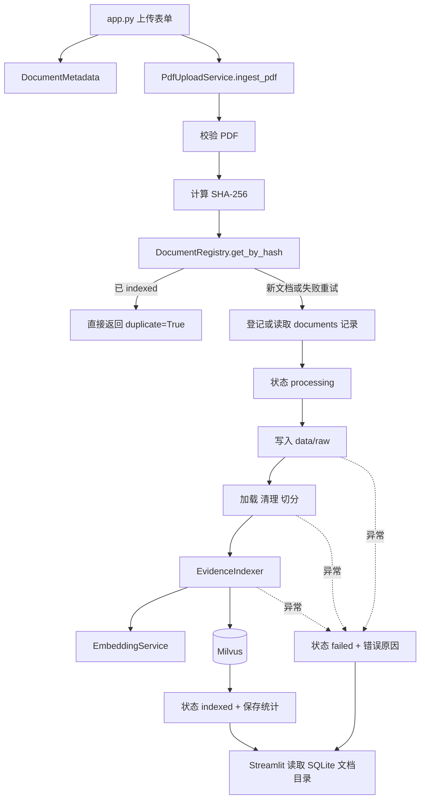
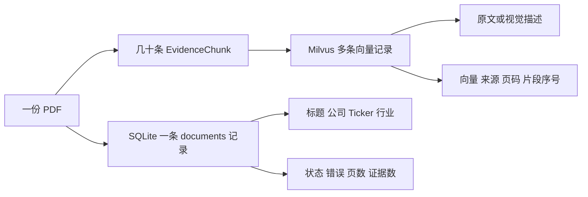
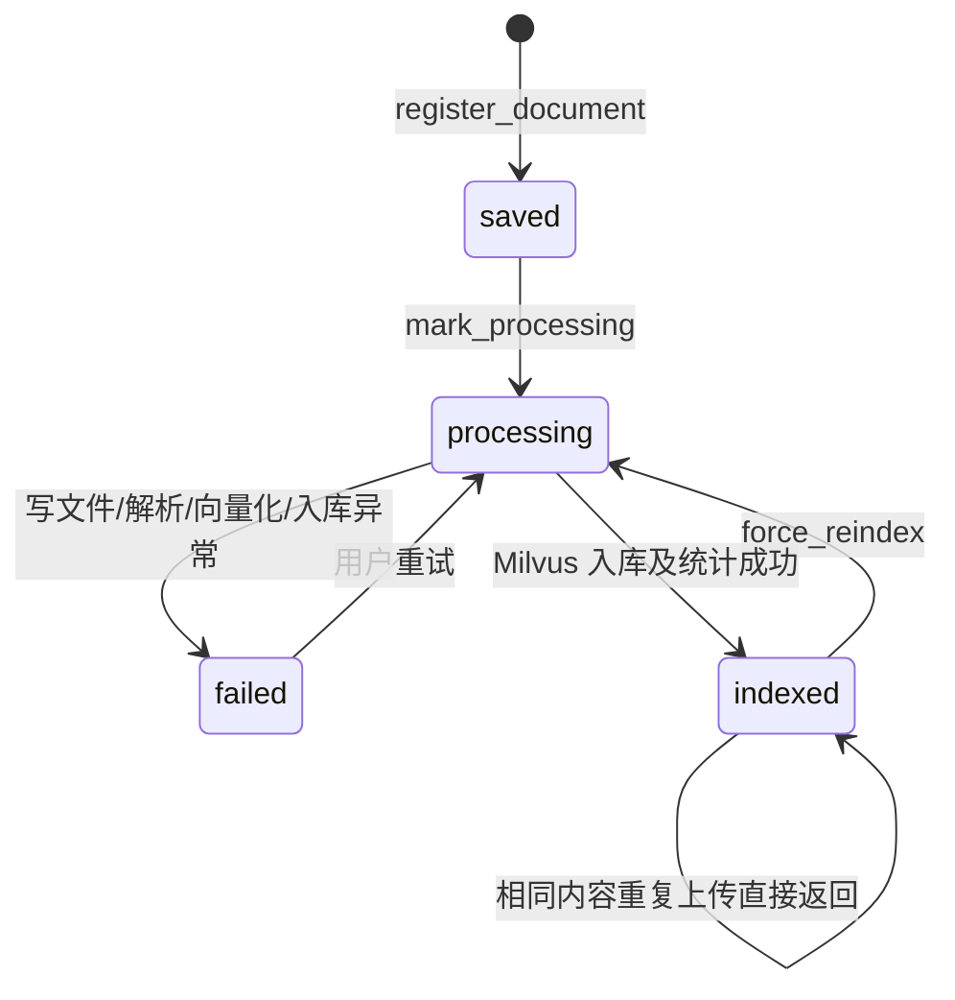
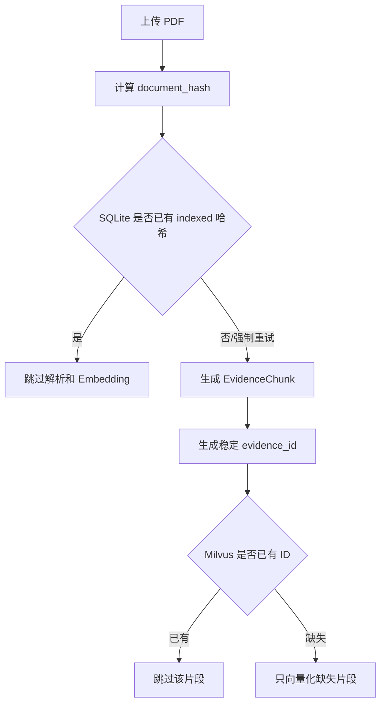
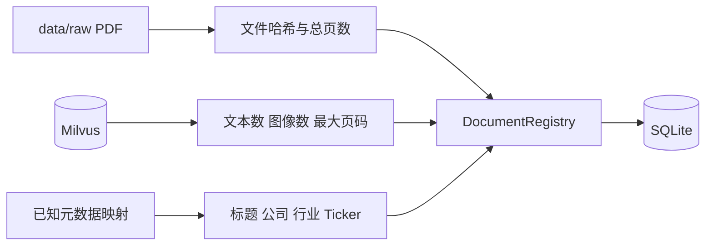

# 第八天复盘：SQLite 文档登记簿

日期：2026-09-30

## 1. 今日目标与完成情况

第八天把“文档”和“证据片段”拆成两个层次管理。SQLite 保存一份 PDF 的元数据与状态，Milvus 保存一份 PDF 拆出的多条可检索证据。

- [x] 新增 SQLite `documents` 表。
- [x] 保存 SHA-256、标题、公司、Ticker、行业、类型和报告日期。
- [x] 保存总页数、处理页数、文本证据数、图像证据数和处理状态。
- [x] 使用上下文管理器确保 SQLite 连接提交、回滚并关闭。
- [x] 上传流程写入 `processing`、`indexed` 和 `failed` 状态。
- [x] 相同内容重复上传在解析前返回，不重复调用 Embedding。
- [x] 同名不同内容继续使用哈希后缀保存。
- [x] Milvus 支持按来源统计文本、图像和最大页码。
- [x] 将 6 份历史 PDF 幂等迁移到注册表。
- [x] Streamlit 文档目录改为读取 SQLite。
- [x] 上传页面增加文档元数据表单。
- [x] 完成 3 项不依赖外部服务的自动化测试。
- [x] 完成真实 NVIDIA 重复上传验收。

## 2. 第八天完成后的主流程



## 3. 新建和修改的文件

| 文件 | 今日职责 | 主要调用关系 |
|---|---|---|
| `src/research_kb/settings.py` | 增加项目根目录、数据目录和 SQLite 路径 | 被 `document_registry.py` 引用 |
| `src/research_kb/document_registry.py` | 文档登记、内容去重、查询、状态更新 | 被上传服务、迁移脚本和页面调用 |
| `src/research_kb/milvus_store.py` | 按来源统计文本/图像证据和最大页码 | 被迁移脚本调用 |
| `src/research_kb/upload_service.py` | 协调文件、SQLite、解析与 Milvus 入库 | 调用 registry、loader、cleaner、chunker、indexer |
| `scripts/migrate_document_registry.py` | 将历史文件和已有向量补登记到 SQLite | 读取 PDF、Milvus，写 SQLite |
| `scripts/check_upload.py` | 用 NVIDIA 验证真实重复上传 | 调用上传服务并比较前后数量 |
| `tests/test_document_registry.py` | 测试登记去重、上传去重和失败状态 | 使用临时 SQLite 和假 Indexer |
| `app.py` | 展示文档登记簿并录入上传元数据 | 创建 registry 并调用上传服务 |
| `.gitignore` | 忽略 SQLite 数据库及临时文件 | 防止运行数据进入 Git |

## 4. SQLite 和 Milvus 的职责边界



SQLite 适合文档列表、状态、唯一约束和组合筛选。Milvus 适合根据问题向量找相似证据。此前用 `list_sources()` 扫描向量推断文档列表，会丢失失败文档，也没有公司、行业和日期；现在页面直接读取 SQLite。

## 5. `documents` 表关键字段

| 字段 | 作用 |
|---|---|
| `document_id` | 业务 ID，格式为 `doc_` 加哈希前 20 位 |
| `document_hash` | 完整 SHA-256，唯一约束保证相同内容只登记一次 |
| `original_name` | 用户上传时的文件名 |
| `saved_name` | 磁盘路径和 Milvus `source` 共用的实际文件名 |
| `title/company/ticker/industry` | 页面展示与后续筛选使用的业务元数据 |
| `document_type/report_date` | 区分年报、季报、行业报告及报告时间 |
| `total_pages/processed_pages` | 区分文件总页数和本次处理范围 |
| `text_chunk_count/image_chunk_count` | 展示文档拥有的两类证据数量 |
| `status/error_message` | 展示处理中、成功、失败和失败原因 |

## 6. 文档状态机



失败记录不能直接消失，因为用户需要知道哪份文档失败、失败发生在哪里，并能使用同一文件再次尝试。

## 7. 文档级与证据级两层去重



文档级去重节省整条处理链；证据级去重负责失败恢复和部分补入库。两层共同保证重复操作不会重复计费。

## 8. SQLite 连接为何使用 `contextmanager`

`sqlite3.Connection` 自带的 `with` 负责事务提交或回滚，但不会关闭连接。Windows 下未关闭的连接会持续占用 `.db` 文件，测试临时目录清理时出现过 `WinError 32`。

`DocumentRegistry._connect()` 现在使用：

```text
建立连接 → yield 给业务 SQL → 成功 commit / 异常 rollback → finally close
```

这让所有查询与更新都共享同一种资源管理方式。

## 9. 历史迁移为什么不重新生成向量

迁移脚本读取三类现有事实：



迁移只为旧数据补目录，不改变 Milvus。第一次新增 6 条文档，第二次根据哈希跳过 6 条，Milvus 始终保持 311 条。

## 10. 自动化测试覆盖

1. `test_registry_deduplicates_and_updates_status`：验证哈希去重、Ticker 大写和成功统计。
2. `test_upload_skips_duplicate_document`：使用 `FakeIndexer` 验证第二次上传不再执行入库。
3. `test_upload_failure_is_saved`：使用 `FailingIndexer` 验证异常会写入 `failed` 和错误信息。

测试使用 pytest 的 `tmp_path` 和 `monkeypatch`，不接触正式数据库、Milvus 或模型 API。

## 11. 实际验收结果

```text
自动化测试：3 passed
注册表文档：6
Milvus 实体：311
文本证据：308
图像证据：3
迁移第二次执行：新增 0，跳过 6
NVIDIA 重复上传：duplicate=True
NVIDIA 新增向量：0
Streamlit 独立端口启动：成功
```

## 12. 面试可能追问

### 为什么不把元数据也全部放在 Milvus？

Milvus 的核心优势是向量相似度检索。文档状态、失败原因、唯一约束和多条件管理更适合关系数据库。拆分后两个存储各自承担最擅长的职责。

### 双存储会不会不一致？

上传服务是统一协调者：先登记并设为处理中，Milvus 成功后才标记 `indexed`，异常则保存 `failed`。若向量已写入但状态更新失败，重新执行时证据 ID 去重会跳过已有向量，最终修复状态而不重复付费。

### 为什么使用 SHA-256，而不是文件名？

文件名可以修改，也可能重名；SHA-256 根据文件内容计算。相同内容即使换了名字仍能识别，同名但内容不同则会保存为两个文档。

### 为什么当前选择 SQLite？

这是单用户本地工具，SQLite 无需部署服务，支持事务、索引、唯一约束和筛选。业务规模扩大后可以保留 Registry 接口并迁移到 PostgreSQL。

## 13. 当前限制与第九天衔接

- 一份文档尚未分配到具体研究项目。
- 页面只能选择全部资料或单份 PDF，尚不能对项目内多份文档检索。
- 尚未提供删除影响预览、备份和同步删除。
- 历史资料中未可靠确认的报告日期保留为空。

第九天将在 SQLite 中增加研究项目，按项目和元数据筛选文档，再把多个 `saved_name` 映射成 Milvus 的多来源过滤条件。

