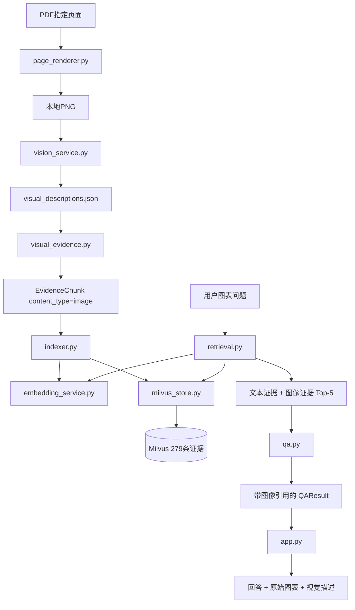

# 第六天复盘：最小多模态 RAG 闭环

日期：2026-09-27

## 1. 今日目标与完成情况

第六天目标是在已有文本 RAG 上加入少量图表页面，形成适合实习面试展示的最小多模态闭环。

- [x] 从现有报告中选择 3 个有代表性的图表页面。
- [x] 使用 PyMuPDF 将指定物理页渲染为 PNG。
- [x] 使用视觉模型生成包含数字、结构和结论的中文描述。
- [x] 将描述转换为 `content_type="image"` 的证据。
- [x] 复用现有 Embedding 和 Milvus 入库流程。
- [x] 为图像证据生成稳定的 `image_...` ID。
- [x] 验证 3 个图表问题均能在 Top-5 命中图像证据。
- [x] 验证文本模型能够引用图像证据回答问题。
- [x] 在 Streamlit 引用区域展示原始页面和视觉描述。
- [x] 验证图像证据重复入库不会产生重复实体。

最终结果：多模态检索 `3/3`，多模态问答 `3/3`，Milvus 中共有 276 条文本证据和 3 条图像证据。

## 2. 首轮多模态样本

| 文件 | PDF 页码 | 图表内容 | 选择原因 |
|---|---:|---|---|
| `01_NVDA_2026_Annual_Report.pdf` | 3 | AI 五层架构图 | 适合验证结构关系和层级顺序。 |
| `03_LITE_OFC_2026_Investor_Briefing.pdf` | 30 | 光学 AI TAM 预测 | 同时包含金额、年份、CAGR 和结构占比。 |
| `05_STX_2025_Decarbonizing_Data_Report.pdf` | 11 | 可持续数据存储障碍 | 适合验证柱状图标签和百分比提取。 |

只选择 3 页是成本和复杂度控制。项目已经证明完整链路成立，不需要为了面试演示处理整本 PDF 的每一页。

## 3. 新建和修改的文件

| 文件 | 作用 |
|---|---|
| `src/research_kb/page_renderer.py` | 将指定 PDF 物理页渲染成 PNG，并统一生成页面图片路径。 |
| `src/research_kb/vision_service.py` | 使用 LangChain `ChatOpenAI` 调用视觉模型生成图表描述。 |
| `src/research_kb/visual_evidence.py` | 读取视觉描述 JSON，校验图片路径并构造图像 `EvidenceChunk`。 |
| `src/research_kb/qa.py` | 将证据类型加入模型上下文，并要求图表问题引用相关图像证据。 |
| `app.py` | 区分文本和图表证据，在引用展开区域显示原始页面。 |
| `scripts/render_chart_pages.py` | 渲染首轮选择的 3 个页面。 |
| `scripts/describe_chart_pages.py` | 生成 3 条视觉描述并保存 JSON。 |
| `scripts/index_visual_evidence.py` | 将视觉描述向量化并幂等写入 Milvus。 |
| `scripts/check_multimodal_retrieval.py` | 验证 3 个图表问题能否召回预期图像证据。 |
| `scripts/check_multimodal_qa.py` | 验证回答是否正确引用预期图像证据。 |

## 4. 代码关系图



具体调用关系：

```text
render_chart_pages.py
└── page_renderer.py
    └── PyMuPDF

describe_chart_pages.py
└── vision_service.py
    ├── ChatOpenAI
    └── qwen3.5-flash

index_visual_evidence.py
├── visual_evidence.py
│   └── chunker.EvidenceChunk
├── indexer.py
├── embedding_service.py
└── milvus_store.py

check_multimodal_retrieval.py
└── retrieval.py
    ├── embedding_service.py
    └── milvus_store.py

check_multimodal_qa.py
└── qa.py
    └── retrieval.py

app.py
├── qa.py
└── page_renderer.get_page_image_path
```

## 5. 离线入库与在线问答

### 离线阶段

```text
PDF页面
  ↓ 144 DPI渲染
PNG图片
  ↓ 视觉模型
中文图表描述
  ↓ 文本Embedding
1024维向量
  ↓
Milvus图像证据
```

视觉模型只在离线入库阶段调用一次。描述保存到 `data/processed/visual_descriptions.json`，图片保存到 `data/images`，后续入库和调试不需要重复支付视觉模型费用。

### 在线阶段

```text
用户问题
  ↓ 查询Embedding
Milvus统一检索
  ├── text证据
  └── image证据的文字描述
  ↓
文本模型生成回答并返回引用ID
  ↓
Streamlit根据source和page_number显示原图
```

在线问答不把原图再次发送给视觉模型，因此速度、费用和实现复杂度都较低。

## 6. 页面渲染的关键点

### 物理页码转换

用户看到的 PDF 页码从 1 开始，PyMuPDF 的 `load_page()` 从 0 开始：

```text
PyMuPDF页索引 = PDF物理页码 - 1
```

### DPI 与缩放

PDF 基础分辨率为 72 DPI。本项目使用 144 DPI：

```text
scale = 144 / 72 = 2
```

这相当于宽高各放大 2 倍，在图表文字可读性和图片体积之间取得平衡。

### 稳定图片路径

```text
data/images/{PDF文件名去除后缀}/page_XXXX.png
```

渲染程序和 Streamlit 共用 `get_page_image_path()`，避免两边各写一套路径规则。

## 7. 图像证据如何进入原有系统

文本证据和图像证据都使用已有的 `EvidenceChunk`：

| 字段 | 文本证据 | 图像证据 |
|---|---|---|
| `evidence_id` | `text_...` | `image_...` |
| `source` | PDF 文件名 | PDF 文件名 |
| `page_number` | 原文页码 | 原图页码 |
| `chunk_index` | 页内片段序号 | 固定为 1 |
| `content_type` | `text` | `image` |
| `text` | PDF 提取文本 | 视觉模型描述 |

Milvus 原有 Schema 已经包含这些字段，因此无需删除或重建 Collection。

## 8. 图像证据 ID 与幂等性

图像证据 ID 由以下内容生成：

```text
source | page_number | image
  ↓ SHA-256前16位
image_7d8c42496374c90f
```

同一 PDF 同一页始终得到相同 ID。第二次入库时，`EvidenceIndexer` 会先查询这些 ID，在调用 Embedding 之前跳过已有记录。

重复入库验收：

```text
处理数量：3
本次新增：0
本次跳过：3
入库前实体：279
入库后实体：279
```

## 9. 为什么不把图片二进制写入 Milvus

Milvus 负责保存可检索向量和证据元数据，原始 PNG 保存在本地。检索结果已经包含 `source` 和 `page_number`，页面可以据此推导图片路径。

这种方式具有三个优点：

1. Collection 不需要增加大字段。
2. 图片文件可以直接交给 Streamlit 展示。
3. 向量数据库只负责检索，更容易解释和维护。

## 10. 实际运行结果

### 页面渲染

```text
NVIDIA 第3页：2376x1548
Lumentum 第30页：1920x1080
Seagate 第11页：1224x1584
```

### 视觉描述

```text
模型：qwen3.5-flash
处理页面：3
NVIDIA描述：873字符
Lumentum描述：446字符
Seagate描述：686字符
```

### 首次入库

```text
本次新增：3
本次跳过：0
入库前实体：276
入库后实体：279
```

### Top-5 多模态检索

| 问题 | 图像证据排名 | 分数 | 结果 |
|---|---:|---:|---|
| NVIDIA AI 五层架构 | 1 | 0.5442 | 通过 |
| Lumentum 光学 AI TAM | 1 | 0.8097 | 通过 |
| Seagate 存储建设障碍 | 3 | 0.5616 | 通过 |

检索验收：`3/3`。

### 多模态问答

三个问题均满足：

- `insufficient_information=False`。
- 回答中的数字和结构与原图一致。
- 引用了预期 `image_...` 证据。
- 引用 ID 通过已有引用校验。

问答验收：`3/3`。

### Streamlit

```text
Milvus实体数：279
已入库文档：5
页面启动：通过
图表证据标签：通过
引用区域原图展示：通过
视觉描述展示：通过
```

## 11. 今天掌握的知识点

- PDF 页面坐标和用户物理页码的差异。
- DPI、缩放矩阵和图片尺寸之间的关系。
- 使用 Base64 Data URL 向视觉模型发送本地图片。
- 将视觉模型输出转换为可检索文本。
- 在同一 Milvus Collection 中统一保存文本与图像描述向量。
- 使用 `content_type` 区分证据类型。
- 使用稳定 ID 实现图像证据幂等入库。
- 使用来源和页码恢复本地原始图片。
- 在 Prompt 中要求图表问题引用图像证据。

## 12. 面试可能追问

### 这个项目的“多模态”体现在哪里？

系统接收 PDF 页面图像，使用视觉模型理解图表，再把视觉语义转换为文本向量参与检索。最终回答可以同时引用 PDF 文本和图表证据，并展示原图供用户核对。

### 为什么不用专门的图片向量模型？

当前目标是完成易理解、低成本的实习面试项目。图像转文字后可以复用已有文本 Embedding、Milvus Schema、检索器和问答链路。后续数据规模扩大时，可以增加 CLIP 等图像向量和多路召回。

### 视觉模型会不会看错图表？

会，所以系统保留来源文件、物理页码和原图。用户可以在引用区域对照原图检查描述和回答，重要数字不能只依赖模型生成文本。

### 为什么图像证据和文本证据放在同一个 Collection？

两种证据都被转换为同一 Embedding 模型的 1024 维文本向量，并共享来源、页码和正文等字段。统一存储可以直接复用 Top-K 检索和引用校验。

### 为什么视觉模型不在每次问答时调用？

离线生成描述可以减少响应时间和费用，也让同一页面的检索结果保持稳定。只有新增或更新图表页面时才需要重新调用视觉模型。

### `image_path` 为什么没有写入 Milvus？

当前路径可以由 `source` 和 `page_number` 稳定计算。保留本地图片并在页面层推导路径，可以避免修改已有 Schema，也符合这个项目的小规模演示定位。

## 13. 当前限制

- 图表页面仍由人工选择，没有自动识别整本 PDF 中的图表。
- 视觉描述质量依赖视觉模型，关键数字仍需查看原图。
- 当前只验证 3 个代表性页面。
- 文本和图像描述使用同一个文本向量空间，没有独立图像向量。
- 原始 PDF、PNG 和生成的描述 JSON 只保存在本机，不上传 Git。

这些限制是有意识的范围控制，适合日常实习面试项目，不影响核心链路展示。

## 14. 第七天开始前

第七天进入最小 LangGraph 工作流，将现有问答步骤显式组织为状态图：

```text
校验问题 → 检索证据 → 判断是否有证据 → 生成回答 → 校验引用
```

目标是展示 LangGraph 的状态、节点和条件边，同时复用现有 `MilvusRetriever` 和问答逻辑，不增加复杂的多 Agent 协作。
