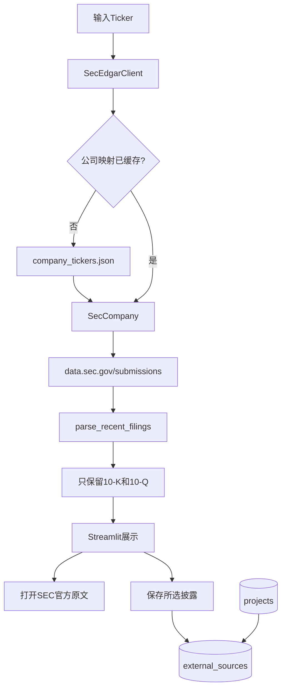
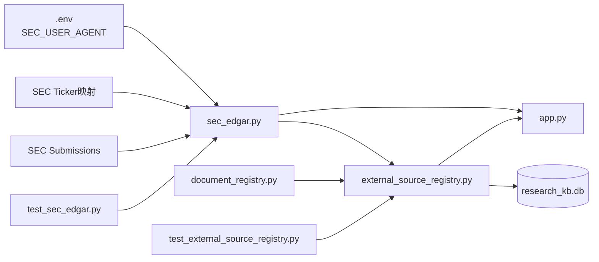
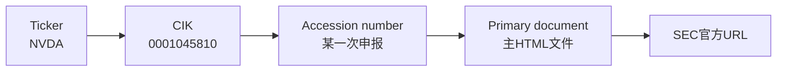
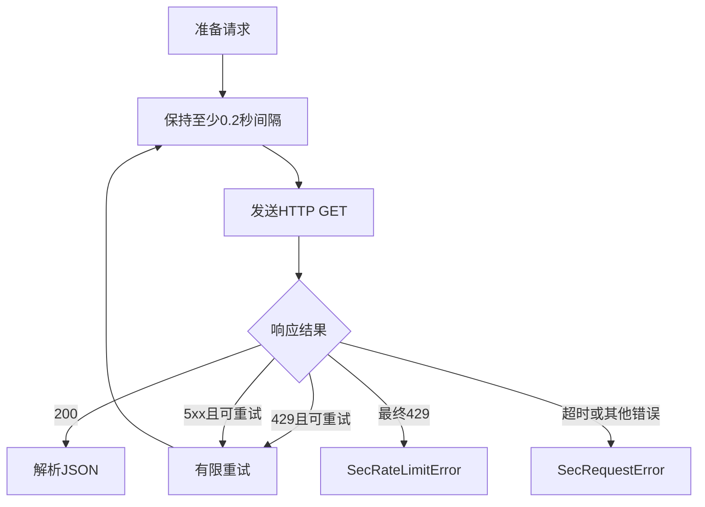
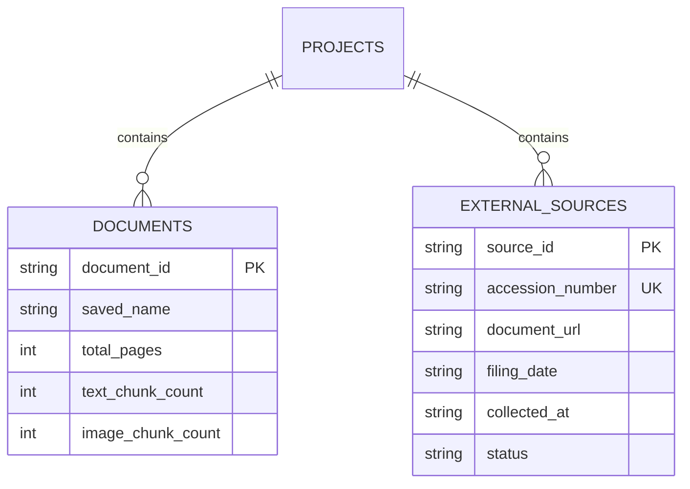
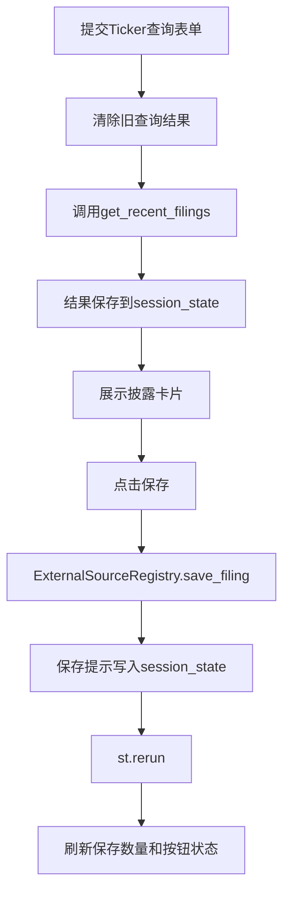
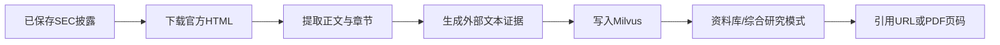

# 第十一天复盘：SEC 官方披露发现与登记

日期：2026-10-03

## 1. 今日完成情况

- [x] 根据美股 Ticker 查询 SEC 官方公司映射。
- [x] 将普通 CIK 补足为 Submissions API 要求的十位格式。
- [x] 读取公司近期申报并筛选 10-K 与 10-Q。
- [x] 构造申报主文档和文件目录的官方 URL。
- [x] 使用 `SEC_USER_AGENT` 声明自动访问身份。
- [x] 将请求频率主动限制为每秒最多 5 次。
- [x] 对超时、网络错误、429 和 5xx 执行有限重试或返回清楚错误。
- [x] 在 SQLite 中建立独立的 `external_sources` 表。
- [x] 外部资料支持归属已有研究项目和重复保存判断。
- [x] Streamlit 支持查询、打开原文、保存和查看已保存披露。
- [x] NVDA 与 TGT 的真实查询通过。
- [x] NVIDIA 与 Target 各保存一份 10-K，重复保存不增加记录。
- [x] 项目自动化测试由 19 项增加到 24 项。

## 2. 最终业务流程



## 3. 代码文件关系



| 文件 | 第十一天职责 | 与其他文件的联系 |
|---|---|---|
| `sec_edgar.py` | 数据模型、字段清理、JSON 解析、URL 构造和网络客户端 | 向页面和外部登记簿提供 `SecFiling` |
| `external_source_registry.py` | 建表、保存、去重、筛选和项目外键 | 与 `document_registry.py` 共用 SQLite 的 `projects` 表 |
| `app.py` | 收集 Ticker、调用 SEC、展示结果和处理保存按钮 | 不直接解析 SEC JSON，也不直接写 SQL |
| `test_sec_edgar.py` | 验证纯函数、缓存、错误和请求头 | 使用 `httpx.MockTransport`，不访问真实网络 |
| `test_external_source_registry.py` | 验证保存、去重、回滚和筛选 | 使用临时 SQLite，不污染正式数据库 |

## 4. 五个核心标识的关系



- `Ticker` 是交易市场使用的股票代码。
- `CIK` 是 SEC 为申报实体分配的编号。
- `accession_number` 唯一标识一次申报。
- `primary_document` 是本次申报中的主要 HTML 文件。
- `source_id` 由 CIK 和去掉连字符的 accession number 组成，用于项目内部去重。

## 5. 为什么 SEC JSON 使用并列数组

Submissions API 的 `recent` 数据不是“每份申报一个字典”，而是多个并列数组：

```text
form[0]
filingDate[0]
reportDate[0]
accessionNumber[0]
primaryDocument[0]
```

相同下标共同组成一条申报。`_get_column_value()` 在读取前检查字段是否为列表、下标是否存在；某个数组较短时只跳过不完整记录，不让整家公司查询失败。

## 6. URL 构造规则

```text
https://www.sec.gov/Archives/edgar/data/
{不带前导零的CIK}/
{去掉连字符的accession number}/
{primary document}
```

例如代码需要依次执行：

```text
0001045810 → 1045810
0001045810-26-000021 → 000104581026000021
```

主文档名禁止包含 `/` 或 `\`，并在进入 URL 前编码，避免意外路径。

## 7. 网络访问和错误处理



SEC 官方上限为每秒 10 次，本项目主动使用每秒 5 次。Ticker 映射在一个客户端实例内缓存，因此连续查询多个公司不会反复下载完整映射。

`SEC_USER_AGENT` 保存在 `.env`，代码和 Git 中只有 `.env.example` 的示例值。页面不显示真实邮箱。

## 8. 为什么建立独立的 external_sources 表

原 `documents` 表描述 PDF，包含总页数、处理页数、文本证据数和图像证据数。SEC 原文通常是 HTML，没有可靠的 PDF 物理页码。



分表避免给网页虚构页数，同时仍通过 `project_id` 将本地 PDF 和官方披露组织到同一个研究项目。

## 9. 重复保存如何处理

保存前依次检查：

1. `source_id` 是否已经存在；
2. `accession_number` 是否已经存在；
3. 插入时仍由 SQLite 的主键和唯一约束处理并发冲突。

第一次返回 `created=True`，重复保存返回原记录和 `created=False`。因此重复点击不会增加 SQLite 数据。

## 10. Streamlit 状态流



查询结果保存在 Session State，因此保存按钮触发页面重新运行后，原查询结果仍然保留。已保存的 `source_id` 会让按钮变成“已经保存”。

SEC 服务使用独立的 `create_sec_services()` 初始化。即使 User-Agent 配置错误或 SEC 暂时不可用，本地 Milvus、PDF 上传和问答仍可启动。

## 11. 自动化测试

`test_sec_edgar.py` 包含 10 项测试，覆盖：

- Ticker 清理和 CIK 补零；
- 公司映射；
- 主文档 URL 和目录 URL；
- 10-K/10-Q 筛选；
- 并列数组长度不一致；
- 公司映射缓存；
- 未知 Ticker；
- HTTP 429；
- 网络超时；
- User-Agent 缺失。

`test_external_source_registry.py` 包含 5 项测试，覆盖：

- 首次保存和重复跳过；
- 项目外键和组合筛选；
- 未知项目事务回滚；
- 错误日期拒绝；
- 非法状态拒绝。

项目最终结果：

```text
24 passed
```

## 12. 正式验收结果

```text
NVDA | NVIDIA CORP | CIK 0001045810
近期结果包含 10-Q、10-Q、10-K
保存：2026报告期10-K
项目：AI 基础设施

TGT | TARGET CORP | CIK 0000027419
近期结果包含 10-Q、10-Q、10-K
保存：2026报告期10-K
项目：消费零售

正式external_sources记录：2
重复保存：created=False
Milvus实体：保持312
```

保存披露只登记官方来源，没有生成 Embedding，因此不会改变 Milvus 实体数，也不会产生模型费用。

## 13. 当前边界与第十二天衔接

第十一天完成的是“发现、打开和登记官方披露”，尚未下载并切分 HTML 正文。因此当前问答仍只使用本地 PDF 证据。

第十二天将处理：



本地 PDF 将继续显示物理页码，外部 SEC 资料显示官方 URL 和日期，不会把两类引用混成同一种格式。

## 14. 推荐复习顺序

```text
normalize_ticker / format_cik
→ parse_company_mapping
→ parse_recent_filings
→ SecEdgarClient._get_json
→ SecEdgarClient.get_recent_filings
→ ExternalSourceRegistry.save_filing
→ app.py SEC查询和保存区域
→ 两个测试文件
```

## 15. 面试可能追问

### 为什么选择 SEC，而不是直接使用聚合财务 API？

第十一天目标是接入一种可靠、可追溯的外部来源。SEC 提供监管原文和稳定标识，且不需要 API Key。聚合行情、新闻和国内数据可以在完成第 14 天整体版本后按 Provider 方式扩展。

### 为什么没有立刻让 SEC HTML 进入 RAG？

HTML 没有 PDF 物理页码。如果直接复用原结构会产生错误引用。先把发现、URL、日期和登记流程完成，再在第十二天扩展统一证据结构，边界更清楚。

### 一个接口失败为什么不会拖垮页面？

SEC 服务和本地问答服务分别缓存、分别捕获初始化异常。页面会显示 SEC 错误，但不会将 `answerer`、Milvus 或上传服务设为不可用。
