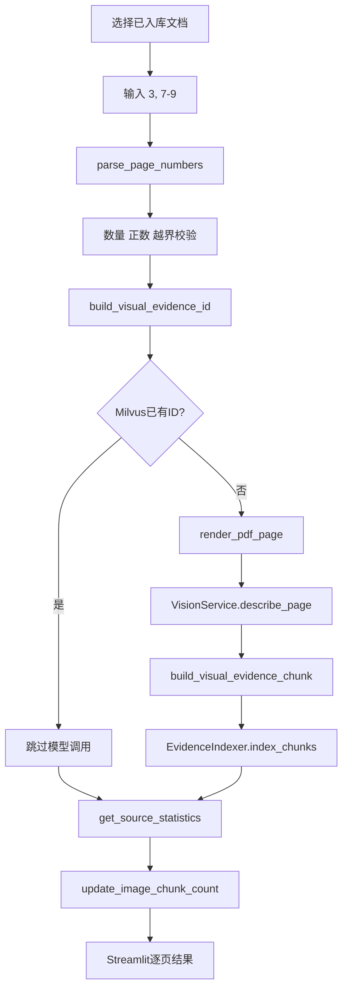
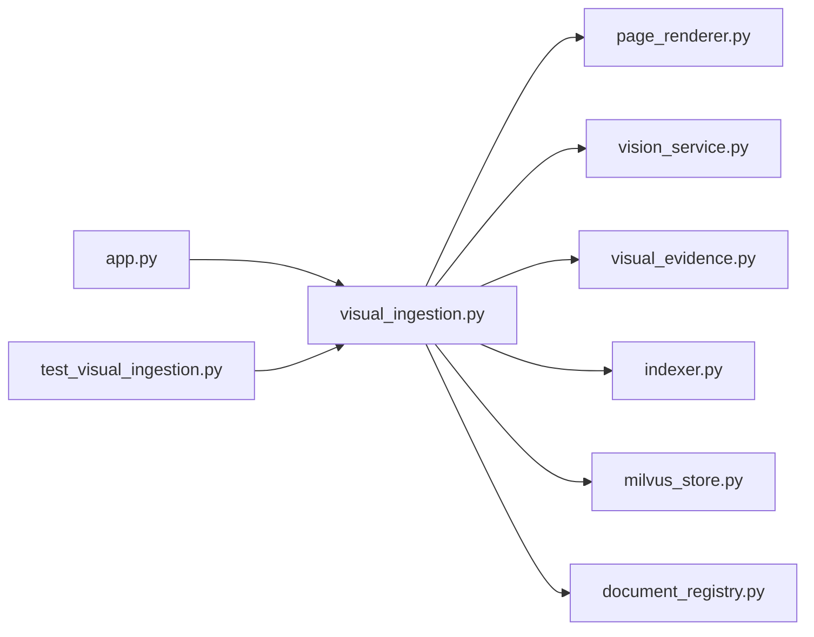
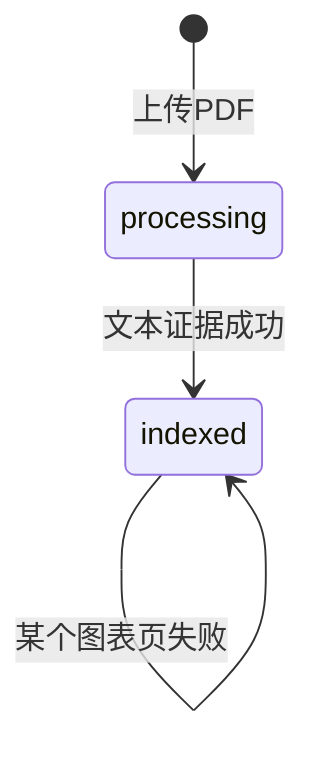

# 第十天复盘：上传后的图表页处理

日期：2026-10-02

## 1. 今日完成情况

- [x] 页面支持输入单页、多个页码和连续页码范围。
- [x] 中文逗号和英文逗号都可以解析。
- [x] 页码去重并保持用户输入顺序。
- [x] 一次最多处理 5 个不重复页面。
- [x] 所有页码在模型调用前统一检查是否越界。
- [x] 从 JSON 导入和网页处理共用图像证据构造函数。
- [x] 已存在图像证据时不调用视觉模型和 Embedding。
- [x] 单页失败不会终止其他页面，也不会改变文本 `indexed` 状态。
- [x] 根据 Milvus 实际统计更新 SQLite 图像证据数量。
- [x] Streamlit 展示视觉调用、新增、跳过、失败和逐页图片。
- [x] 正式处理 Lumentum 第 7 页，并完成重复处理验收。
- [x] 自动化测试由 6 项增加到 9 项。

## 2. 最终业务流程



## 3. 代码文件关系



| 文件 | 第十天职责 | 关键联系 |
|---|---|---|
| `visual_ingestion.py` | 页码解析、多页处理、重复跳过、部分失败和统计同步 | 统一调用渲染、视觉、证据、入库、Milvus 和 SQLite |
| `visual_evidence.py` | 构造稳定的单页图像证据 | 被旧 JSON 导入流程和新网页流程共同调用 |
| `document_registry.py` | 只更新 `image_chunk_count` | 不覆盖文本数量和文档状态 |
| `app.py` | 输入页码、提示费用、调用服务并展示报告 | 不直接操作视觉模型或向量数据库 |
| `test_visual_ingestion.py` | 测试解析、重复跳过、部分失败和越界拒绝 | 使用临时数据库和 Fake 服务，不产生费用 |

## 4. 页码解析规则

`parse_page_numbers()` 将页面输入转换为 `list[int]`：

```text
3, 7, 9     → [3, 7, 9]
3，7-9      → [3, 7, 8, 9]
3, 3, 2-4   → [3, 2, 4]
空字符串     → []
```

以下输入会在视觉模型调用前报错：空项、非整数、0、负数、倒序范围以及超过 5 个不重复页面。

## 5. 为什么先检查图像证据 ID

图像证据 ID 只由 PDF 保存文件名、物理页码和 `image` 类型生成。同一页每次都会得到相同 ID。

```text
source + page_number + image
→ SHA-256 前16位
→ image_xxxxxxxxxxxxxxxx
```

视觉描述本身不会参与 ID 计算。服务在渲染和模型调用之前查询 Milvus；如果 ID 已存在，直接返回 `skipped`。这比只依靠 `EvidenceIndexer` 去重更省费用，因为 Indexer 的去重发生在视觉描述已经生成之后。

## 6. 单页失败为何不修改文档状态

文本入库和图表增强是两个阶段：



图表页失败不代表整份 PDF 不可检索。服务把失败记录在 `VisualPageResult`，继续处理剩余页面；SQLite 仍保持文本证据数和 `indexed` 状态。

## 7. 为什么最终数量以 Milvus 为准

一次请求可能同时包含：

- 已存在并跳过的页面；
- 新增成功的页面；
- 视觉模型失败的页面；
- 入库失败的页面。

只使用本次 `inserted_chunks` 累加容易与历史数据不一致。因此处理结束后调用 `get_source_statistics()`，把 Milvus 当前实际 `image` 数量写回 SQLite。

## 8. Streamlit 状态流


报告需要暂存在 Session State，因为处理成功后必须重新运行页面，才能重新读取 Milvus 实体总数和 SQLite 图像数量。

## 9. 自动化测试

第十天增加 3 项测试：

1. `test_parse_page_numbers`：验证单页、范围、中文逗号、顺序去重和非法输入。
2. `test_visual_ingestion_skips_and_continues`：验证重复页跳过、新页入库、单页失败继续及 SQLite 同步。
3. `test_out_of_range_page_has_no_external_calls`：验证越界时不查询 Milvus、不渲染、不调用视觉模型和 Indexer。

测试总数为 `9 passed`。

## 10. 正式验收结果

```text
正式处理：03_LITE_OFC_2026_Investor_Briefing.pdf 第7页
视觉模型调用：1
新增图像证据：1
证据ID：image_62ef961c2f406a0a
Milvus实体：311 → 312
Lumentum图像证据：1 → 2
失败页面：0

重复处理同一页：
视觉模型调用：0
新增：0
跳过：1
Milvus实体：保持312

相关问题检索：
image_62ef961c2f406a0a 排名第1
```

页面还验证了 NVIDIA 第 176 页越界提示。该文档共 175 页，错误在视觉模型调用前返回，没有产生费用。

## 11. 面试可能追问

### 为什么让用户选页，而不自动识别全部图表？

个人研究工具更重视成本可控和结果可解释。用户通常知道关键图表页；一次最多处理 5 页，能清楚预计调用次数。自动图表检测可以作为后续优化，但不是实习项目核心。

### 为什么不把视觉处理直接写进 `app.py`？

页面只负责收集输入和展示结果。业务服务可以被脚本、测试或其他界面复用，也能使用 Fake VisionService 验证失败和重复场景。

### 为什么图像描述还要生成 Embedding？

Milvus 检索的是向量。视觉模型先把图片转成包含数字、单位和趋势的文字描述，再由 Embedding 模型转成向量，使普通文本问题能够召回图表证据。

### 重复处理为什么不会重复收费？

服务在视觉模型调用前根据稳定 `evidence_id` 查询 Milvus。已存在时直接跳过，视觉模型和 Embedding 都不会执行。

## 12. 推荐复习顺序

```text
parse_page_numbers
→ build_visual_evidence_id
→ VisualIngestionService.ingest_pages
→ build_visual_evidence_chunk
→ EvidenceIndexer.index_chunks
→ update_image_chunk_count
→ app.py 图表页处理面板
```

## 13. 第十一天衔接

当前资料仍需要用户手动找到并上传。第十一天将接入第一种官方外部来源：根据美股 Ticker 获取 SEC 最近的 10-K 和 10-Q 元数据、原始链接与提交日期，再由用户选择是否导入。

