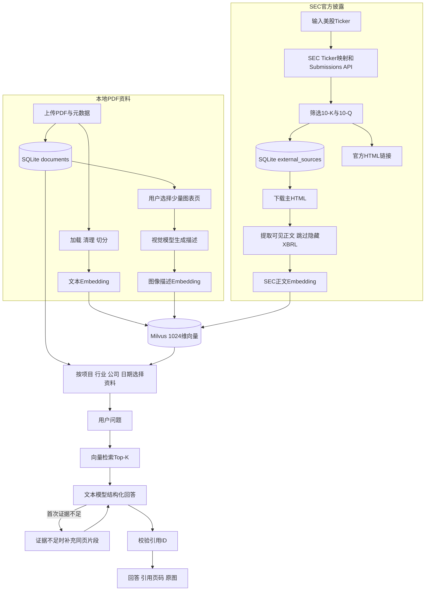
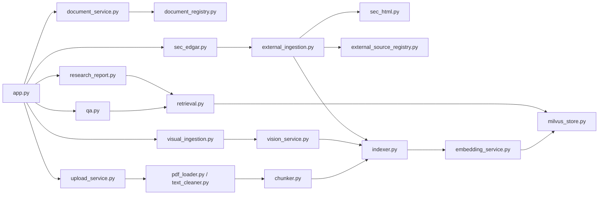
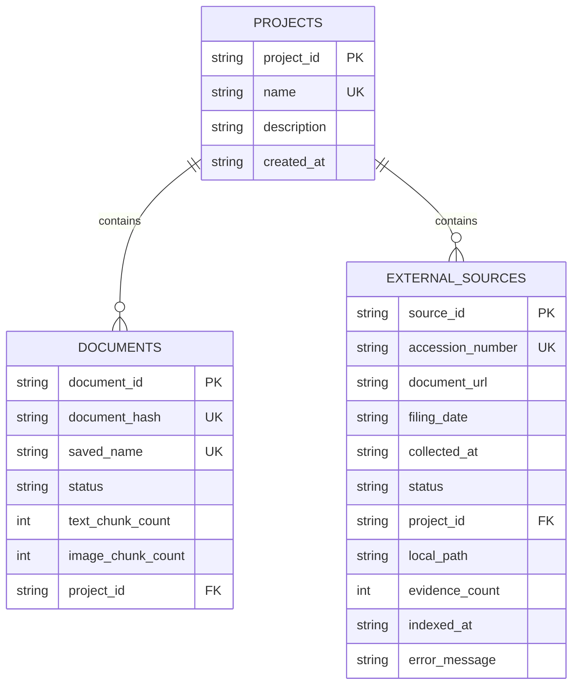

# ResearchKB 项目交接说明

最后更新：2026-09-30  
当前阶段：第 13 天已完成，第 14 天尚未开始实现
Git 分支：`main`  
交接基线提交：第 12 天功能提交见当前 `main` 分支最新记录

> 新接手的开发者或 Codex：请先完整阅读本文，再查看代码和运行测试。本文是项目唯一的历史与后续开发说明，旧的每日任务、复盘和学习文档已经删除。

## 1. 项目目标

ResearchKB 是一个面向个人投资研究的多模态知识库。用户可以上传跨行业 PDF，系统提取文本和图表证据，写入 Milvus，通过 RAG 生成带引用的中文回答；同时可以根据美股 Ticker 查询并保存 SEC 官方 10-K / 10-Q。

项目用于学生实习面试和实际个人研究，优先级依次是：

1. 流程完整且能实际运行；
2. 引用可追溯，证据不足时拒答；
3. 代码适合学生理解和讲解；
4. 控制模型调用费用；
5. 只在存在真实业务需求时增加框架复杂度。

当前没有使用 LangGraph 或 MCP。依赖已经安装不代表必须使用。现有确定性 RAG 流程不需要为了技术栈展示而强行引入状态图。

## 2. 当前完整业务流程



关键边界：SEC 正文已经可以进入 Milvus。页面通过 SQLite 按 `source_id` 为向量结果补回公司、报告期和官方 URL；网页证据使用 `page_number=0`，但界面不会把它显示成 PDF 页码。

## 3. 已完成能力

### 3.1 PDF 与文本 RAG

- 上传不超过 20 MB 的 PDF；
- 单次最多处理 30 页，并明确显示是否截断；
- 登记标题、公司、Ticker、行业、文档类型、报告日期和项目；
- 提取、清理并按 `800` 字符、`120` 字符重叠切分；
- 使用 1024 维 Embedding 写入 Milvus；
- 文件 SHA-256 和稳定 `evidence_id` 两层去重；
- 支持多文档来源过滤；
- 模型只允许依据检索证据回答；
- 模型返回的引用 ID 必须属于本轮检索结果；
- 证据不足时拒答；
- 首次证据不足时补充最高分 PDF 物理页的其他片段，只重试一次。

### 3.2 多模态图表证据

- 用户为已上传 PDF 输入单页或范围，例如 `3, 7-9`；
- 支持中英文逗号、去重和顺序保留；
- 一次最多处理 5 个图表页；
- 页码越界在模型调用前拒绝；
- PDF 页面渲染为 PNG；
- 视觉模型生成包含数字、单位和趋势的文字描述；
- 描述生成 Embedding 后作为 `content_type=image` 写入 Milvus；
- 已存在图像 ID 时在调用视觉模型前跳过，避免重复费用；
- 单页失败不影响其他页，也不改变文本已入库状态；
- 问答引用图像证据时页面显示原图。

### 3.3 项目与资料管理

- SQLite `projects` 和 `documents` 表；
- 同一文档属于零个或一个研究项目；
- 按项目、行业、公司、报告日期筛选；
- 在筛选范围内选择多份 PDF 参与问答；
- 重新生成文本证据时保留已有图像证据；
- 删除前创建备份；
- 删除时同步清理 Milvus、SQLite、PDF 和页面图片；
- 数据库迁移是幂等的，旧表缺字段时通过 `ALTER TABLE` 补齐。

### 3.4 SEC 官方披露

- 读取 SEC 官方 Ticker/CIK 映射；
- CIK 补足为 API 需要的十位字符串；
- 查询公司 Submissions JSON；
- 只展示近期 `10-K` 和 `10-Q`；
- 保存公司名称、Ticker、CIK、报告期、提交日期、accession number 和官方 URL；
- `SEC_USER_AGENT` 从 `.env` 读取；
- 默认最多每秒 5 次请求，低于 SEC 每秒 10 次上限；
- 处理超时、网络错误、HTTP 429 和 5xx；
- Ticker 映射在客户端内存中缓存；
- SQLite 独立表 `external_sources` 保存外部资料；
- 相同 `source_id` 或 accession number 不重复保存；
- 外部资料可以归入已有研究项目；
- SEC 初始化失败不会导致本地 PDF 问答不可用。
- 已保存披露可下载主 HTML，并限制单份不超过 20 MB；
- 清洗时排除脚本、样式、隐藏节点和隐藏 Inline XBRL 数据；
- 每条 SEC 证据加入公司、表单和报告期前缀，降低跨期混淆；
- 单份最多索引 500 条，重复执行在下载和 Embedding 前跳过；
- 页面提供“仅资料库”和“综合研究”模式；
- 综合模式把选中 PDF 与当前项目下已索引 SEC 正文一起检索；
- PDF 引用显示物理页码，SEC 引用显示报告期和官方 URL；
- SEC 证据不会进入 PDF 的同页扩展逻辑。

### 3.5 公司对比与研究简报

- 使用当前项目、文档选择和问答模式作为简报资料范围；
- 用户输入研究问题和简报日期；
- 按每个来源平衡召回 2—4 条，避免大型 SEC 文档挤占对比资料；
- 固定输出核心结论、关键事实、公司与行业对比、催化因素、风险、信息缺口和来源；
- 每条事实陈述必须引用本轮真实证据 ID；
- 无引用陈述自动移入信息缺口，伪造证据 ID 直接拒绝；
- 来源清单分别展示 PDF 物理页码和 SEC 官方 URL；
- 保存为带时间戳的 Markdown，并可从页面下载。

## 4. 当前真实数据状态

### 4.1 研究项目

| 项目 | project_id |
|---|---|
| AI 基础设施 | `project_316a34e00bf14885` |
| 消费零售 | `project_40e1eb6f4c9c47a4` |

### 4.2 已登记 PDF

| 文件 | Ticker | 行业 | 处理页 | 文本 | 图像 | 项目 |
|---|---:|---|---:|---:|---:|---|
| `01_NVDA_2026_Annual_Report.pdf` | NVDA | 半导体 | 20 | 59 | 1 | AI 基础设施 |
| `02_AMD_2025_Annual_Report.pdf` | AMD | 半导体 | 7 | 20 | 0 | AI 基础设施 |
| `03_LITE_OFC_2026_Investor_Briefing.pdf` | LITE | 光模块 | 30 | 40 | 2 | AI 基础设施 |
| `04_MU_2025_Annual_Report.pdf` | MU | 存储 | 15 | 71 | 0 | AI 基础设施 |
| `05_STX_2025_Decarbonizing_Data_Report.pdf` | STX | 数据存储 | 28 | 86 | 1 | AI 基础设施 |
| `06_TGT_2025_Annual_Report.pdf` | TGT | 消费零售 | 10 | 32 | 0 | 消费零售 |

汇总：

- 6 份 PDF；
- 308 条文本证据；
- 4 条图像证据；
- PDF 与图像证据共 312 条；加上 SEC 后 Milvus 有效实体总数为 1239。

### 4.3 已保存 SEC 披露

| Ticker | 类型 | 报告期 | 状态 | 项目 |
|---|---|---|---|---|
| NVDA | 10-K | 2026-01-25 | `indexed` | AI 基础设施 |
| TGT | 10-K | 2026-01-31 | `indexed` | 消费零售 |

两条记录已经完成正文入库：

| Ticker | 状态 | SEC证据 | 是否截断 |
|---|---|---:|---|
| TGT | `indexed` | 427 | 否 |
| NVDA | `indexed` | 500 | 是，原文完整切分为604条，按成本上限保留前500条 |

当前 Milvus 合计：312 条 PDF/图像证据 + 927 条 SEC 网页证据 = **1239 条实体**。

## 5. 技术栈与运行环境

- Windows + PowerShell；
- Python `>=3.11,<3.13`；
- `uv` 管理虚拟环境和依赖；
- Streamlit 页面；
- LangChain 文本切分、模型和 Embedding 封装；
- Milvus 向量数据库运行在 VMware Linux 虚拟机；
- Attu 用于查看 Milvus；
- SQLite 保存业务元数据；
- PyMuPDF / pypdf 处理 PDF；
- 阿里云百炼 OpenAI 兼容接口；
- SEC EDGAR 官方 JSON API。

当前 `.env.example` 中的基础地址：

```dotenv
MILVUS_URI=http://192.168.88.161:19530
MILVUS_COLLECTION=research_knowledge
ATTU_URL=http://192.168.88.161:7000
OPENAI_BASE_URL=https://dashscope.aliyuncs.com/compatible-mode/v1
TEXT_MODEL=qwen3.5-flash
VISION_MODEL=qwen3.5-flash
EMBEDDING_MODEL=qwen3.7-text-embedding-flash
SEC_USER_AGENT=ResearchKB your-email@example.com
```

真实 `.env` 不提交 Git。接手人需要填写自己的 `OPENAI_API_KEY` 和真实 SEC 联系邮箱。虚拟机 IP 如果变化，需要同步修改 `MILVUS_URI` 和 `ATTU_URL`。

## 6. 启动与验证

### 6.1 安装依赖

```powershell
cd E:\AI-Agent-Projects\ResearchKB
uv sync
```

不要复制旧机器的 `.venv` 作为交接方案，接手人在自己的机器上重新执行 `uv sync`。

### 6.2 启动页面

```powershell
uv run streamlit run app.py
```

也可以在 PyCharm 普通 Python 运行配置中运行：

```text
scripts/run_streamlit.py
```

停止服务：在运行终端按 `Ctrl + C`。

不要直接使用普通 Python 方式运行 `app.py`，否则会缺少 Streamlit `ScriptRunContext`。

### 6.3 自动化测试

```powershell
uv run pytest -q
```

交接时的基线结果：

```text
33 passed
```

### 6.4 编译和 Git 检查

```powershell
uv run python -m compileall -q app.py src tests
git diff --check
git status --short
```

## 7. 代码结构与职责



### 7.1 核心文件

| 文件 | 职责 |
|---|---|
| `app.py` | Streamlit 页面、Session State、服务调用和结果展示 |
| `settings.py` | 项目路径和默认切分参数 |
| `pdf_loader.py` | 按物理页加载 PDF 文本 |
| `text_cleaner.py` | 清理 PDF 抽取文本 |
| `chunker.py` | `EvidenceChunk`、稳定文本 ID 和文本切分 |
| `embedding_service.py` | 文档和问题 Embedding |
| `milvus_store.py` | Collection、查询、统计和删除 |
| `indexer.py` | 去重、Embedding、批量写入 Milvus |
| `retrieval.py` | Top-K 检索、来源过滤和同页补充 |
| `qa.py` | 结构化回答、证据不足和引用 ID 校验 |
| `document_registry.py` | `projects` / `documents` 表与迁移 |
| `upload_service.py` | PDF 验证、保存、解析、登记和入库事务 |
| `document_service.py` | 项目筛选、备份删除和重新入库 |
| `page_renderer.py` | PDF 单页渲染 PNG |
| `vision_service.py` | 调用视觉模型描述页面 |
| `visual_evidence.py` | 稳定图像 ID 和图像证据构造 |
| `visual_ingestion.py` | 网页端图表页多页处理流程 |
| `sec_edgar.py` | SEC 数据模型、解析、URL 和网络客户端 |
| `external_source_registry.py` | `external_sources` 表、保存和去重 |
| `sec_html.py` | 提取 SEC 可见正文、过滤隐藏 XBRL 并切分证据 |
| `external_ingestion.py` | 下载、保存、向量化及成功/失败状态编排 |
| `research_report.py` | 按来源平衡检索、结构化简报、引用校验和 Markdown 保存 |

### 7.2 测试文件

| 文件 | 覆盖内容 |
|---|---|
| `test_document_registry.py` | 上传登记、状态、文件哈希和失败恢复 |
| `test_document_management.py` | 项目隔离、筛选、删除备份和重新入库 |
| `test_visual_ingestion.py` | 页码解析、重复跳过、部分失败和越界 |
| `test_sec_edgar.py` | SEC JSON、URL、缓存、超时、429 和 User-Agent |
| `test_external_source_registry.py` | 外部资料保存、去重、项目外键和事务回滚 |
| `test_sec_html.py` | 可见文本、隐藏内容过滤和成本截断 |
| `test_external_ingestion.py` | 正文入库、状态更新和重复跳过 |
| `test_retrieval_sources.py` | 网页引用和禁止 PDF 同页扩展 |
| `test_research_report.py` | 简报保存、两类来源、无引用降级和伪造引用拒绝 |

### 7.3 scripts 目录

`scripts` 中大部分文件是早期开发、迁移或验收脚本，不是产品运行主入口。正式页面主要通过 `app.py` 调用 `src/research_kb`。

- `run_streamlit.py`：PyCharm 启动入口；
- `migrate_document_registry.py`：旧 PDF/Milvus 数据迁移；
- `check_upload.py`：上传幂等验收；
- `inspect_pdf.py`、`build_evidence.py`：早期 PDF 处理检查；
- `index_milvus.py`、`check_retrieval.py`：早期向量入库与检索；
- `evaluate_qa.py`：固定问答评测；
- `render_chart_pages.py`、`describe_chart_pages.py`、`index_visual_evidence.py`：第六天固定样本流程，产品页面已有通用版本；
- `check_multimodal_retrieval.py`、`check_multimodal_qa.py`：多模态验收。

## 8. 关键数据结构

### 8.1 Milvus Collection

现有 Collection 使用固定 Schema：

```text
evidence_id     VARCHAR 主键
vector          FLOAT_VECTOR(1024)
source          VARCHAR
page_number     INT64
chunk_index     INT64
content_type    VARCHAR
document_hash   VARCHAR
text            VARCHAR
```

现阶段没有重建 Collection。新增功能应尽量兼容这套 Schema，除非提供明确的迁移和回滚方案。

### 8.2 SQLite

`data/research_kb.db` 中有三张主要表：



`documents` 只表示 PDF。`external_sources` 表示网页披露。不要给 SEC HTML 虚构 PDF 页码。

## 9. 已确认的设计取舍

### 9.1 不强行使用 LangGraph

现有流程是确定性的：校验问题 → 检索 → 必要时补同页 → 生成回答 → 校验引用。使用普通 Python 更容易理解、测试和面试讲解。只有出现“模型自主选择来源、循环补证据、具有明确状态和终止条件”的需求时再引入 LangGraph。

### 9.2 外部来源先做 SEC

第 11 天只接入一种官方来源，按原 7—14 天计划控制范围。多 Provider、FMP、Tushare、通用搜索等想法已经讨论，但明确推迟到第 14 天完整版本评估之后，不要在第 12 天突然扩张范围。

### 9.3 PDF 与网页分开引用

- 本地 PDF：文件名 + 物理页码；
- 图像证据：PDF 页码 + 原图；
- SEC 网页：公司、表单、报告期 + 官方 URL。

第 12 天已经统一检索结果结构，同时保持两种展示：网页在 Milvus 内部使用页码 0，界面显示“SEC 官方原文”及链接，不显示“PDF 第 0 页”。

### 9.4 模型不能补充外部常识

系统 Prompt 只允许使用本轮证据。关键数字、日期、公司和经营结论必须可追溯。资料过期或年份不同必须在回答中说明。

### 9.5 成本控制

- PDF 默认最多 30 页；
- 一次最多 5 个图表页；
- 已有证据在模型调用前跳过；
- 自动化测试使用 Fake/Mock，不调用收费模型；
- 重复上传和重复图表处理不重复 Embedding。
- SEC HTML 单份最多写入 500 条证据，已索引来源不重复下载或 Embedding。

## 10. 已知限制

1. NVIDIA SEC 原文完整切分为 604 条，目前按单份 500 条成本上限截断；后部章节可能无法检索。
2. Milvus Schema 没有 URL 和日期字段，当前依靠 SQLite 按 `source_id` 补充；迁移数据库时必须连同 Milvus 一起考虑。
3. 当前检索只有向量检索，没有 BM25 和重排；先在第 14 天评测后决定是否增加。
4. SQLite、原始 PDF 和下载的 SEC HTML 被 `.gitignore` 忽略，单独 clone GitHub 不能恢复当前本地数据。
5. Streamlit 页面是单用户本地工具，没有账号、权限和并发编辑设计。
6. PDF 双栏或复杂版式可能需要同页补充；OCR 扫描件尚未专门支持。
7. SEC HTML 解析保留可见表格文本，但复杂表格的行列关系可能在纯文本化后减弱。
8. 模型输出仍可能受证据质量影响，不能作为自动投资建议。
9. 简报当前输出 Markdown，不包含 Word/PDF 导出；这是第 14 天后再评估的展示增强。

## 11. 第 12—14 天后续计划

### 11.1 第 12 天：资料库 / 综合研究两种模式（已完成）

目标：让已保存 SEC HTML 真正进入检索，同时区分本地页码和网页 URL。

已完成内容：

1. 为 `external_sources` 增加幂等迁移字段，例如本地 HTML 路径、证据数量、索引时间和错误信息。
2. 为 `SecEdgarClient` 增加复用现有限流/重试逻辑的 HTML 下载方法。
3. 新增 SEC HTML 正文提取器，跳过脚本、样式和隐藏 XBRL 内容，保留可读段落或章节。
4. 将正文切成 `EvidenceChunk`；外部证据 `source` 建议使用稳定 `source_id`，`content_type` 使用清楚的外部文本类型。
5. 修改 `EvidenceIndexer`，允许调用者为来源提供显式文件路径，以便计算外部 HTML 哈希，同时保持 PDF 调用兼容。
6. Milvus 仍使用现有 Schema；URL、公司、日期和来源类型由 `external_sources` 按 `source_id` 补充。
7. 扩展 `RetrievalResult`，包含可选的 `source_type`、`source_url`、`source_date` 和展示标题。
8. 外部网页证据不调用 `get_page_records()`；只有 PDF 且页码大于 0 时才执行同页扩展。
9. 页面增加显式模式：
   - `仅资料库`：只检索用户选中的 PDF，不进行任何联网下载；
   - `综合研究`：检索本地 PDF 加已下载并索引的 SEC 证据。
10. 回答引用区分别显示 `PDF 第 N 页` 和 `SEC 官方原文`。
11. Prompt 增加年份与口径规则，避免把不同报告期数字混写。
12. 使用 NVDA 与 TGT 验证本地 PDF 和 SEC HTML 都能被正确引用。

验收结果：Target 问题在“仅资料库”模式只召回 PDF；“综合研究”Top-5 同时召回 PDF 和 3 条 SEC 证据。真实结构化问答成功引用 TGT 10-K 官方 URL，报告期为 2026-01-31，未虚构 PDF 页码。

### 11.2 第 13 天：公司对比与研究简报（已完成）

目标：将问答升级为可保存的研究成果。

- 固定 Markdown 模板：研究问题、核心结论、关键事实、公司/行业对比、催化因素、风险、信息缺口、来源清单；
- 用户选择研究项目、资料范围和报告日期；
- 双公司关键数字必须能追溯到 PDF 页码或官方 URL；
- 缺失数据明确写“未找到”；
- 文件名包含时间或序号，避免覆盖旧简报；
- 如果计算比率，先由 Python 按明确单位计算，再由模型解释。

完成结果：

- 页面沿用当前项目、PDF 和已索引 SEC 范围，不重复维护资料选择状态；
- 简报固定包含核心结论、关键事实、公司与行业对比、催化因素、风险、信息缺口和来源；
- 普通问答继续使用全局 Top-5，简报按每个所选来源分别召回 2—4 条，防止大文档垄断结果；
- 每条事实都必须拥有本轮真实证据 ID；伪造 ID 会拒绝整份简报；
- 无引用陈述不会进入事实章节，而是转换为“未找到足够证据”的信息缺口；
- Markdown 来源分别输出 PDF 物理页码和 SEC 官方 URL；
- 报告保存到 `data/reports`，文件名带微秒时间戳，页面支持直接下载；
- 当前没有新增比率计算需求，因此模型未执行无来源算术；后续如加入派生指标，必须由 Python 按明确单位计算。

真实验收：以 NVIDIA、AMD PDF 和 NVIDIA SEC 为范围生成对比简报，检索 12 条、有效引用 12 条，三类来源均命中；输出同时含 PDF 页码、SEC URL 和信息缺口。

### 11.3 第 14 天：评测与交付

目标：证明系统适用范围并说明失败边界。

- 建立约 20 个固定问题，覆盖 AI、零售、图表、库外问题、不同年份和来源冲突；
- 记录检索命中、引用有效性、拒答、耗时和模型调用次数；
- 评测后再决定是否增加 BM25、重排或多数据源；
- 更新 README、启动说明、演示路径和架构图；
- 确保新同学只按 README 即可启动；
- 演示上传 → 图表 → 检索 → SEC → 综合问答 → 简报。

## 12. 1—13 天历史摘要

| 阶段 | 主要结果 |
|---|---|
| 第 1 天 | 检查 Windows、Python、uv、虚拟机、Docker、Milvus 和 Attu；准备样本 PDF |
| 第 2 天 | PDF 加载、文本清理、切分、稳定证据 ID，100 页生成 276 条证据 |
| 第 3 天 | Embedding、Milvus Schema、幂等入库和 Top-K 检索 |
| 第 4 天 | 结构化问答、引用校验、拒答和固定评测 |
| 第 5 天 | Streamlit 问答、上传和 PyCharm 启动配置 |
| 第 6 天 | 页面渲染、视觉描述、图像证据和多模态问答 |
| 第 7 天 | 跨行业通用化、Target 样本和同页证据补全 |
| 第 8 天 | SQLite 文档登记簿、迁移、哈希去重和状态管理 |
| 第 9 天 | 研究项目、组合筛选、备份删除和重新入库 |
| 第 10 天 | 上传后选择图表页、重复跳过和图像统计同步 |
| 第 11 天 | SEC 10-K/10-Q 查询、官方 URL、外部登记簿和页面保存 |
| 第 12 天 | SEC HTML 下载清洗入库、两种问答模式、来源元数据和 URL 引用 |
| 第 13 天 | 按来源平衡召回、公司对比简报、逐条引用校验和 Markdown 下载 |

重要 Git 提交：

```text
27a33f4 feat: generalize research workflow across industries
70a9a9b feat: add SQLite document registry
df39f0b feat: add research projects and document management
8873abb feat: add interactive visual evidence ingestion
d8abcc7 feat: add SEC filing discovery and registry
```

## 13. 交接文件注意事项

GitHub 仓库不包含以下本机数据：

- `.env`；
- `data/research_kb.db`；
- `data/raw/*.pdf`；
- `data/images/`；
- `data/processed/`；
- `data/backups/`。
- `data/external/`。
- `data/reports/`。

如果要把“当前可运行状态”完整交给另一台电脑，需要通过可信方式额外复制：

1. `data/research_kb.db`；
2. `data/raw` 中的 PDF；
3. `data/images` 中需要展示的页面图片；
4. `data/external` 中已下载的 SEC HTML；
5. 需要保留的 `data/reports` 研究简报；
6. 必要的 processed 文件；
7. 由接手人重新创建 `.env`，不要通过公开 Git 或聊天发送真实 API Key。

Milvus 数据在虚拟机中，不在项目目录。接手人若不能访问原虚拟机，需要导出/迁移 Milvus，或使用本地 PDF 重新入库。Attu 只是管理界面，不保存数据本身。

## 14. 开发协作偏好

这是原开发者明确提出的工作方式，接手人可以根据新小组调整：

- 使用中文解释；
- Python 关键逻辑写中文注释和 docstring；
- 新文件可以给完整代码；
- 在大文件中插入代码时必须给出精确文件、搜索锚点、上方/下方和缩进，复杂插入可直接修改；
- 验证、迁移和 Git 操作尽量由 Codex 执行，不让用户反复输入命令；
- 每次修改后运行相关测试和全量测试；
- 每个阶段结束提交并推送 GitHub；
- 不在代码、文档、日志或提交中写入 API Key、密码或真实邮箱；
- 不为了展示技术栈强行增加 LangGraph、MCP 或多数据源。

## 15. 新 Codex 的建议启动提示

可以将下面内容作为新会话的第一条指令：

```text
请先完整阅读 docs/项目交接说明.md，再检查当前 Git 状态、33 项测试、SQLite 和 Milvus 的实际状态。项目第 13 天已完成，请从第 14 天“评测与交付”继续。保持现有 PDF、图表、项目管理、SEC 综合研究和 Markdown 简报不回退；不要引入 LangGraph，不要扩展到其他数据源。代码使用中文注释，完成后运行相关测试和全量测试，并更新本交接文档中的当前状态。
```

## 16. 接手后的第一轮检查清单

- [ ] `git status --short` 没有未知改动；
- [ ] 当前分支和目标提交正确；
- [ ] `.env` 已由接手人本地创建；
- [ ] 虚拟机 Milvus 地址可访问；
- [ ] Attu 可打开并看到 `research_knowledge`；
- [ ] `uv sync` 完成；
- [ ] `uv run pytest -q` 显示 33 项通过；
- [ ] Streamlit 能显示 1239 条 Milvus 实体、6 份 PDF 和 2 条已索引 SEC 披露；
- [ ] NVDA 与 TGT 的 SEC 查询可用；
- [ ] 本地 PDF 问答仍能显示页码和图像引用；
- [ ] “仅资料库”只返回 PDF，“综合研究”可以返回 SEC 官方 URL。
- [ ] 对比简报能同时引用两家公司资料并下载 Markdown。
